# DeerFlow 架构全景：完整版

> 来源: https://github.com/bytedance/deer-flow
> 日期: 2026-04-05
> 版本: DeerFlow 2.0

---

## 目录

1. [项目概述](#项目概述)
2. [系统架构总览](#系统架构总览)
3. [核心模块详解](#核心模块详解)
4. [组件功能详解](#组件功能详解)
5. [开发指南](#开发指南)
6. [最佳实践](#最佳实践)
7. [常见问题](#常见问题)
8. [参考资源](#参考资源)

---

# 项目概述

DeerFlow（Deep Exploration and Efficient Research Flow）是一个开源的**超级 Agent 框架**，通过编排**子 Agent**、**记忆系统**和**沙箱环境**来实现复杂任务，基于**可扩展技能系统**驱动。

## 核心特性

- **子 Agent 系统**：支持创建和管理子 Agent，实现任务分解和并行处理
- **记忆系统**：长期记忆存储与检索，支持上下文关联
- **沙箱环境**：Docker 容器隔离，安全的代码执行环境
- **技能扩展**：通过 SKILL.md 文件定义和加载技能
- **MCP 集成**：支持 Model Context Protocol，可接入外部工具
- **多模型支持**：兼容 OpenAI、Claude、DeepSeek 等多种模型

---

# 系统架构总览

## 1. 系统总览架构图

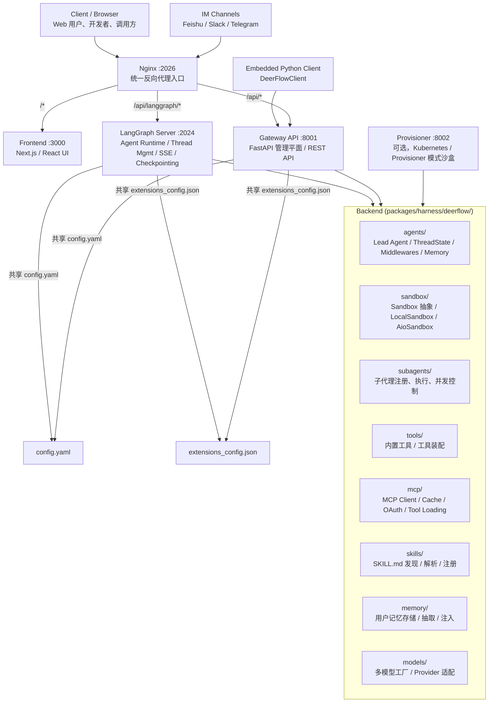
```mermaid
flowchart TB
    Client["Client / Browser<br/>Web 用户、开发者、调用方"]
    IM["IM Channels<br/>Feishu / Slack / Telegram"]
    Embedded["Embedded Python Client<br/>DeerFlowClient"]

    Nginx["Nginx :2026<br/>统一反向代理入口"]
    Frontend["Frontend :3000<br/>Next.js / React UI"]
    LangGraph["LangGraph Server :2024<br/>Agent Runtime / Thread Mgmt / SSE / Checkpointing"]
    Gateway["Gateway API :8001<br/>FastAPI 管理平面 / REST API"]
    Provisioner["Provisioner :8002<br/>可选，Kubernetes / Provisioner 模式沙盒"]

    Client --> Nginx
    IM --> Nginx
    Embedded --> Gateway

    Nginx -->|/api/langgraph/*| LangGraph
    Nginx -->|/api/*| Gateway
    Nginx -->|/*| Frontend

    LangGraph -->|"共享 config.yaml"| Config["config.yaml"]
    Gateway -->|"共享 config.yaml"| Config
    LangGraph -->|"共享 extensions_config.json"| ExtConfig["extensions_config.json"]
    Gateway -->|"共享 extensions_config.json"| ExtConfig

    subgraph Backend["Backend (packages/harness/deerflow/)"]
        Agents["agents/<br/>Lead Agent / ThreadState / Middlewares / Memory"]
        Sandbox["sandbox/<br/>Sandbox 抽象 / LocalSandbox / AioSandbox"]
        Subagents["subagents/<br/>子代理注册、执行、并发控制"]
        Tools["tools/<br/>内置工具 / 工具装配"]
        MCP["mcp/<br/>MCP Client / Cache / OAuth / Tool Loading"]
        Skills["skills/<br/>SKILL.md 发现 / 解析 / 注册"]
        Memory["memory/<br/>用户记忆存储 / 抽取 / 注入"]
        Models["models/<br/>多模型工厂 / Provider 适配"]
    end

    LangGraph --> Backend
    Gateway --> Backend
    Provisioner --> Backend
```

---

## 2. 整体架构图（简化版）

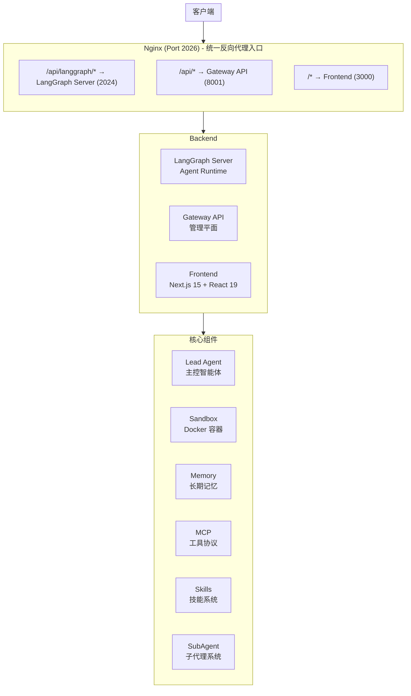
```mermaid
flowchart TB
    subgraph Client["客户端"]
    end

    subgraph Nginx["Nginx (Port 2026) - 统一反向代理入口"]
        direction TB
        A["/api/langgraph/* → LangGraph Server (2024)"]
        B["/api/* → Gateway API (8001)"]
        C["/* → Frontend (3000)"]
    end

    subgraph Backend["Backend"]
        LG["LangGraph Server<br/>Agent Runtime"]
        GW["Gateway API<br/>管理平面"]
        FS["Frontend<br/>Next.js 15 + React 19"]
    end

    subgraph Core["核心组件"]
        Agent["Lead Agent<br/>主控智能体"]
        Sandbox["Sandbox<br/>Docker 容器"]
        Memory["Memory<br/>长期记忆"]
        MCP["MCP<br/>工具协议"]
        Skills["Skills<br/>技能系统"]
        SubAgent["SubAgent<br/>子代理系统"]
    end

    Client --> Nginx
    Nginx --> Backend
    Backend --> Core
```

---

## 3. 后端内核分层图

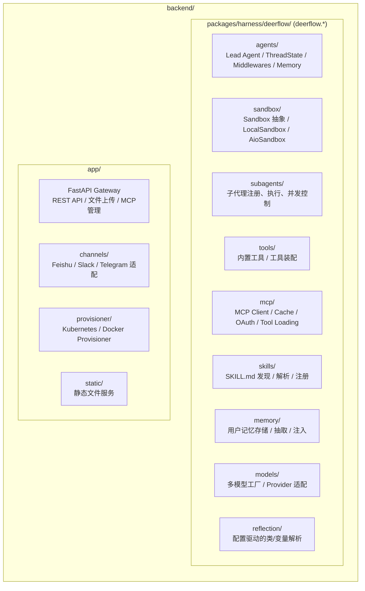
```mermaid
flowchart LR
    subgraph Backend["backend/"]
        subgraph Harness["packages/harness/deerflow/  (deerflow.*)"]
            Agents["agents/<br/>Lead Agent / ThreadState / Middlewares / Memory"]
            Sandbox["sandbox/<br/>Sandbox 抽象 / LocalSandbox / AioSandbox"]
            Subagents["subagents/<br/>子代理注册、执行、并发控制"]
            Tools["tools/<br/>内置工具 / 工具装配"]
            MCP["mcp/<br/>MCP Client / Cache / OAuth / Tool Loading"]
            Skills["skills/<br/>SKILL.md 发现 / 解析 / 注册"]
            Memory["memory/<br/>用户记忆存储 / 抽取 / 注入"]
            Models["models/<br/>多模型工厂 / Provider 适配"]
            Reflection["reflection/<br/>配置驱动的类/变量解析"]
        end

        subgraph App["app/"]
            API["FastAPI Gateway<br/>REST API / 文件上传 / MCP管理"]
            Channels["channels/<br/>Feishu / Slack / Telegram 适配"]
            Provisioner["provisioner/<br/>Kubernetes / Docker Provisioner"]
            Static["static/<br/>静态文件服务"]
        end
    end
```

---

## 4. 标准运行模式详细图

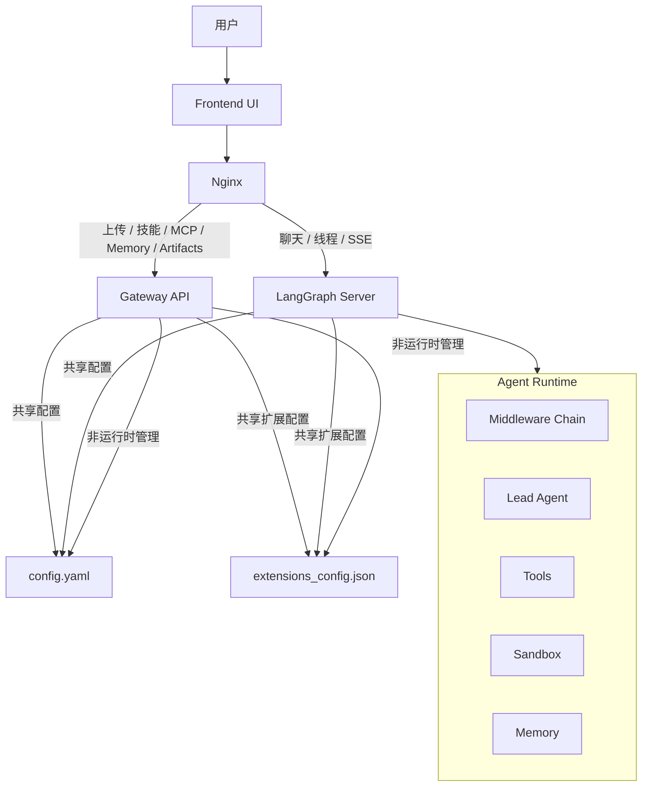
```mermaid
flowchart TB
    User["用户"]
    WebUI["Frontend UI"]
    Nginx["Nginx"]
    LG["LangGraph Server"]
    GA["Gateway API"]

    User --> WebUI
    WebUI --> Nginx
    Nginx -->|聊天 / 线程 / SSE| LG
    Nginx -->|上传 / 技能 / MCP / Memory / Artifacts| GA

    GA -->|共享配置| CFG["config.yaml"]
    GA -->|共享扩展配置| EXTCFG["extensions_config.json"]
    LG -->|共享配置| CFG
    LG -->|共享扩展配置| EXTCFG

    subgraph Runtime["Agent Runtime"]
        MW["Middleware Chain"]
        Agent["Lead Agent"]
        Tools["Tools"]
        Sandbox["Sandbox"]
        Memory["Memory"]
    end

    LG --> Runtime
    GA -->|非运行时管理| CFG
    GA -->|非运行时管理| EXTCFG
```

---

## 5. Gateway Mode（实验模式）图

> 页面对应的开发说明里还提到 **Gateway mode**：此时 Agent Runtime 嵌入 Gateway，不再单独启 LangGraph 进程。

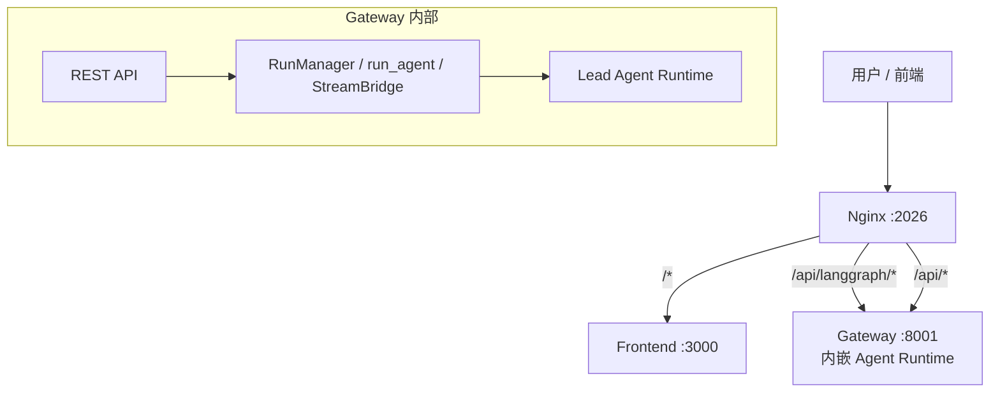
```mermaid
flowchart TB
    User["用户 / 前端"]
    Nginx["Nginx :2026"]
    Frontend["Frontend :3000"]
    Gateway["Gateway :8001<br/>内嵌 Agent Runtime"]

    Runtime["RunManager / run_agent / StreamBridge"]
    GatewayAPI["REST API"]
    Agent["Lead Agent Runtime"]

    User --> Nginx
    Nginx -->|/*| Frontend
    Nginx -->|/api/langgraph/*| Gateway
    Nginx -->|/api/*| Gateway

    subgraph GatewayInternal["Gateway 内部"]
        GatewayAPI
        Runtime
        Agent
    end

    GatewayAPI --> Runtime
    Runtime --> Agent
```

---

## 6. Lead Agent 执行链路图

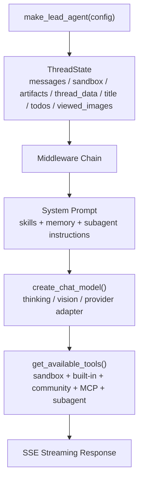
```mermaid
flowchart TB
    Entry["make_lead_agent(config)"]
    ThreadState["ThreadState<br/>messages / sandbox / artifacts / thread_data / title / todos / viewed_images"]
    MW["Middleware Chain"]
    Prompt["System Prompt<br/>skills + memory + subagent instructions"]
    Model["create_chat_model()<br/>thinking / vision / provider adapter"]
    Tools["get_available_tools()<br/>sandbox + built-in + community + MCP + subagent"]
    Response["SSE Streaming Response"]

    Entry --> ThreadState
    ThreadState --> MW
    MW --> Prompt
    Prompt --> Model
    Model --> Tools
    Tools --> Response
```

---

## 7. Middleware 详细顺序图

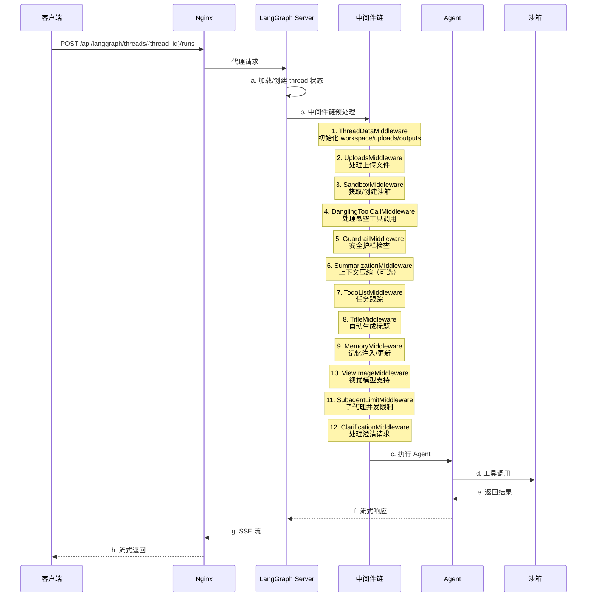
```mermaid
sequenceDiagram
    participant Client as 客户端
    participant Nginx
    participant LGS as LangGraph Server
    participant MW as 中间件链
    participant Agent as Agent
    participant Sandbox as 沙箱

    Client->>Nginx: POST /api/langgraph/threads/{thread_id}/runs
    Nginx->>LGS: 代理请求

    LGS->>LGS: a. 加载/创建 thread 状态
    LGS->>MW: b. 中间件链预处理

    Note over MW: 1. ThreadDataMiddleware<br/>初始化 workspace/uploads/outputs
    Note over MW: 2. UploadsMiddleware<br/>处理上传文件
    Note over MW: 3. SandboxMiddleware<br/>获取/创建沙箱
    Note over MW: 4. DanglingToolCallMiddleware<br/>处理悬空工具调用
    Note over MW: 5. GuardrailMiddleware<br/>安全护栏检查
    Note over MW: 6. SummarizationMiddleware<br/>上下文压缩（可选）
    Note over MW: 7. TodoListMiddleware<br/>任务跟踪
    Note over MW: 8. TitleMiddleware<br/>自动生成标题
    Note over MW: 9. MemoryMiddleware<br/>记忆注入/更新
    Note over MW: 10. ViewImageMiddleware<br/>视觉模型支持
    Note over MW: 11. SubagentLimitMiddleware<br/>子代理并发限制
    Note over MW: 12. ClarificationMiddleware<br/>处理澄清请求

    MW->>Agent: c. 执行 Agent
    Agent->>Sandbox: d. 工具调用
    Sandbox-->>Agent: e. 返回结果
    Agent-->>LGS: f. 流式响应
    LGS-->>Nginx: g. SSE 流
    Nginx-->>Client: h. 流式返回
```

---

## 8. Tool System 架构图

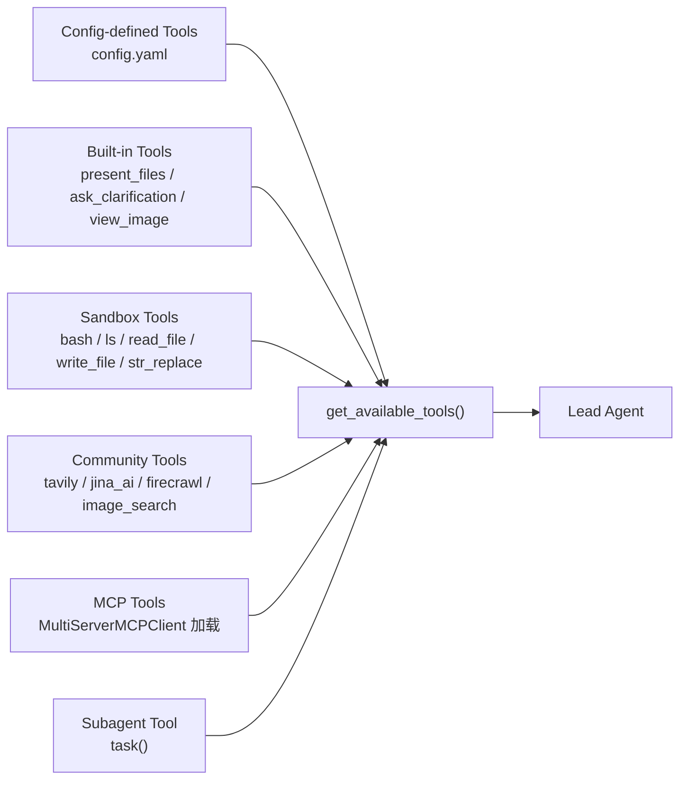
```mermaid
flowchart LR
    ConfigTools["Config-defined Tools<br/>config.yaml"]
    Builtins["Built-in Tools<br/>present_files / ask_clarification / view_image"]
    SandboxTools["Sandbox Tools<br/>bash / ls / read_file / write_file / str_replace"]
    CommunityTools["Community Tools<br/>tavily / jina_ai / firecrawl / image_search"]
    MCPTools["MCP Tools<br/>MultiServerMCPClient 加载"]
    SubagentTool["Subagent Tool<br/>task()"]

    Assembler["get_available_tools()"]

    Agent["Lead Agent"]

    ConfigTools --> Assembler
    Builtins --> Assembler
    SandboxTools --> Assembler
    CommunityTools --> Assembler
    MCPTools --> Assembler
    SubagentTool --> Assembler

    Assembler --> Agent
```

---

## 9. Sandbox 体系图

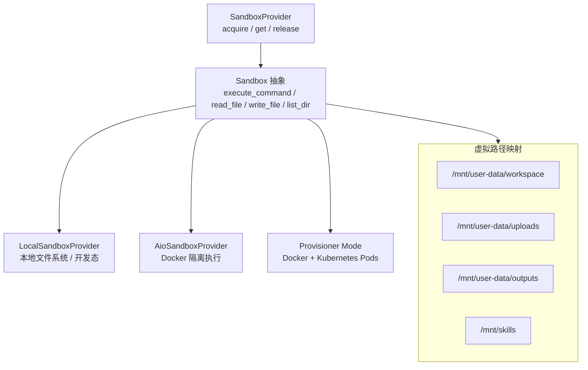
```mermaid
flowchart TB
    Provider["SandboxProvider<br/>acquire / get / release"]
    Sandbox["Sandbox 抽象<br/>execute_command / read_file / write_file / list_dir"]

    Local["LocalSandboxProvider<br/>本地文件系统 / 开发态"]
    Aio["AioSandboxProvider<br/>Docker 隔离执行"]
    Prov["Provisioner Mode<br/>Docker + Kubernetes Pods"]

    Provider --> Sandbox
    Sandbox --> Local
    Sandbox --> Aio
    Sandbox --> Prov

    subgraph Paths["虚拟路径映射"]
        V1["/mnt/user-data/workspace"]
        V2["/mnt/user-data/uploads"]
        V3["/mnt/user-data/outputs"]
        V4["/mnt/skills"]
    end

    Sandbox --> Paths
```

---

## 10. Subagent 架构图

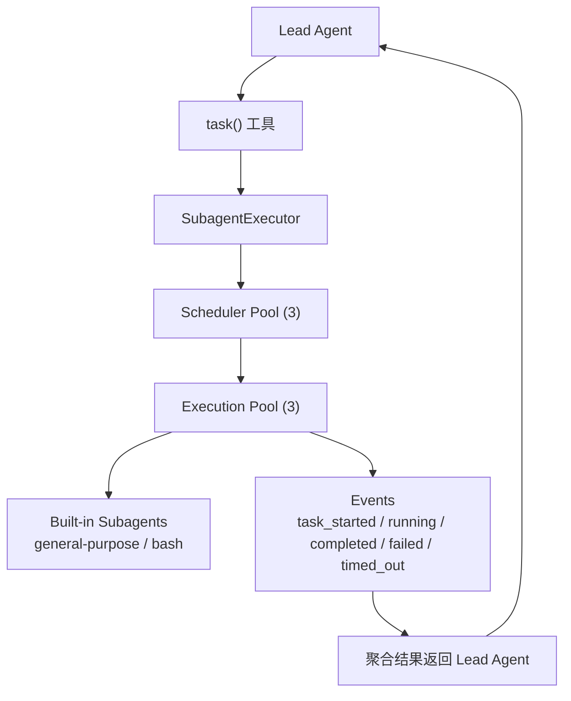
```mermaid
flowchart TB
    Lead["Lead Agent"]
    TaskTool["task() 工具"]
    Executor["SubagentExecutor"]
    Scheduler["Scheduler Pool (3)"]
    Workers["Execution Pool (3)"]
    Builtins["Built-in Subagents<br/>general-purpose / bash"]
    Events["Events<br/>task_started / running / completed / failed / timed_out"]
    Result["聚合结果返回 Lead Agent"]

    Lead --> TaskTool
    TaskTool --> Executor
    Executor --> Scheduler
    Scheduler --> Workers
    Workers --> Builtins
    Workers --> Events
    Events --> Result
    Result --> Lead
```

---

## 11. Memory System 架构图

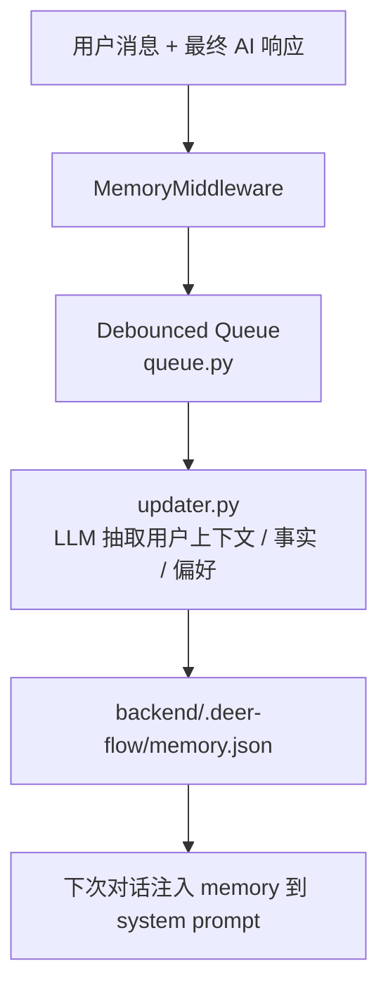
```mermaid
flowchart TB
    Conv["用户消息 + 最终 AI 响应"]
    MW["MemoryMiddleware"]
    Queue["Debounced Queue<br/>queue.py"]
    Updater["updater.py<br/>LLM 抽取用户上下文 / 事实 / 偏好"]
    Store["backend/.deer-flow/memory.json"]
    Inject["下次对话注入 memory 到 system prompt"]

    Conv --> MW
    MW --> Queue
    Queue --> Updater
    Updater --> Store
    Store --> Inject
```

---

## 12. MCP 与 Skills 架构图

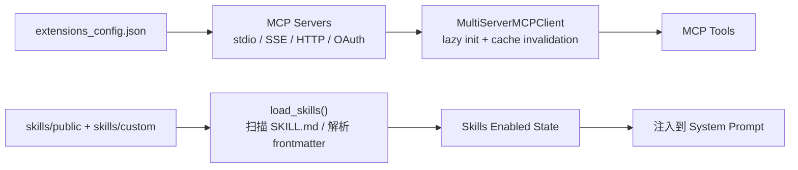
```mermaid
flowchart LR
    ExtCfg["extensions_config.json"]
    MCPServers["MCP Servers<br/>stdio / SSE / HTTP / OAuth"]
    MCPClient["MultiServerMCPClient<br/>lazy init + cache invalidation"]
    MCPTools["MCP Tools"]

    SkillsDir["skills/public + skills/custom"]
    SkillLoader["load_skills()<br/>扫描 SKILL.md / 解析 frontmatter"]
    SkillState["Skills Enabled State"]
    Prompt["注入到 System Prompt"]

    ExtCfg --> MCPServers
    MCPServers --> MCPClient
    MCPClient --> MCPTools

    SkillsDir --> SkillLoader
    SkillLoader --> SkillState
    SkillState --> Prompt
```

---

## 13. Gateway API 路由图

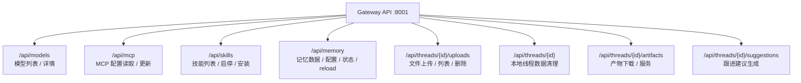
```mermaid
flowchart TB
    Gateway["Gateway API :8001"]

    Models["/api/models<br/>模型列表 / 详情"]
    MCP["/api/mcp<br/>MCP 配置读取 / 更新"]
    Skills["/api/skills<br/>技能列表 / 启停 / 安装"]
    Memory["/api/memory<br/>记忆数据 / 配置 / 状态 / reload"]
    Uploads["/api/threads/{id}/uploads<br/>文件上传 / 列表 / 删除"]
    Threads["/api/threads/{id}<br/>本地线程数据清理"]
    Artifacts["/api/threads/{id}/artifacts<br/>产物下载 / 服务"]
    Suggestions["/api/threads/{id}/suggestions<br/>跟进建议生成"]

    Gateway --> Models
    Gateway --> MCP
    Gateway --> Skills
    Gateway --> Memory
    Gateway --> Uploads
    Gateway --> Threads
    Gateway --> Artifacts
    Gateway --> Suggestions
```

---

## 14. IM Channels 架构图

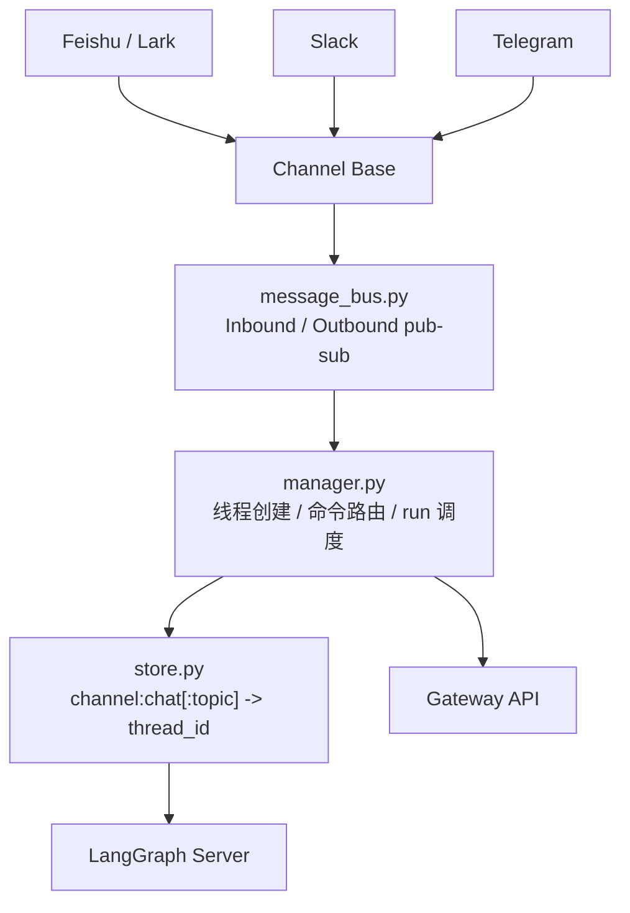
```mermaid
flowchart TB
    Feishu["Feishu / Lark"]
    Slack["Slack"]
    Telegram["Telegram"]

    Base["Channel Base"]
    Bus["message_bus.py<br/>Inbound / Outbound pub-sub"]
    Manager["manager.py<br/>线程创建 / 命令路由 / run 调度"]
    Store["store.py<br/>channel:chat[:topic] -> thread_id"]
    LangGraph["LangGraph Server"]
    Gateway["Gateway API"]

    Feishu --> Base
    Slack --> Base
    Telegram --> Base

    Base --> Bus
    Bus --> Manager
    Manager --> Store
    Store --> LangGraph
    Manager --> Gateway
```

---

## 15. 前端架构图

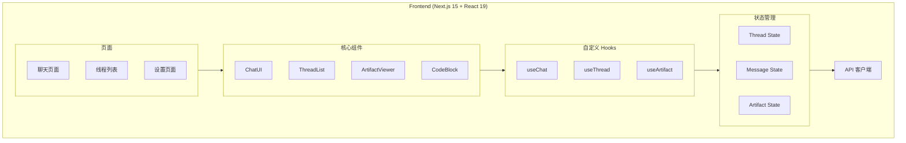
```mermaid
flowchart TB
    subgraph Frontend["Frontend (Next.js 15 + React 19)"]
        Pages["页面组件"]
        Components["UI 组件"]
        Hooks["自定义 Hooks"]
        State["状态管理"]
        API["API 客户端"]
    end

    subgraph Pages["页面"]
        Chat["聊天页面"]
        Threads["线程列表"]
        Settings["设置页面"]
    end

    subgraph Components["核心组件"]
        ChatUI["ChatUI"]
        ThreadList["ThreadList"]
        ArtifactViewer["ArtifactViewer"]
        CodeBlock["CodeBlock"]
    end

    subgraph Hooks["自定义 Hooks"]
        useChat["useChat"]
        useThread["useThread"]
        useArtifact["useArtifact"]
    end

    subgraph State["状态管理"]
        ThreadState["Thread State"]
        MessageState["Message State"]
        ArtifactState["Artifact State"]
    end

    Pages --> Components
    Components --> Hooks
    Hooks --> State
    State --> API
```

---

## 16. 部署架构图

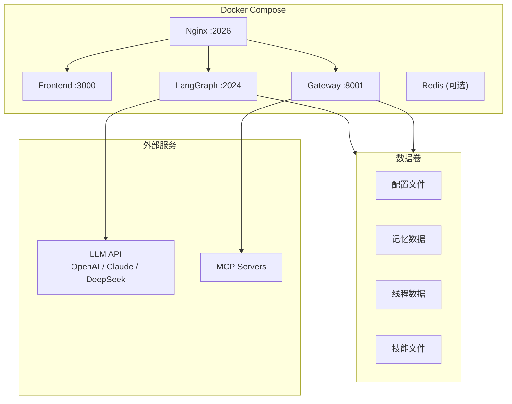
```mermaid
flowchart TB
    subgraph Docker["Docker Compose"]
        Nginx["Nginx :2026"]
        Frontend["Frontend :3000"]
        LangGraph["LangGraph :2024"]
        Gateway["Gateway :8001"]
        Redis["Redis (可选)"]
    end

    subgraph Volumes["数据卷"]
        Config["配置文件"]
        Memory["记忆数据"]
        Threads["线程数据"]
        Skills["技能文件"]
    end

    subgraph External["外部服务"]
        LLM["LLM API<br/>OpenAI / Claude / DeepSeek"]
        MCP["MCP Servers"]
    end

    Nginx --> Frontend
    Nginx --> LangGraph
    Nginx --> Gateway

    LangGraph --> Volumes
    Gateway --> Volumes
    LangGraph --> LLM
    Gateway --> MCP
```

---

## 17. 配置热更新流程图

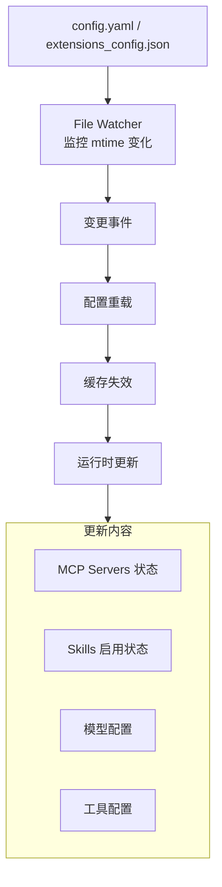
```mermaid
flowchart TB
    ConfigFile["config.yaml / extensions_config.json"]
    Watcher["File Watcher<br/>监控 mtime 变化"]
    Event["变更事件"]
    Reload["配置重载"]
    Cache["缓存失效"]
    Runtime["运行时更新"]

    ConfigFile --> Watcher
    Watcher --> Event
    Event --> Reload
    Reload --> Cache
    Cache --> Runtime

    subgraph Updates["更新内容"]
        U1["MCP Servers 状态"]
        U2["Skills 启用状态"]
        U3["模型配置"]
        U4["工具配置"]
    end

    Runtime --> Updates
```

---

# 核心模块详解

## 1. Agent 架构

### 1.1 Lead Agent（主 Agent）

**入口**: `lead_agent/agent.py:make_lead_agent(config)`

**核心职责**:
- Agent 创建和配置
- Thread 状态管理
- 中间件链执行
- 工具调用编排
- SSE 流式响应

**代码示例**:
```python
def make_lead_agent(config: dict) -> CompiledGraph:
    """创建 Lead Agent"""
    # 1. 创建模型
    model = create_chat_model(config)
    
    # 2. 获取工具
    tools = get_available_tools(config)
    
    # 3. 构建系统提示
    system_prompt = build_system_prompt(config)
    
    # 4. 创建 Agent
    agent = create_react_agent(
        model=model,
        tools=tools,
        state_modifier=system_prompt
    )
    
    return agent
```

### 1.2 中间件链

执行顺序：

| 序号 | 中间件 | 功能 |
|:---:|:---|:---|
| 1 | ThreadDataMiddleware | 初始化 workspace/uploads/outputs 路径 |
| 2 | UploadsMiddleware | 处理上传的文件 |
| 3 | SandboxMiddleware | 获取沙箱环境 |
| 4 | DanglingToolCallMiddleware | 处理悬空工具调用 |
| 5 | GuardrailMiddleware | 安全护栏检查 |
| 6 | SummarizationMiddleware | 上下文压缩（可选） |
| 7 | TodoListMiddleware | 任务跟踪（plan_mode 模式） |
| 8 | TitleMiddleware | 自动生成对话标题 |
| 9 | MemoryMiddleware | 记忆注入与更新 |
| 10 | ViewImageMiddleware | 视觉模型支持 |
| 11 | SubagentLimitMiddleware | 子代理并发限制 |
| 12 | ClarificationMiddleware | 处理澄清请求 |

### 1.3 Thread State（线程状态）

```python
class ThreadState(AgentState):
    # AgentState 核心状态
    messages: list[BaseMessage]
    
    # DeerFlow 扩展
    sandbox: dict             # 沙箱环境信息
    artifacts: list[str]      # 生成的文件路径
    thread_data: dict         # {workspace, uploads, outputs} 路径
    title: str | None         # 自动生成的对话标题
    todos: list[dict]         # 任务跟踪（plan mode）
    viewed_images: dict       # 视觉模型图像数据
    uploaded_files: list      # 上传的文件列表
```

---

## 2. 沙箱系统

### 2.1 架构设计

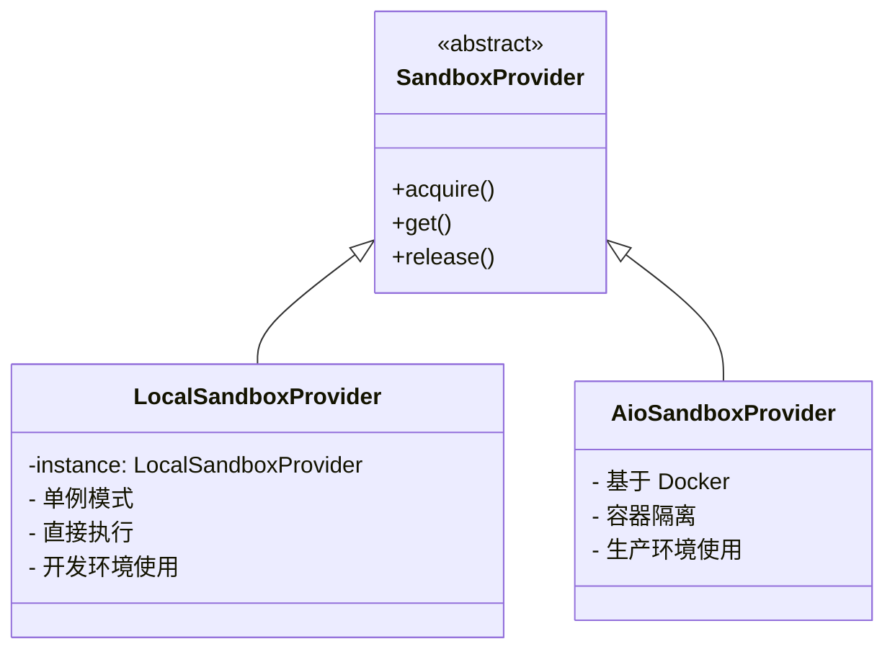
```mermaid
classDiagram
    class SandboxProvider {
        <<abstract>>
        +acquire()
        +get()
        +release()
    }

    class LocalSandboxProvider {
        -instance: LocalSandboxProvider
        - 单例模式
        - 直接执行
        - 开发环境使用
    }

    class AioSandboxProvider {
        - 基于 Docker
        - 容器隔离
        - 生产环境使用
    }

    SandboxProvider <|-- LocalSandboxProvider
    SandboxProvider <|-- AioSandboxProvider
```

### 2.2 虚拟路径映射

| 虚拟路径 | 物理路径 |
|:---|:---|
| `/mnt/user-data/workspace` | `backend/.deer-flow/threads/{thread_id}/user-data/workspace` |
| `/mnt/user-data/uploads` | `backend/.deer-flow/threads/{thread_id}/user-data/uploads` |
| `/mnt/user-data/outputs` | `backend/.deer-flow/threads/{thread_id}/user-data/outputs` |
| `/mnt/skills` | `deer-flow/skills/` |

### 2.3 Sandbox 抽象接口

```python
class Sandbox(ABC):
    @abstractmethod
    async def execute_command(
        self, 
        command: str, 
        cwd: str | None = None
    ) -> CommandResult:
        """执行命令"""
        pass

    @abstractmethod
    async def read_file(self, path: str) -> str:
        """读取文件"""
        pass

    @abstractmethod
    async def write_file(self, path: str, content: str) -> None:
        """写入文件"""
        pass

    @abstractmethod
    async def list_dir(self, path: str) -> list[str]:
        """列出目录"""
        pass
```

---

## 3. 工具系统

### 3.1 工具来源

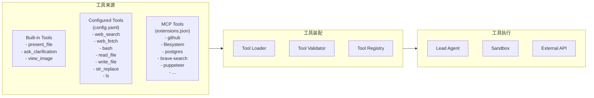
```mermaid
flowchart LR
    subgraph Sources["工具来源"]
        BuiltIn["Built-in Tools<br/>- present_file<br/>- ask_clarification<br/>- view_image"]
        Configured["Configured Tools<br/>(config.yaml)<br/>- web_search<br/>- web_fetch<br/>- bash<br/>- read_file<br/>- write_file<br/>- str_replace<br/>- ls"]
        MCP["MCP Tools<br/>(extensions.json)<br/>- github<br/>- filesystem<br/>- postgres<br/>- brave-search<br/>- puppeteer<br/>- ..."]
    end

    subgraph Assembly["工具装配"]
        Loader["Tool Loader"]
        Validator["Tool Validator"]
        Registry["Tool Registry"]
    end

    subgraph Execution["工具执行"]
        Agent["Lead Agent"]
        Sandbox["Sandbox"]
        External["External API"]
    end

    Sources --> Assembly
    Assembly --> Execution
```

### 3.2 工具配置示例

```yaml
tools:
  built_in:
    - present_file
    - ask_clarification
    - view_image
  
  sandbox:
    - bash
    - read_file
    - write_file
    - str_replace
    - ls
  
  community:
    tavily:
      enabled: true
      api_key: $TAVILY_API_KEY
    jina_ai:
      enabled: true
      api_key: $JINA_API_KEY
```

### 3.3 工具装配流程

```python
def get_available_tools(config: dict) -> list[BaseTool]:
    """获取所有可用工具"""
    tools = []
    
    # 1. 内置工具
    tools.extend(get_builtin_tools())
    
    # 2. 沙箱工具
    tools.extend(get_sandbox_tools(config))
    
    # 3. 社区工具
    tools.extend(get_community_tools(config))
    
    # 4. MCP 工具
    tools.extend(get_mcp_tools(config))
    
    # 5. 子代理工具
    tools.append(get_subagent_tool(config))
    
    return tools
```

---

## 4. 模型工厂

### 4.1 配置示例

```yaml
models:
  - name: gpt-4
    display_name: GPT-4
    use: langchain_openai:ChatOpenAI
    model: gpt-4
    api_key: $OPENAI_API_KEY
    max_tokens: 4096
    supports_thinking: false
    supports_vision: true
  
  - name: claude-3-opus
    display_name: Claude 3 Opus
    use: langchain_anthropic:ChatAnthropic
    model: claude-3-opus-20240229
    api_key: $ANTHROPIC_API_KEY
    max_tokens: 4096
    supports_thinking: true
    supports_vision: true
  
  - name: deepseek-v3
    display_name: DeepSeek V3
    use: langchain_deepseek:ChatDeepSeek
    model: deepseek-chat
    api_key: $DEEPSEEK_API_KEY
    max_tokens: 4096
    supports_thinking: false
    supports_vision: false
```

### 4.2 支持的 Provider

| Provider | 类路径 | 特性 |
|:---|:---|:---|
| OpenAI | `langchain_openai:ChatOpenAI` | Vision, Responses API |
| Anthropic | `langchain_anthropic:ChatAnthropic` | Thinking, Vision |
| DeepSeek | `langchain_deepseek:ChatDeepSeek` | Thinking |
| 自定义 | 自定义类路径 | 可扩展 |

### 4.3 模型工厂代码

```python
def create_chat_model(config: dict) -> BaseChatModel:
    """创建聊天模型"""
    model_config = config["model"]
    
    # 1. 解析类
    model_class = resolve_class(model_config["use"])
    
    # 2. 解析变量
    api_key = resolve_variable(model_config["api_key"])
    
    # 3. 创建实例
    model = model_class(
        model=model_config["model"],
        api_key=api_key,
        max_tokens=model_config.get("max_tokens", 4096)
    )
    
    return model
```

---

## 5. MCP 集成

### 5.1 配置示例

```json
{
  "mcpServers": {
    "github": {
      "enabled": true,
      "type": "stdio",
      "command": "npx",
      "args": ["-y", "@modelcontextprotocol/server-github"],
      "env": {"GITHUB_TOKEN": "$GITHUB_TOKEN"}
    },
    "filesystem": {
      "enabled": true,
      "type": "stdio",
      "command": "npx",
      "args": ["-y", "@modelcontextprotocol/server-filesystem", "/path/to/dir"]
    },
    "postgres": {
      "enabled": true,
      "type": "stdio",
      "command": "npx",
      "args": ["-y", "@modelcontextprotocol/server-postgres"],
      "env": {"DATABASE_URL": "$DATABASE_URL"}
    },
    "brave-search": {
      "enabled": true,
      "type": "stdio",
      "command": "npx",
      "args": ["-y", "@modelcontextprotocol/server-brave-search"],
      "env": {"BRAVE_API_KEY": "$BRAVE_API_KEY"}
    },
    "puppeteer": {
      "enabled": true,
      "type": "stdio",
      "command": "npx",
      "args": ["-y", "@modelcontextprotocol/server-puppeteer"]
    }
  }
}
```

### 5.2 传输协议

| 协议 | 描述 | 使用场景 |
|:---|:---|:---|
| stdio | 标准输入输出 | 本地进程通信 |
| SSE | Server-Sent Events | HTTP 长连接 |
| HTTP | HTTP 请求 | REST API |

### 5.3 MCP 客户端架构

```python
class MultiServerMCPClient:
    """多服务器 MCP 客户端"""
    
    def __init__(self, config: dict):
        self.servers: dict[str, MCPServer] = {}
        self.tools: dict[str, list[Tool]] = {}
        self._cache: dict[str, Any] = {}
    
    async def connect(self, server_name: str) -> None:
        """连接到 MCP 服务器"""
        server_config = self.config["mcpServers"][server_name]
        
        if server_config["type"] == "stdio":
            server = StdioMCPServer(server_config)
        elif server_config["type"] == "sse":
            server = SSEMCPServer(server_config)
        elif server_config["type"] == "http":
            server = HTTPMCPServer(server_config)
        
        self.servers[server_name] = server
        self.tools[server_name] = await server.list_tools()
    
    async def call_tool(
        self, 
        server_name: str, 
        tool_name: str, 
        arguments: dict
    ) -> Any:
        """调用 MCP 工具"""
        server = self.servers[server_name]
        return await server.call_tool(tool_name, arguments)
```

---

## 6. 技能系统

### 6.1 SKILL.md 格式

```markdown
---
name: code-review
description: 代码审查技能
version: 1.0.0
author: developer
tags: [code, review, quality]
tools: [read_file, bash]
---

# Code Review Skill

你是一个专业的代码审查助手。

## 审查流程

1. 读取代码文件
2. 分析代码质量
3. 提供改进建议

## 关注点

- 代码风格
- 潜在 bug
- 性能问题
- 安全隐患
```

### 6.2 技能加载流程

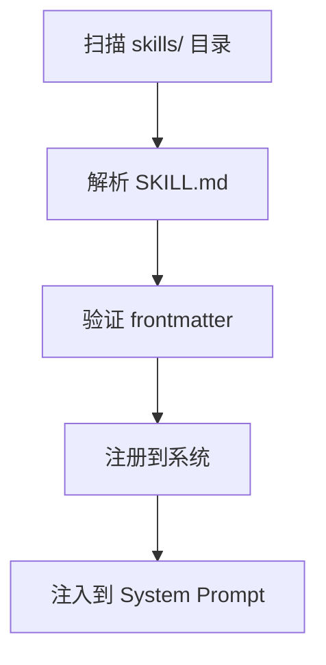
```mermaid
flowchart TB
    Scan["扫描 skills/ 目录"]
    Parse["解析 SKILL.md"]
    Validate["验证 frontmatter"]
    Register["注册到系统"]
    Inject["注入到 System Prompt"]

    Scan --> Parse
    Parse --> Validate
    Validate --> Register
    Register --> Inject
```

### 6.3 技能配置

```yaml
skills:
  directories:
    - skills/public
    - skills/custom
  
  enabled:
    - code-review
    - documentation
    - testing
  
  disabled:
    - deprecated-skill
```

---

## 7. 记忆系统

### 7.1 架构设计

```mermaid
flowchart TB
    subgraph Input["输入"]
        UserMsg["用户消息"]
        AIResp["AI 响应"]
    end

    subgraph Processing["处理"]
        Extract["信息抽取"]
        Struct["结构化"]
        Merge["合并到现有记忆"]
    end

    subgraph Storage["存储"]
        JSON["memory.json"]
        Backup["备份"]
    end

    subgraph Usage["使用"]
        Inject["注入到 Prompt"]
        Context["提供上下文"]
    end

    Input --> Processing
    Processing --> Storage
    Storage --> Usage
```

### 7.2 记忆数据结构

```json
{
  "user_context": {
    "preferences": ["使用 Python", "偏好简洁代码"],
    "facts": ["项目使用 FastAPI", "团队有 5 人"],
    "history_summary": "用户正在进行 API 开发"
  },
  "last_updated": "2026-04-05T12:00:00Z"
}
```

### 7.3 记忆更新流程

```python
class MemoryUpdater:
    """记忆更新器"""
    
    def __init__(self, llm: BaseChatModel):
        self.llm = llm
        self.queue = DebouncedQueue(delay=5.0)
    
    async def update(self, messages: list[BaseMessage]) -> None:
        """更新记忆"""
        # 1. 加入队列（防抖）
        await self.queue.put(messages)
        
        # 2. LLM 抽取信息
        extracted = await self._extract_info(messages)
        
        # 3. 合并到现有记忆
        memory = await self._load_memory()
        memory = self._merge(memory, extracted)
        
        # 4. 保存
        await self._save_memory(memory)
    
    async def _extract_info(self, messages: list[BaseMessage]) -> dict:
        """使用 LLM 抽取信息"""
        prompt = f"""
        从以下对话中抽取用户偏好、事实和上下文信息：
        
        {messages}
        
        以 JSON 格式返回结果。
        """
        response = await self.llm.ainvoke(prompt)
        return json.loads(response.content)
```

---

## 8. 子代理系统

### 8.1 架构设计

```mermaid
flowchart TB
    subgraph Lead["Lead Agent"]
        TaskTool["task() 工具"]
    end

    subgraph Executor["SubagentExecutor"]
        Scheduler["调度器"]
        Pool["执行池 (3)"]
    end

    subgraph Subagents["子代理"]
        GP["general-purpose"]
        Bash["bash"]
        Custom["自定义子代理"]
    end

    subgraph Events["事件"]
        Started["task_started"]
        Running["running"]
        Completed["completed"]
        Failed["failed"]
        Timeout["timed_out"]
    end

    Lead --> TaskTool
    TaskTool --> Executor
    Executor --> Scheduler
    Scheduler --> Pool
    Pool --> Subagents
    Subagents --> Events
    Events --> Lead
```

### 8.2 配置示例

```yaml
subagents:
  max_concurrent: 3
  default_timeout: 900  # 15分钟
  
  built_in:
    - name: general-purpose
      description: 通用任务处理
    - name: bash
      description: 命令行任务
  
  custom:
    - name: code-analyzer
      description: 代码分析专家
      model: gpt-4
      system_prompt: |
        你是一个代码分析专家...
```

### 8.3 子代理调用流程

```python
async def task(
    instruction: str,
    subagent_type: str = "general-purpose",
    timeout: int = 900
) -> str:
    """调用子代理执行任务"""
    
    # 1. 创建子代理
    subagent = await create_subagent(subagent_type)
    
    # 2. 执行任务
    try:
        result = await asyncio.wait_for(
            subagent.run(instruction),
            timeout=timeout
        )
        return result
    except asyncio.TimeoutError:
        raise TimeoutError(f"Subagent timed out after {timeout}s")
```

---

## 9. 前端架构

### 9.1 技术栈

| 技术 | 版本 | 用途 |
|:---|:---:|:---|
| Next.js | 15 | 框架 |
| React | 19 | UI 库 |
| TypeScript | 5.x | 类型安全 |
| Tailwind CSS | 3.x | 样式 |
| Vercel AI SDK | 4.x | AI 集成 |

### 9.2 核心组件

```typescript
// 聊天组件
export function ChatUI() {
  const { messages, input, handleSubmit } = useChat({
    api: '/api/langgraph/threads/${threadId}/runs',
  })

  return (
    <div className="flex flex-col h-full">
      <MessageList messages={messages} />
      <ChatInput 
        value={input} 
        onSubmit={handleSubmit} 
      />
    </div>
  )
}

// 线程列表组件
export function ThreadList() {
  const { threads, isLoading } = useThreads()
  
  return (
    <div className="space-y-2">
      {threads.map(thread => (
        <ThreadItem key={thread.id} thread={thread} />
      ))}
    </div>
  )
}

// 产物查看器
export function ArtifactViewer({ artifact }: { artifact: Artifact }) {
  const content = useArtifact(artifact.path)
  
  return (
    <div className="artifact-viewer">
      {artifact.type === 'image' && (
        
      )}
      {artifact.type === 'code' && (
        <CodeBlock code={content} language={artifact.language} />
      )}
    </div>
  )
}
```

### 9.3 状态管理

```typescript
// 线程状态
interface ThreadState {
  id: string
  title: string
  messages: Message[]
  artifacts: Artifact[]
  status: 'idle' | 'running' | 'error'
}

// 消息状态
interface MessageState {
  role: 'user' | 'assistant' | 'system'
  content: string
  timestamp: Date
  toolCalls?: ToolCall[]
}

// 产物状态
interface ArtifactState {
  id: string
  name: string
  type: 'image' | 'code' | 'file'
  path: string
  createdAt: Date
}
```

---

## 10. 部署架构

### 10.1 Docker Compose 配置

```yaml
version: '3.8'

services:
  nginx:
    image: nginx:alpine
    ports:
      - "2026:2026"
    volumes:
      - ./nginx.conf:/etc/nginx/nginx.conf
    depends_on:
      - frontend
      - langgraph
      - gateway

  frontend:
    build: ./frontend
    ports:
      - "3000:3000"
    environment:
      - NEXT_PUBLIC_API_URL=http://nginx:2026

  langgraph:
    build: ./backend
    ports:
      - "2024:2024"
    environment:
      - CONFIG_PATH=/app/config.yaml
    volumes:
      - ./config.yaml:/app/config.yaml
      - deerflow-data:/app/.deer-flow

  gateway:
    build: ./backend
    ports:
      - "8001:8001"
    environment:
      - CONFIG_PATH=/app/config.yaml
    volumes:
      - ./config.yaml:/app/config.yaml
      - deerflow-data:/app/.deer-flow

volumes:
  deerflow-data:
```

### 10.2 Nginx 配置

```nginx
upstream frontend {
    server frontend:3000;
}

upstream langgraph {
    server langgraph:2024;
}

upstream gateway {
    server gateway:8001;
}

server {
    listen 2026;

    # Frontend
    location / {
        proxy_pass http://frontend;
        proxy_set_header Host $host;
    }

    # LangGraph API
    location /api/langgraph/ {
        proxy_pass http://langgraph/;
        proxy_set_header Host $host;
        proxy_buffering off;
        proxy_cache off;
    }

    # Gateway API
    location /api/ {
        proxy_pass http://gateway/;
        proxy_set_header Host $host;
    }
}
```

---

# 组件功能详解

## 14.1 外围接入层

### 1) Client / Browser

**功能**:
- 发起 Web 端交互
- 接收流式响应
- 发起线程操作、上传、配置管理等请求

### 2) Frontend（Next.js / React UI）

**功能**:
- DeerFlow 的 Web UI
- 聊天界面、线程管理、文件展示、产物下载
- 对接 `/api/langgraph/*` 与 Gateway API

### 3) IM Channels（Feishu / Slack / Telegram）

**功能**:
- 把 DeerFlow 接入外部消息平台
- 负责消息收发、线程映射、命令处理、平台适配
- Feishu 支持流式更新卡片，Slack/Telegram 以最终响应为主

**平台差异**:

| 平台 | 流式支持 | 特殊功能 |
|:---|:---:|:---|
| Feishu/Lark | ✅ 支持流式卡片 | 富文本卡片 |
| Slack | ❌ 最终响应 | Block Kit |
| Telegram | ❌ 最终响应 | Markdown |

---

## 14.2 接入与调度层

### 5) Nginx

**功能**:
- 统一入口
- 反向代理到 Frontend、LangGraph、Gateway
- 在 Gateway mode 下，还会把 `/api/langgraph/*` 改为代理到 Gateway 内嵌运行时

**路由规则**:

| 路径 | 目标 |
|:---|:---|
| `/*` | Frontend :3000 |
| `/api/langgraph/*` | LangGraph :2024 |
| `/api/*` | Gateway :8001 |

### 6) LangGraph Server

**功能**:
- 标准模式下的核心 Agent Runtime
- 负责线程管理、状态持久化、工具编排、SSE 流式输出
- 入口为 `make_lead_agent(config)`

**核心能力**:
- Thread 管理（创建、加载、持久化）
- Checkpointing（状态快照）
- SSE 流式响应
- 工具调用编排

### 7) Gateway API

**功能**:
- 非 Agent 推理类能力的管理平面
- 提供 Models / MCP / Skills / Memory / Uploads / Artifacts / Threads / Suggestions 等 REST API
- 也是 IM Channels 的辅助服务入口

**API 列表**:

| 路径 | 功能 |
|:---|:---|
| `/api/models` | 模型列表 / 详情 |
| `/api/mcp` | MCP 配置读取 / 更新 |
| `/api/skills` | 技能列表 / 启停 / 安装 |
| `/api/memory` | 记忆数据 / 配置 / 状态 / reload |
| `/api/threads/{id}/uploads` | 文件上传 / 列表 / 删除 |
| `/api/threads/{id}` | 本地线程数据清理 |
| `/api/threads/{id}/artifacts` | 产物下载 / 服务 |
| `/api/threads/{id}/suggestions` | 跟进建议生成 |

---

## 14.3 配置与状态层

### 9) `config.yaml`

**功能**:
- DeerFlow 主配置文件
- 定义模型、工具、沙盒、skills、memory、subagents、summarization、channels 等核心参数
- 被 LangGraph 与 Gateway 共享读取

**配置结构**:

```yaml
# 模型配置
models:
  - name: gpt-4
    display_name: GPT-4
    use: langchain_openai:ChatOpenAI
    model: gpt-4
    api_key: $OPENAI_API_KEY

# 工具配置
tools:
  built_in: [present_file, ask_clarification, view_image]
  sandbox: [bash, read_file, write_file, str_replace, ls]
  community:
    tavily:
      enabled: true
      api_key: $TAVILY_API_KEY

# 沙箱配置
sandbox:
  provider: aio
  docker_image: deerflow-sandbox:latest

# 技能配置
skills:
  directories: [skills/public, skills/custom]

# 记忆配置
memory:
  enabled: true
  file: .deer-flow/memory.json

# 子代理配置
subagents:
  max_concurrent: 3
  default_timeout: 900

# 总结配置
summarization:
  enabled: true
  max_tokens: 8000
  target_tokens: 4000

# 通道配置
channels:
  slack:
    enabled: true
    bot_token: $SLACK_BOT_TOKEN
  telegram:
    enabled: true
    bot_token: $TELEGRAM_BOT_TOKEN
```

### 10) `extensions_config.json`

**功能**:
- 管理 MCP Servers 与 Skills 启用状态
- 支持 Gateway API 动态修改
- 通过 mtime 变化驱动运行时热更新

**结构**:

```json
{
  "mcpServers": {
    "github": {
      "enabled": true,
      "type": "stdio",
      "command": "npx",
      "args": ["-y", "@modelcontextprotocol/server-github"],
      "env": {"GITHUB_TOKEN": "$GITHUB_TOKEN"}
    }
  },
  "skills": {
    "code-review": {
      "enabled": true
    },
    "documentation": {
      "enabled": true
    }
  }
}
```

### 11) ThreadState

**功能**:
- DeerFlow 对 LangGraph `AgentState` 的扩展
- 保存消息、标题、沙箱信息、产物、待办、图像上下文、线程目录等
- 是 DeerFlow 会话的状态载体

**字段说明**:

| 字段 | 类型 | 说明 |
|:---|:---|:---|
| messages | list[BaseMessage] | 对话消息列表 |
| sandbox | dict | 沙箱环境信息 |
| artifacts | list[str] | 生成的文件路径 |
| thread_data | dict | 线程目录路径 |
| title | str \| None | 对话标题 |
| todos | list[dict] | 任务列表 |
| viewed_images | dict | 视觉模型图像 |
| uploaded_files | list | 上传文件列表 |

### 12) 线程目录

**功能**:
- 为每个线程提供隔离的文件空间
- 包括 `workspace`、`uploads`、`outputs`

**目录结构**:

```
backend/.deer-flow/threads/{thread_id}/
├── user-data/
│   ├── workspace/    # 工作目录
│   ├── uploads/      # 上传文件
│   └── outputs/      # 输出产物
├── checkpoints/      # 状态快照
└── metadata.json     # 线程元数据
```

---

## 14.4 Agent Runtime 内核层

### 13) Lead Agent

**功能**:
- DeerFlow 的主控智能体
- 负责综合模型、工具、skills、memory、subagents 执行任务
- 是 LangGraph Runtime 的主要逻辑入口

**核心流程**:

```mermaid
flowchart TB
    Input["用户输入"]
    Parse["意图解析"]
    Plan["任务规划"]
    Execute["执行工具"]
    Subagent["调用子代理"]
    Response["生成响应"]

    Input --> Parse
    Parse --> Plan
    Plan --> Execute
    Execute --> Subagent
    Subagent --> Response
```

### 14) Middleware Chain

**功能**:
- 为 Agent 执行链路提供横切能力
- 包括线程目录初始化、文件上传注入、沙箱获取、工具调用保护、上下文压缩、Todo 计划、自动标题、记忆更新、图片注入、子代理限制、澄清中断

**执行顺序**:

1. ThreadDataMiddleware - 初始化目录
2. UploadsMiddleware - 处理上传
3. SandboxMiddleware - 获取沙箱
4. DanglingToolCallMiddleware - 处理悬空调用
5. GuardrailMiddleware - 安全检查
6. SummarizationMiddleware - 上下文压缩
7. TodoListMiddleware - 任务跟踪
8. TitleMiddleware - 生成标题
9. MemoryMiddleware - 记忆处理
10. ViewImageMiddleware - 图像处理
11. SubagentLimitMiddleware - 并发限制
12. ClarificationMiddleware - 澄清处理

### 15) System Prompt Builder

**功能**:
- 把 skills、memory、subagent 指令、工作目录提示等统一注入系统提示词
- 使 Agent 行为具备更强任务导向性

**提示词结构**:

```
# 系统提示

## 技能指令
{skill_instructions}

## 用户记忆
{memory_context}

## 子代理指令
{subagent_instructions}

## 工作目录
当前工作目录: /mnt/user-data/workspace

## 可用工具
{tool_descriptions}
```

### 16) Model Factory

**功能**:
- 依据 `config.yaml` 动态装配不同模型提供方
- 支持 thinking、vision、responses API、CLI-backed provider 等能力
- 通过 `resolve_class()` 实现配置驱动实例化

**Reflection System**:

```python
def resolve_class(path: str) -> type:
    """解析类路径"""
    module_path, class_name = path.rsplit(":", 1)
    module = importlib.import_module(module_path)
    return getattr(module, class_name)

def resolve_variable(value: str) -> str:
    """解析变量（支持环境变量）"""
    if value.startswith("$"):
        return os.environ.get(value[1:], value)
    return value
```

---

## 14.5 工具与执行层

### 17) Tool Assembler

**功能**:
- 从多个来源收集工具并装配到 Agent
- 处理工具冲突、依赖、优先级

**工具优先级**:

1. Built-in Tools（最高优先级）
2. Sandbox Tools
3. Config-defined Tools
4. MCP Tools
5. Subagent Tool（最低优先级）

### 18) Sandbox System

**功能**:
- 提供隔离的代码执行环境
- 支持本地（开发）和 Docker（生产）两种模式
- 通过虚拟路径映射实现文件系统隔离

**Provider 选择**:

| 模式 | Provider | 使用场景 |
|:---|:---|:---|
| 开发 | LocalSandboxProvider | 本地开发、调试 |
| 生产 | AioSandboxProvider | Docker 部署 |
| 集群 | Provisioner | Kubernetes |

### 19) MCP Client

**功能**:
- 连接并管理多个 MCP Server
- 提供 lazy init 与缓存失效机制
- 支持 stdio、SSE、HTTP 三种传输协议

**缓存策略**:

```python
class MCPCache:
    """MCP 工具缓存"""
    
    def __init__(self, ttl: int = 300):
        self._cache: dict[str, CachedTools] = {}
        self._ttl = ttl
    
    async def get_tools(self, server_name: str) -> list[Tool]:
        """获取工具（带缓存）"""
        if self._should_refresh(server_name):
            tools = await self._fetch_tools(server_name)
            self._cache[server_name] = CachedTools(
                tools=tools,
                timestamp=time.time()
            )
        return self._cache[server_name].tools
    
    def _should_refresh(self, server_name: str) -> bool:
        """检查是否需要刷新"""
        if server_name not in self._cache:
            return True
        return time.time() - self._cache[server_name].timestamp > self._ttl
```

### 20) Community Tools

**功能**:
- 集成第三方工具服务
- 支持 Tavily、Jina AI、Firecrawl、Image Search 等

**可用工具**:

| 工具 | 功能 | API Key |
|:---|:---|:---|
| tavily | Web 搜索 | TAVILY_API_KEY |
| jina_ai | Web 内容提取 | JINA_API_KEY |
| firecrawl | 网页爬取 | FIRECRAWL_API_KEY |
| image_search | 图片搜索 | - |

---

## 14.6 扩展与记忆层

### 21) Skills Loader

**功能**:
- 扫描并解析 skills 目录下的 SKILL.md 文件
- 验证 frontmatter 元数据
- 注册启用的技能到 Agent

**加载流程**:

```mermaid
flowchart TB
    Scan["扫描目录"]
    Find["发现 SKILL.md"]
    Parse["解析 frontmatter"]
    Validate["验证元数据"]
    Check["检查启用状态"]
    Register["注册技能"]

    Scan --> Find
    Find --> Parse
    Parse --> Validate
    Validate --> Check
    Check --> Register
```

### 22) Memory System

**功能**:
- 存储用户偏好、上下文、事实等长期记忆
- 使用 LLM 从对话中自动抽取信息
- 通过 Debounced Queue 实现高效更新

**更新策略**:
- 防抖延迟：5秒
- 批量合并
- 增量更新

### 23) Extensions Config Watcher

**功能**:
- 监控 `extensions_config.json` 文件变化
- 触发 MCP/Skills 热更新
- 避免重启服务

**热更新流程**:

```mermaid
flowchart TB
    File["extensions_config.json"]
    Watch["File Watcher"]
    Event["变更事件"]
    Reload["重新加载"]
    Cache["缓存失效"]

    File --> Watch
    Watch --> Event
    Event --> Reload
    Reload --> Cache
```

---

## 14.7 子代理层

### 24) Subagent Executor

**功能**:
- 执行 Lead Agent 委派的任务
- 管理并发与超时
- 聚合结果返回

**并发控制**:

```python
class SubagentScheduler:
    """子代理调度器"""
    
    def __init__(self, max_concurrent: int = 3):
        self._semaphore = asyncio.Semaphore(max_concurrent)
        self._active_tasks: dict[str, asyncio.Task] = {}
    
    async def execute(
        self, 
        task_id: str, 
        instruction: str,
        timeout: int = 900
    ) -> str:
        """执行子代理任务"""
        async with self._semaphore:
            try:
                result = await asyncio.wait_for(
                    self._run_subagent(instruction),
                    timeout=timeout
                )
                return result
            except asyncio.TimeoutError:
                raise TimeoutError(f"Task {task_id} timed out")
```

### 25) Subagent Pool

**功能**:
- 维护子代理实例池
- 支持预定义和自定义子代理类型
- 提供负载均衡

**内置子代理**:

| 名称 | 功能 |
|:---|:---|
| general-purpose | 通用任务处理 |
| bash | 命令行任务 |

---

## 14.8 接入渠道层

### 26) IM Channels

**功能**:
- 把 DeerFlow 接入外部消息平台
- 负责消息收发、线程映射、命令处理、平台适配
- Feishu 支持流式更新卡片，Slack/Telegram 以最终响应为主

**架构组件**:

| 组件 | 文件 | 功能 |
|:---|:---|:---|
| Channel Base | `base.py` | 通道抽象基类 |
| Message Bus | `message_bus.py` | Inbound/Outbound pub-sub |
| Manager | `manager.py` | 线程创建、命令路由、run 调度 |
| Store | `store.py` | channel:chat[:topic] -> thread_id 映射 |

**平台适配**:

| 平台 | 流式支持 | 特殊功能 |
|:---|:---:|:---|
| Feishu/Lark | ✅ 支持流式卡片 | 富文本卡片、命令订阅 |
| Slack | ❌ 最终响应 | Block Kit、Slash Commands |
| Telegram | ❌ 最终响应 | Markdown、Inline Keyboard |

### 27) Embedded Python Client

**功能**:
- 提供 Python SDK 直接调用 DeerFlow
- 无需通过 HTTP API
- 适合集成到其他 Python 应用

**核心方法**:

```python
class DeerFlowClient:
    """DeerFlow Python 客户端"""
    
    async def chat(
        self, 
        message: str, 
        thread_id: str | None = None
    ) -> str:
        """发送消息并获取响应"""
        pass
    
    async def stream(
        self, 
        message: str, 
        thread_id: str | None = None
    ) -> AsyncIterator[str]:
        """流式获取响应"""
        pass
    
    async def list_models(self) -> list[Model]:
        """列出可用模型"""
        pass
    
    async def list_skills(self) -> list[Skill]:
        """列出可用技能"""
        pass
    
    async def upload_files(
        self, 
        files: list[str], 
        thread_id: str
    ) -> list[UploadedFile]:
        """上传文件"""
        pass
```

---

## 14.9 Provisioner 层

### 28) Provisioner

**功能**:
- 可选组件，端口 8002
- 支持 Kubernetes / Provisioner 模式沙盒
- 提供更强大的沙箱管理能力

**使用场景**:
- 大规模部署
- 多租户隔离
- 资源配额管理

---

# 开发指南

## 快速开始

### 1. 环境准备

```bash
# 克隆仓库
git clone https://github.com/bytedance/deer-flow.git
cd deer-flow

# 安装依赖
pip install -r requirements.txt

# 配置环境变量
cp .env.example .env
# 编辑 .env 填入 API Keys
```

### 2. 配置文件

```yaml
# config.yaml
models:
  - name: gpt-4
    display_name: GPT-4
    use: langchain_openai:ChatOpenAI
    model: gpt-4
    api_key: $OPENAI_API_KEY

sandbox:
  provider: local  # 开发环境使用 local

skills:
  directories:
    - skills/public
    - skills/custom

memory:
  enabled: true
  file: .deer-flow/memory.json
```

### 3. 启动服务

```bash
# 启动 LangGraph Server
python -m deerflow.langgraph_server

# 启动 Gateway API
python -m app.main

# 启动 Frontend（另一个终端）
cd frontend
npm install
npm run dev
```

### 4. Docker 部署

```bash
# 使用 Docker Compose
docker-compose up -d

# 查看日志
docker-compose logs -f
```

---

## 自定义开发

### 1. 添加自定义技能

```markdown
<!-- skills/custom/my-skill/SKILL.md -->
---
name: my-custom-skill
description: 我的自定义技能
version: 1.0.0
author: me
tags: [custom, example]
tools: [read_file, write_file, bash]
---

# My Custom Skill

这是一个自定义技能的说明。

## 使用场景

- 场景1
- 场景2

## 执行流程

1. 步骤1
2. 步骤2
```

### 2. 添加 MCP Server

```json
// extensions_config.json
{
  "mcpServers": {
    "my-mcp-server": {
      "enabled": true,
      "type": "stdio",
      "command": "python",
      "args": ["-m", "my_mcp_server"],
      "env": {
        "API_KEY": "$MY_API_KEY"
      }
    }
  }
}
```

### 3. 添加自定义子代理

```yaml
# config.yaml
subagents:
  custom:
    - name: my-expert
      description: 我的专家子代理
      model: gpt-4
      system_prompt: |
        你是一个专门处理XX任务的专家...
      tools:
        - read_file
        - bash
```

### 4. 添加自定义中间件

```python
# packages/harness/deerflow/agents/middlewares/my_middleware.py

from .base import Middleware

class MyCustomMiddleware(Middleware):
    """自定义中间件"""
    
    async def before_agent(self, state: ThreadState) -> ThreadState:
        """Agent 执行前"""
        # 自定义逻辑
        return state
    
    async def after_agent(self, state: ThreadState) -> ThreadState:
        """Agent 执行后"""
        # 自定义逻辑
        return state
```

---

## 调试技巧

### 1. 启用调试日志

```python
import logging

logging.basicConfig(level=logging.DEBUG)
logging.getLogger("deerflow").setLevel(logging.DEBUG)
```

### 2. 查看中间件执行

```python
# 在中间件中添加日志
class DebugMiddleware(Middleware):
    async def before_agent(self, state: ThreadState) -> ThreadState:
        print(f"[DEBUG] Before Agent: {state.keys()}")
        return state
```

### 3. 检查工具调用

```python
# 在工具执行前后打印
async def debug_tool_call(tool_name: str, args: dict):
    print(f"[TOOL] {tool_name}({args})")
    result = await tool.execute(args)
    print(f"[RESULT] {result}")
    return result
```

---

# 最佳实践

## 1. 性能优化

### 1.1 上下文压缩

```yaml
summarization:
  enabled: true
  max_tokens: 8000
  target_tokens: 4000
  trigger_threshold: 0.8
```

### 1.2 记忆更新策略

```yaml
memory:
  enabled: true
  update_delay: 5.0  # 防抖延迟
  max_facts: 100     # 最大事实数
```

### 1.3 子代理并发控制

```yaml
subagents:
  max_concurrent: 3
  default_timeout: 900
  queue_size: 10
```

---

## 2. 安全建议

### 2.1 沙箱隔离

- 生产环境使用 AioSandboxProvider
- 限制文件系统访问
- 设置资源配额

### 2.2 API Key 管理

- 使用环境变量存储
- 不要硬编码在配置文件
- 定期轮换

### 2.3 工具权限

- 只启用必要的工具
- 限制危险命令执行
- 添加 Guardrail 检查

---

## 3. 运维建议

### 3.1 日志管理

```yaml
logging:
  level: INFO
  format: "%(asctime)s - %(name)s - %(levelname)s - %(message)s"
  file: logs/deerflow.log
```

### 3.2 监控指标

- 响应时间
- Token 使用量
- 工具调用频率
- 错误率

### 3.3 备份策略

- 定期备份 `memory.json`
- 备份线程数据
- 配置版本控制

---

# 常见问题

## Q1: 如何切换模型？

修改 `config.yaml` 中的模型配置，或通过 Gateway API 动态切换。

## Q2: 如何添加新的 MCP 工具？

在 `extensions_config.json` 中添加 MCP Server 配置，系统会自动加载。

## Q3: 记忆系统不生效？

检查：
1. `memory.enabled` 是否为 true
2. 文件写入权限
3. MemoryMiddleware 是否在中间件链中

## Q4: 子代理超时怎么办？

调整 `subagents.default_timeout` 配置，或检查任务复杂度。

## Q5: 如何调试工具调用？

启用 DEBUG 日志级别，查看工具执行详情。

---

# 参考资源

## 官方资源

- **GitHub**: https://github.com/bytedance/deer-flow
- **文档**: https://deer-flow.readthedocs.io
- **Discord**: https://discord.gg/deerflow

## 相关技术

- **LangGraph**: https://github.com/langchain-ai/langgraph
- **LangChain**: https://github.com/langchain-ai/langchain
- **MCP**: https://modelcontextprotocol.io

## 社区资源

- **示例项目**: examples/
- **技能仓库**: skills/public/
- **插件市场**: https://plugins.deer-flow.io

---

# 附录

## A. 配置完整示例

```yaml
# config.yaml 完整示例

# 模型配置
models:
  - name: gpt-4
    display_name: GPT-4
    use: langchain_openai:ChatOpenAI
    model: gpt-4
    api_key: $OPENAI_API_KEY
    max_tokens: 4096
    supports_thinking: false
    supports_vision: true
  
  - name: claude-3-opus
    display_name: Claude 3 Opus
    use: langchain_anthropic:ChatAnthropic
    model: claude-3-opus-20240229
    api_key: $ANTHROPIC_API_KEY
    max_tokens: 4096
    supports_thinking: true
    supports_vision: true

# 工具配置
tools:
  built_in:
    - present_file
    - ask_clarification
    - view_image
  
  sandbox:
    - bash
    - read_file
    - write_file
    - str_replace
    - ls
  
  community:
    tavily:
      enabled: true
      api_key: $TAVILY_API_KEY
    jina_ai:
      enabled: true
      api_key: $JINA_API_KEY

# 沙箱配置
sandbox:
  provider: aio
  docker_image: deerflow-sandbox:latest
  timeout: 300

# 技能配置
skills:
  directories:
    - skills/public
    - skills/custom
  auto_reload: true

# 记忆配置
memory:
  enabled: true
  file: .deer-flow/memory.json
  update_delay: 5.0
  max_facts: 100

# 子代理配置
subagents:
  max_concurrent: 3
  default_timeout: 900
  
  built_in:
    - name: general-purpose
      description: 通用任务处理
    - name: bash
      description: 命令行任务
  
  custom:
    - name: code-analyzer
      description: 代码分析专家
      model: gpt-4
      system_prompt: |
        你是一个代码分析专家...

# 总结配置
summarization:
  enabled: true
  max_tokens: 8000
  target_tokens: 4000
  trigger_threshold: 0.8

# 通道配置
channels:
  slack:
    enabled: true
    bot_token: $SLACK_BOT_TOKEN
    app_token: $SLACK_APP_TOKEN
  
  telegram:
    enabled: true
    bot_token: $TELEGRAM_BOT_TOKEN
  
  feishu:
    enabled: true
    app_id: $FEISHU_APP_ID
    app_secret: $FEISHU_APP_SECRET
```

## B. 环境变量说明

| 变量 | 说明 | 必需 |
|:---|:---|:---:|
| OPENAI_API_KEY | OpenAI API Key | 视模型 |
| ANTHROPIC_API_KEY | Anthropic API Key | 视模型 |
| DEEPSEEK_API_KEY | DeepSeek API Key | 视模型 |
| TAVILY_API_KEY | Tavily 搜索 API | 可选 |
| JINA_API_KEY | Jina AI API | 可选 |
| SLACK_BOT_TOKEN | Slack Bot Token | 可选 |
| TELEGRAM_BOT_TOKEN | Telegram Bot Token | 可选 |
| FEISHU_APP_ID | 飞书 App ID | 可选 |
| FEISHU_APP_SECRET | 飞书 App Secret | 可选 |

## C. 端口说明

| 端口 | 服务 | 说明 |
|:---:|:---|:---|
| 2026 | Nginx | 统一入口 |
| 3000 | Frontend | Web UI |
| 2024 | LangGraph Server | Agent Runtime |
| 8001 | Gateway API | 管理平面 |
| 8002 | Provisioner | 可选 |

---

> 文档版本: 2026-04-05
> 
> 来源: https://github.com/bytedance/deer-flow