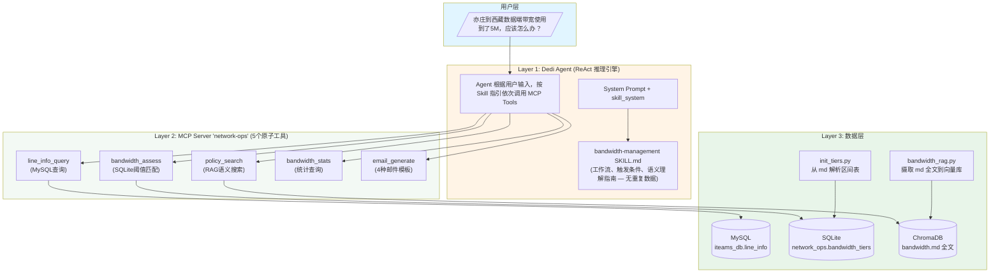
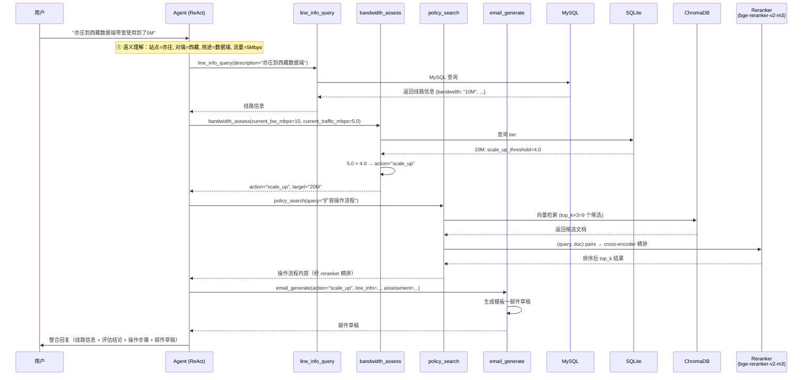
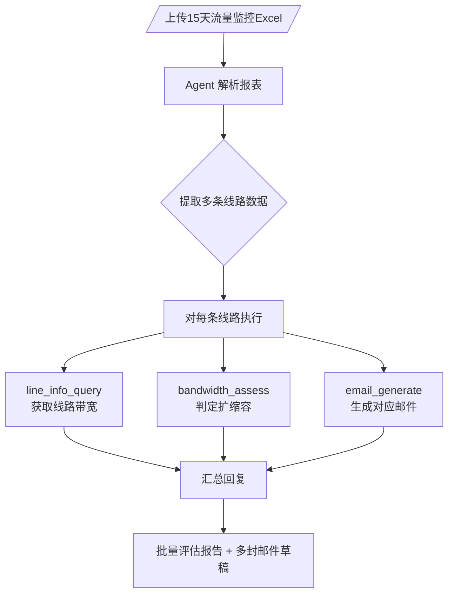
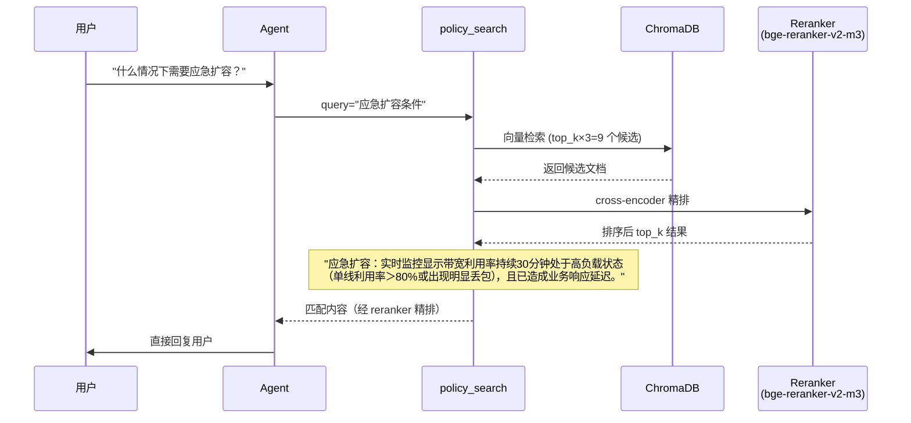
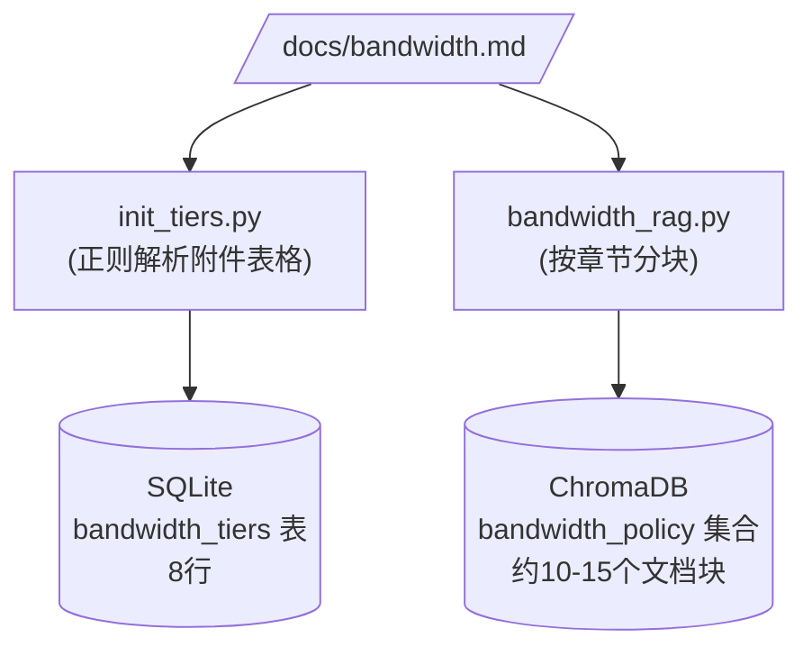

# 带宽管理系统架构设计文档

> **版本**: v1.1  
> **日期**: 2026-04-08  
> **状态**: 设计评审中  
> **数据源唯一真相**: [`docs/bandwidth.md`](./bandwidth.md)

---

## 目录

1. [背景与目标](#1-背景与目标)
2. [架构总览](#2-架构总览)
3. [数据层设计](#3-数据层设计)
4. [MCP Server 设计](#4-mcp-server-设计)
5. [Skill 技能层设计](#5-skill-技能层设计)
6. [DeerFlow 集成路径](#6-deerflow-集成路径)
7. [文件结构](#7-文件结构)
8. [数据流与调用链路](#8-数据流与调用链路)
9. [迁移策略](#9-迁移策略)
10. [配置与部署](#10-配置与部署)

---

## 1. 背景与目标

### 1.1 现状问题

当前带宽管理功能以单体工具形式存在（`bandwidth_tool.py`，486行），存在以下问题：

| 问题 | 影响 |
|------|------|
| 带宽阈值表硬编码在 Python 代码中 | 策略变更需改代码重新部署 |
| RAG 数据在 `bandwidth_rag.py` 中硬编码 | 与 `docs/bandwidth.md` 策略文档不同步 |
| 工具与业务逻辑耦合 | 无法独立测试、无法被其他 Agent 复用 |
| 邮件模板只支持常态化扩容 | 缺少临时扩容、应急扩容、缩容三种场景 |

### 1.2 目标

将带宽管理功能重构为**三层解耦架构**：


**核心原则：`docs/bandwidth.md` 是唯一数据源（Single Source of Truth）**

- 策略全文 → ChromaDB RAG（语义搜索）
- 区间阈值表 → SQLite（精确匹配）
- 邮件模板（4种）→ 从 bandwidth.md 模板一~模板四提取
- Skill 文档不重复任何策略数据

### 1.3 约束

- 所有工具通过 MCP Server 注册，Agent 执行 ReAct 推理
- Agent 语义理解用户输入（一句话或报表），再调用工具链
- 技术栈：Python 3.12 + FastMCP 2.x + MySQL + SQLite + ChromaDB

---

## 2. 架构总览

### 2.1 三层架构



### 2.2 设计原则

| 原则 | 说明 |
|------|------|
| **单一数据源** | `docs/bandwidth.md` 是所有策略数据的唯一来源，代码中不硬编码 |
| **工具原子化** | 每个工具只做一件事，Agent 负责编排调用顺序 |
| **Skill 不重复数据** | Skill 文档只包含工作流和语义理解指南，策略细节通过 `policy_search` 获取 |
| **数据与逻辑分离** | 阈值表在 SQLite，策略文本在 ChromaDB，操作步骤在 RAG，工具只负责查询 |
| **模板全覆盖** | 邮件生成支持全部4种场景（常态化扩容、临时扩容、应急扩容、缩容） |

---

## 3. 数据层设计

### 3.1 数据源：bandwidth.md

`docs/bandwidth.md`（154行）包含以下结构化内容：

| 区域 | 行范围 | 内容 | 摄取方式 |
|------|--------|------|----------|
| 策略全文 | 1-62 | 概述、实施过程、角色职责、风险控制 | → ChromaDB RAG |
| 区间阈值表（附件） | 63-71 | 8档带宽 × 5列（当前/扩容阈值/扩容目标/缩容阈值/缩容目标） | → SQLite |
| 模板一 | 75-93 | 常态化扩容申请邮件格式 | → RAG + email_generate |
| 模板二 | 96-112 | 临时扩容申请邮件格式 | → RAG + email_generate |
| 模板三 | 115-132 | 应急扩容汇报邮件格式 | → RAG + email_generate |
| 模板四 | 135-153 | 缩容申请邮件格式 | → RAG + email_generate |

### 3.2 MySQL — 线路信息

**用途**: 存储专线线路基础数据，供 `line_info_query` 工具查询。

| 表名 | 说明 |
|------|------|
| `iteams_db.line_info` | 专线线路表，含 local_site、remote_name、service_provider、bandwidth、purpose 等字段 |

**查询方式**：
- 结构化参数查询（local_site, remote_name, provider 等）
- 自然语言查询（LLM 提取参数后转结构化查询）

### 3.3 SQLite — 带宽阈值区间表

**用途**: 存储从 `bandwidth.md` 附件解析的8档阈值表，供 `bandwidth_assess` 工具精确匹配。

**表结构**：

```sql
CREATE TABLE bandwidth_tiers (
    id                     INTEGER PRIMARY KEY,
    current_bw_mbps        INTEGER NOT NULL UNIQUE,  -- 当前带宽 (2/4/6/8/10/20/30/40)
    scale_up_threshold_mbps  REAL NOT NULL,            -- 扩容阈值 (P95流量的40%)
    scale_up_target_mbps   INTEGER NOT NULL,          -- 扩容目标带宽
    scale_down_threshold_mbps REAL,                    -- 缩容阈值 (下一档的35%)，NULL表示不缩容
    scale_down_target_mbps  INTEGER,                  -- 缩容目标带宽，NULL表示不缩容
    description            TEXT,                       -- 操作策略说明
    created_at             TIMESTAMP DEFAULT CURRENT_TIMESTAMP,
    updated_at             TIMESTAMP DEFAULT CURRENT_TIMESTAMP
);
```

**数据示例**（从 bandwidth.md 解析）：

| current_bw | scale_up_threshold | scale_up_target | scale_down_threshold | scale_down_target |
|------------|-------------------|-----------------|---------------------|-------------------|
| 2          | 0.8               | 4               | NULL                | NULL              |
| 4          | 1.6               | 6               | 0.7                 | 2                 |
| 10         | 4.0               | 20              | 2.8                 | 8                 |
| 40         | 16.0              | 50              | 10.5                | 30                |

**初始化方式**: `init_tiers.py` 读取 `docs/bandwidth.md`，正则解析附件表格，插入 SQLite。首次启动自动执行。

### 3.4 ChromaDB — 策略文档 RAG

**用途**: 将 `bandwidth.md` 全文按章节分块后嵌入向量库，供 `policy_search` 工具语义搜索。

**分块策略**：

按编号标题（`1. 概述`、`2.1. 前置条件`）和模板标题（`模板一：...`、`模板四：...`）切分为独立文档块。

**预期分块结果**：

| 章节 | 内容摘要 |
|------|----------|
| 1. 概述 | 编制目的、适用范围、原则、术语定义 |
| 2. 实施过程 | 前置条件、容量判定标准（扩容/缩容） |
| 2.3. 操作流程 | 常态化扩容流程、临时扩容流程、应急扩容流程、缩容流程 |
| 3. 角色与职责 | 一线运维职责、二线运维职责 |
| 4. 风险控制 | 保障期禁缩容、例外处理 |
| 附件 | 带宽配置标准对照表 |
| 模板一~四 | 4种邮件的完整格式模板 |

**嵌入模型**: Ollama `bge-m3:567m`（本地部署，1024 维）

**重排序模型**: `BAAI/bge-reranker-v2-m3`（FlagEmbedding cross-encoder，CPU 推理，sigmoid 归一化到 [0,1]）

**检索流程**: ChromaDB 向量检索 top_k×3 → Reranker 二次排序 → 返回 top_k 最终结果

**查询示例**：
- `"扩容操作流程"` → 返回 2.3 章节的常态化扩容步骤
- `"应急扩容条件"` → 返回 2.2 章节的应急扩容判定标准
- `"缩容邮件模板"` → 返回模板四的完整格式
- `"一线运维职责"` → 返回 3.1 章节的职责列表

---

## 4. MCP Server 设计

### 4.1 Server 概况

| 属性 | 值 |
|------|-----|
| 名称 | `network-ops` |
| 框架 | FastMCP 2.x |
| 传输方式 | stdio（DeerFlow 自动管理进程） |
| 入口文件 | `mcp-servers/network-ops/server.py` |

### 4.2 工具清单

#### 工具 1：`line_info_query` — 线路信息查询

**功能**: 从 MySQL `line_info` 表查询专线线路信息。

**参数**：

| 参数 | 类型 | 必填 | 说明 |
|------|------|------|------|
| local_site | string | 否 | 本端站点（模糊匹配），如 "亦庄" |
| remote_name | string | 否 | 对端名称（模糊匹配），如 "山东" |
| provider | string | 否 | 运营商（精确匹配）：电信/联通/移动 |
| purpose | string | 否 | 用途（模糊匹配）：数据端/管理端 |
| bandwidth | string | 否 | 带宽值（精确匹配），如 "10M" |
| description | string | 否* | 自然语言描述，如 "亦庄到西藏数据端电信线路" |

> *当仅提供 `description` 而无其他结构化参数时，使用 LLM 提取参数后查询。

**返回**: 线路信息列表，每条包含 id、local_site、remote_name、service_provider、bandwidth、purpose、local_line_number 等字段。

---

#### 工具 2：`bandwidth_assess` — 带宽评估

**功能**: 根据当前带宽档位和实际流量，从 SQLite 阈值表判断是否需要扩缩容。

**参数**：

| 参数 | 类型 | 必填 | 说明 |
|------|------|------|------|
| current_bw_mbps | int | 是 | 当前带宽档位（Mbps），如 10 |
| current_traffic_mbps | float | 是 | 当前 P95 流量（Mbps），如 5.0 |

**返回**：

```json
{
  "action": "scale_up",           // scale_up | scale_down | maintain | unknown
  "current_bw": "10 Mbps",
  "current_traffic_mbps": 5.0,
  "threshold_mbps": 4.0,
  "target_bw": "20 Mbps",
  "reasoning": "当前流量 5.0 Mbps 超过扩容阈值 4.0 Mbps，建议扩容到 20 Mbps"
}
```

**判定逻辑**（全部来自 SQLite，无硬编码）：

```
if current_traffic > scale_up_threshold → "scale_up"
if current_traffic < scale_down_threshold → "scale_down"
otherwise → "maintain"
```

---

#### 工具 3：`policy_search` — 策略文档语义搜索

**功能**: 对 `docs/bandwidth.md` 全文进行语义搜索，返回匹配章节。

**参数**：

| 参数 | 类型 | 必填 | 说明 |
|------|------|------|------|
| query | string | 是 | 搜索查询，如 "扩容操作流程"、"缩容判定标准" |
| k | int | 否 | 返回结果数量，默认 3 |

**返回**：

```json
[
  {
    "section": "2.3. 操作流程",
    "content": "常态化扩容流程\n1) 一线运维人员根据每日P95流量报表...",
    "score": 0.87
  }
]
```

**设计意图**: Skill 文档不重复策略数据，Agent 需要了解具体操作步骤、判定标准、角色职责时，通过此工具查询 RAG。

**Reranker 二次排序**: `policy_search` 在内部执行两阶段检索：
1. **向量召回**：从 ChromaDB 检索 top_k × 3 个候选文档（通过 `retrieval_multiplier` 控制过采样倍数）
2. **Cross-encoder 精排**：将 query 与每个候选文档组成 (query, doc) 对，由 `BAAI/bge-reranker-v2-m3` 计算相关性分数（sigmoid 归一化），取分数最高的 top_k 个返回

当 `RERANKER_ENABLED=false` 时，退化为纯向量检索模式。

---

#### 工具 4：`bandwidth_stats` — 带宽统计

**功能**: 查询带宽档位配置和线路数量统计。

**参数**：

| 参数 | 类型 | 必填 | 说明 |
|------|------|------|------|
| bandwidth | string | 否 | 按带宽筛选，如 "10M"。不传返回所有档位 |

**返回**：

```json
{
  "tiers": [
    {"current_bw_mbps": 2, "scale_up_threshold_mbps": 0.8, ...},
    {"current_bw_mbps": 10, "scale_up_threshold_mbps": 4.0, ...}
  ],
  "line_count": 15,
  "total_lines": 120
}
```

---

#### 工具 5：`email_generate` — 邮件草稿生成

**功能**: 根据评估结果生成邮件草稿，支持4种模板。

**参数**：

| 参数 | 类型 | 必填 | 说明 |
|------|------|------|------|
| action | string | 是 | "scale_up" 或 "scale_down" |
| line_info | dict | 是 | 线路信息（来自 `line_info_query` 返回） |
| assessment | dict | 是 | 评估结果（来自 `bandwidth_assess` 返回） |
| template_type | string | 否 | 扩容子类型："normal"/"temporary"/"emergency"，默认 "normal" |

**模板映射**：

| action | template_type | 对应模板 | 场景 |
|--------|--------------|----------|------|
| scale_up | normal | 模板一：常态化扩容 | 日常流量增长，P95 > 40% |
| scale_up | temporary | 模板二：临时扩容 | 重大活动/赛事保障 |
| scale_up | emergency | 模板三：应急扩容 | 突发故障/拥塞，P95 > 80% |
| scale_down | (忽略) | 模板四：缩容申请 | 流量 < 下一档35% |

**返回**：

```json
{
  "subject": "【专线扩容-常态化扩容申请】- 20260408",
  "recipients": ["李王昊"],
  "cc": ["潘处", "毅总", "许祎恒", "霍乾", "黄美华", "王亮", "一线", "二线", "值班经理", "商务"],
  "body": "各位领导/同事：\n\n【申请摘要】...",
  "attachments": ["15天流量趋势图", "P95统计报告"],
  "template_type": "normal"
}
```

---

## 5. Skill 技能层设计

### 5.1 文件结构

```
skills/custom/bandwidth-management/
├── SKILL.md               # 技能文档：工作流 + 触发条件 + 语义理解指南
└── bandwidth-policy.md    # docs/bandwidth.md 的副本，供 Agent read_file 参考
```

### 5.2 SKILL.md 内容边界

**包含（Skill 应有）**：
- ✅ 触发条件（什么用户输入激活此技能）
- ✅ 可用工具列表及用途说明
- ✅ 工作流程（流程A：一句话、流程B：报表、流程C：统计、流程D：策略咨询）
- ✅ 语义理解指南（"带宽使用到了5M" → 流量5Mbps）
- ✅ 注意事项（工具选择策略、数据源说明）

**不包含（Skill 不应有，通过工具获取）**：
- ❌ 带宽档位阈值表 → `bandwidth_assess` 工具自动查询 SQLite
- ❌ 操作流程步骤 → `policy_search` 工具查询 RAG
- ❌ 邮件模板格式 → `email_generate` 工具内置4种模板
- ❌ 角色职责说明 → `policy_search` 工具查询 RAG

### 5.3 Skill 加载机制

DeerFlow Skill 系统加载流程：

```
1. skills/loader.py 扫描 skills/custom/ 目录
2. 发现 bandwidth-management/SKILL.md
3. 解析 YAML frontmatter（name、description）
4. 注入到 Agent 的 system prompt 的 <skill_system> XML 块
5. Agent 根据用户输入匹配 Skill description 中的触发词
6. Agent 通过 read_file 加载完整 SKILL.md 后按流程执行
```

---

## 6. DeerFlow 集成路径

### 6.1 MCP Server 注册

**配置文件**: `extensions_config.json`（项目根目录）

```json
{
  "mcpServers": {
    "network-ops": {
      "enabled": true,
      "type": "stdio",
      "command": "python",
      "args": ["mcp-servers/network-ops/server.py"],
      "env": {
        "MYSQL_HOST": "host.docker.internal",
        "MYSQL_PORT": "3306",
        "MYSQL_USER": "$MYSQL_USER",
        "MYSQL_PASSWORD": "$MYSQL_PASSWORD",
        "MYSQL_DATABASE": "$MYSQL_DATABASE"
      },
      "description": "网络运维工具集：线路查询、带宽评估、策略搜索、统计查询、邮件生成"
    }
  }
}
```

### 6.2 MCP 工具加载链路

```
extensions_config.json
  → extensions_config.py (加载配置)
  → mcp/tools.py (MultiServerMCPClient 连接 MCP Server)
  → tools/tools.py (get_available_tools 合并 local + MCP + builtin)
  → Agent 可见所有 MCP 工具
```

### 6.3 旧工具移除

**config.yaml** 删除旧注册（约第434-437行）：

```yaml
# 删除以下内容：
- name: bandwidth_policy_query
  group: network
  use: deerflow.tools.bandwidth_tool:bandwidth_policy_query_tool
```

---

## 7. 文件结构

### 7.1 新增文件

```
mcp-servers/
└── network-ops/
    ├── server.py              # FastMCP 入口，注册5个工具
    ├── config.py              # 配置管理（MySQL/SQLite/ChromaDB）
    ├── db/
    │   ├── __init__.py
    │   ├── init_tiers.py      # 从 bandwidth.md 解析区间表 → SQLite
    │   ├── mysql_client.py    # MySQL 线路查询客户端
    │   └── sqlite_client.py   # SQLite 阈值查询客户端
    ├── rag/
    │   ├── __init__.py
    │   └── bandwidth_rag.py   # ChromaDB 摄取 bandwidth.md 全文
    ├── tools/
    │   ├── __init__.py
    │   ├── line_query.py      # line_info_query 工具
    │   ├── bandwidth_assess.py # bandwidth_assess 工具
    │   ├── policy_search.py   # policy_search 工具
    │   ├── bandwidth_stats.py # bandwidth_stats 工具
    │   └── email_generate.py  # email_generate 工具（4种模板）
    ├── requirements.txt
    └── README.md

skills/custom/
└── bandwidth-management/
    ├── SKILL.md               # 技能文档（无重复数据）
    └── bandwidth-policy.md    # bandwidth.md 副本
```

### 7.2 删除文件（迁移完成后）

```
backend/packages/harness/deerflow/tools/bandwidth_tool.py    # 旧单体工具
backend/packages/harness/deerflow/rag/bandwidth_db.py        # 旧 SQLite 客户端
backend/packages/harness/deerflow/rag/bandwidth_rag.py       # 旧 RAG（硬编码数据）
backend/packages/harness/deerflow/rag/line_info_provider.py  # 旧 MySQL 客户端
```

### 7.3 修改文件

| 文件 | 变更 |
|------|------|
| `config.yaml` | 删除 bandwidth_policy_query 工具注册 |
| `backend/packages/harness/deerflow/rag/__init__.py` | 移除 bandwidth 相关 import |

### 7.4 保留文件

| 文件 | 原因 |
|------|------|
| `docs/bandwidth.md` | 唯一数据源 |
| `backend/packages/harness/deerflow/config/network_ops_config.py` | 共享配置引用 |

---

## 8. 数据流与调用链路

### 8.1 典型场景：用户一句话输入

**用户**: "亦庄到西藏数据端带宽使用到了5M，应该怎么办？"



### 8.2 场景：报表批量处理

**用户**: [上传15天流量监控Excel]



### 8.3 场景：策略咨询

**用户**: "什么情况下需要应急扩容？"



### 8.4 数据摄取流程（首次启动）



---

## 9. 迁移策略

### 9.1 迁移阶段

| 阶段 | 内容 | 风险 |
|------|------|------|
| 阶段1：搭建 | 创建 MCP Server scaffold + 数据层 | 低 |
| 阶段2：迁移 | 逐个迁移5个工具 | 中（需测试每个工具） |
| 阶段3：Skill | 创建 Skill 文档 | 低 |
| 阶段4：集成 | 注册到 DeerFlow + E2E 验证 | 中 |
| 阶段5：清理 | 删除旧代码 | 高（需确认无遗漏引用） |

### 9.2 回滚方案

每个阶段独立提交 git commit，如出问题：
1. 回退 `extensions_config.json` 保留旧工具注册
2. 恢复 `config.yaml` 旧注册
3. MCP Server 和旧工具可暂时共存

### 9.3 代码迁移映射

| 旧文件 | 旧功能 | 新文件 | 新功能 |
|--------|--------|--------|--------|
| `tools/bandwidth_tool.py` L1-100 | MySQL 查询 | `mcp/.../db/mysql_client.py` | MySQL 客户端 |
| `tools/bandwidth_tool.py` L100-200 | 带宽评估（硬编码阈值） | `mcp/.../db/sqlite_client.py` + `init_tiers.py` | 从 md 解析到 SQLite |
| `tools/bandwidth_tool.py` L200-350 | RAG 查询（硬编码数据） | `mcp/.../rag/bandwidth_rag.py` | 摄取 md 到 ChromaDB |
| `tools/bandwidth_tool.py` L350-486 | 邮件生成（仅1种） | `mcp/.../tools/email_generate.py` | 4种模板 |
| `rag/bandwidth_db.py` | SQLite 硬编码种子 | `mcp/.../db/init_tiers.py` | 从 md 解析 |
| `rag/bandwidth_rag.py` | RAG 硬编码文本 | `mcp/.../rag/bandwidth_rag.py` | 从 md 摄取 |
| `rag/line_info_provider.py` | MySQL + LLM | `mcp/.../db/mysql_client.py` | 精简迁移 |

---

## 10. 配置与部署

### 10.1 环境变量

| 变量 | 说明 | 默认值 |
|------|------|--------|
| MYSQL_HOST | MySQL 主机 | host.docker.internal |
| MYSQL_PORT | MySQL 端口 | 3306 |
| MYSQL_USER | MySQL 用户 | (从 .env) |
| MYSQL_PASSWORD | MySQL 密码 | (从 .env) |
| MYSQL_DATABASE | MySQL 数据库 | iteams_db |
| SQLITE_DB_PATH | SQLite 数据库路径 | .deer-flow/db/network_ops.db |
| CHROMA_PERSIST_DIR | ChromaDB 持久化目录 | .deer-flow/vectors/bandwidth_policy |
| OLLAMA_BASE_URL | Ollama 嵌入模型地址 | http://host.docker.internal:11434 |
| RERANKER_MODEL | Reranker 模型名称 | BAAI/bge-reranker-v2-m3 |
| RERANKER_DEVICE | Reranker 推理设备 | cpu |
| RERANKER_ENABLED | 是否启用 Reranker | true |
| RERANKER_MAX_LENGTH | 最大序列长度 | 512 |
| RERANKER_RETRIEVAL_MULTIPLIER | 向量检索过采样倍数 | 3 |
| HF_HUB_OFFLINE | 离线模式（防止模型初始化时联网） | 1 |

### 10.2 依赖

```
# mcp-servers/network-ops/requirements.txt
fastmcp>=2.0
mysql-connector-python>=8.0
langchain-chroma>=0.1
langchain-ollama>=0.1
langchain-openai>=0.1
pydantic>=2.0
FlagEmbedding>=1.2
```

### 10.3 部署模式

**开发阶段**: stdio 模式，DeerFlow 自动启动 MCP Server 子进程

**生产阶段（可选）**: 切换到 SSE 模式，MCP Server 独立部署为 HTTP 服务

---

## 附录 A：带宽配置标准对照表

> 以下数据来源于 [`docs/bandwidth.md`](./bandwidth.md) 附件。运行时由 `init_tiers.py` 自动解析，不硬编码在代码中。

| 当前带宽 | 扩容阈值 (P95>40%) | 扩容目标 | 缩容阈值 (P95<下一档×35%) | 缩容目标 |
|----------|-------------------|----------|--------------------------|----------|
| 2 Mbps   | > 0.8 Mbps        | 4 Mbps   | -                        | -        |
| 4 Mbps   | > 1.6 Mbps        | 6 Mbps   | < 0.7 Mbps               | 2 Mbps   |
| 6 Mbps   | > 2.4 Mbps        | 8 Mbps   | < 1.4 Mbps               | 4 Mbps   |
| 8 Mbps   | > 3.2 Mbps        | 10 Mbps  | < 2.1 Mbps               | 6 Mbps   |
| 10 Mbps  | > 4.0 Mbps        | 20 Mbps  | < 2.8 Mbps               | 8 Mbps   |
| 20 Mbps  | > 8.0 Mbps        | 30 Mbps  | < 3.5 Mbps               | 10 Mbps  |
| 30 Mbps  | > 12.0 Mbps       | 40 Mbps  | < 7.0 Mbps               | 20 Mbps  |
| 40 Mbps  | > 16.0 Mbps       | 50 Mbps  | < 10.5 Mbps              | 30 Mbps  |

## 附录 B：实施计划

详细实施步骤见：[`docs/superpowers/plans/2026-04-08-bandwidth-mcp-skill-architecture.md`](./superpowers/plans/2026-04-08-bandwidth-mcp-skill-architecture.md)

共计 13 个任务：

| # | 任务 | 产出 |
|---|------|------|
| 1 | MCP Server scaffold | server.py, config.py, requirements.txt |
| 2 | MySQL 客户端迁移 | db/mysql_client.py |
| 3 | SQLite 客户端（从 md 解析） | db/init_tiers.py, db/sqlite_client.py |
| 4 | RAG（摄取 bandwidth.md） | rag/bandwidth_rag.py |
| 5 | line_info_query 工具 | tools/line_query.py |
| 6 | bandwidth_assess 工具 | tools/bandwidth_assess.py |
| 7 | bandwidth_stats 工具 | tools/bandwidth_stats.py |
| 8 | policy_search 工具 | tools/policy_search.py |
| 9 | email_generate 工具 | tools/email_generate.py |
| 10 | Skill 文档 | skills/custom/bandwidth-management/ |
| 11 | MCP Server 注册 | extensions_config.json, config.yaml |
| 12 | 旧代码清理 | 删除 bandwidth_tool.py 等 |
| 13 | 端到端验证 | 功能测试 |
