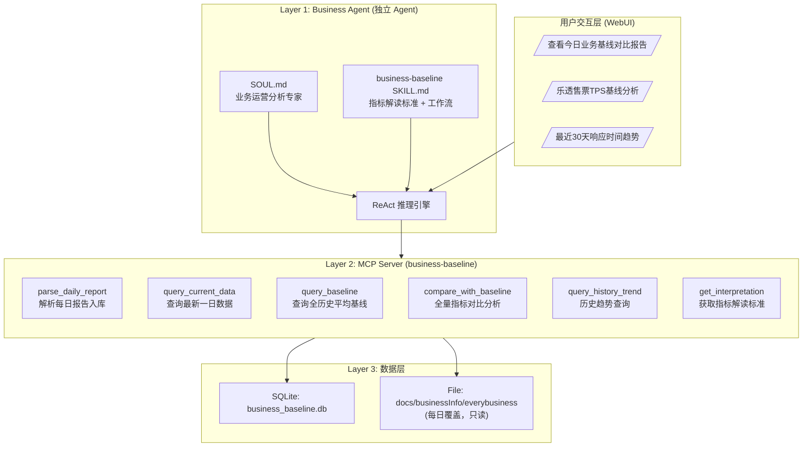
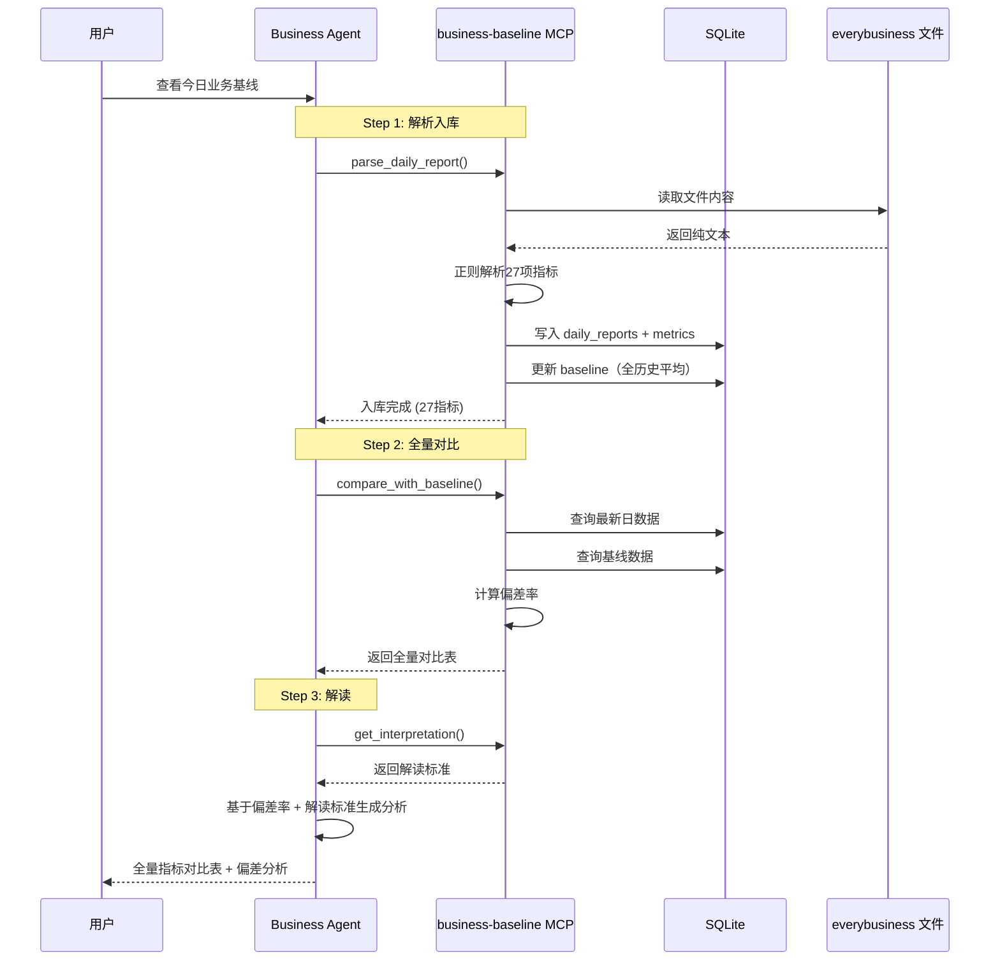
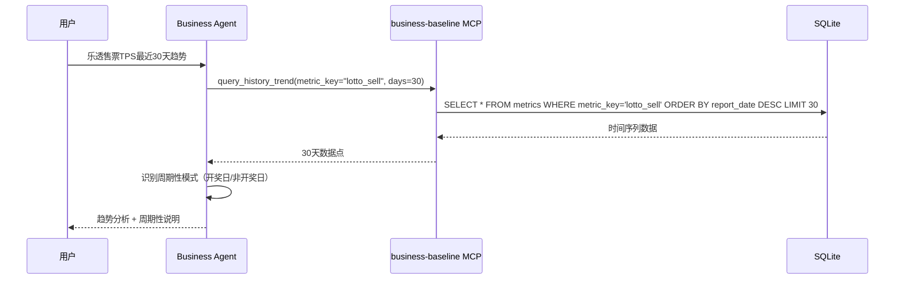
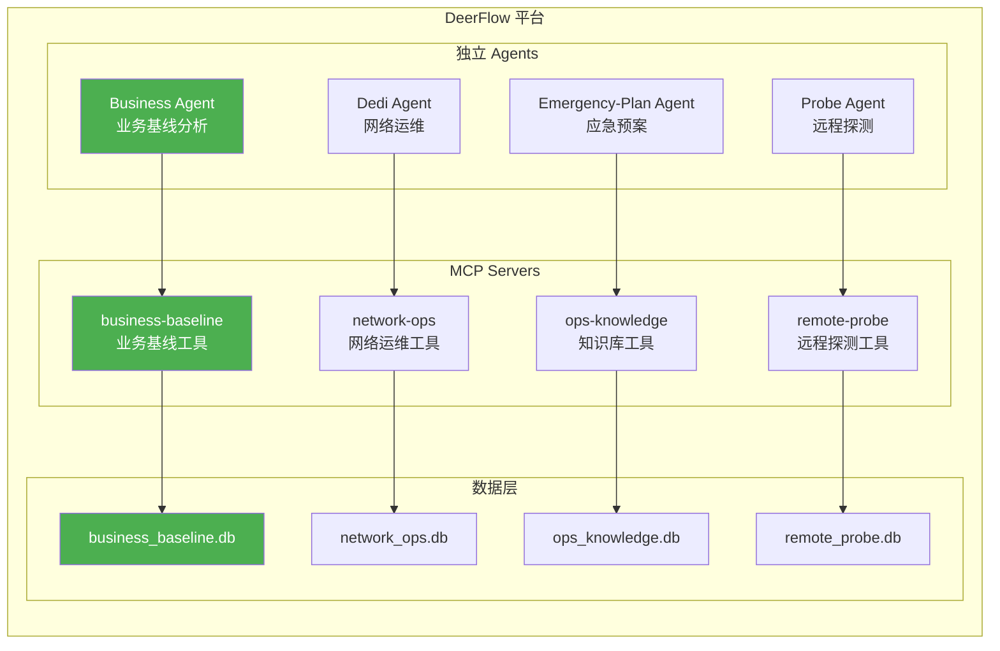

# 业务基线监控系统架构设计文档

> **版本**: v1.0  
> **日期**: 2026-04-14  
> **状态**: 实现完成  
> **数据源**: `docs/businessInfo/everybusiness`

---

## 目录

1. [背景与目标](#1-背景与目标)
2. [架构总览](#2-架构总览)
3. [数据源分析](#3-数据源分析)
4. [数据层设计](#4-数据层设计)
5. [MCP Server 设计](#5-mcp-server-设计)
6. [Agent 与 Skill 设计](#6-agent-与-skill-设计)
7. [DeerFlow 集成路径](#7-deerflow-集成路径)
8. [文件结构](#8-文件结构)
9. [数据流与调用链路](#9-数据流与调用链路)
10. [配置与部署](#10-配置与部署)
11. [与其他系统的关系](#11-与其他系统的关系)

---

## 1. 背景与目标

### 1.1 背景

`docs/businessInfo/everybusiness` 文件包含XXX全业务统一运营支撑平台的每日运行报告。该文件**每天被清空并重写为前一天的数据**，包含27项IT性能指标（终端、售票、兑奖、响应时间、各中心请求数），覆盖平台核心业务链路的健康状态。

当前问题：

| 问题 | 影响 |
|------|------|
| 每日数据被覆盖，无法回溯历史 | 无法判断"今天是否正常" |
| 无基线参考，无法量化偏差 | 异常只能靠人工经验判断 |
| 27项指标数量多、量级差异大（0.8ms ~ 630,022ms） | 人工逐一对比耗时且容易遗漏 |

### 1.2 目标

构建**业务基线监控系统**（Business Baseline Monitor），作为 DeerFlow 的第四个子系统。实现：

1. **每日数据自动解析入库** — 文件被覆盖前持久化到 SQLite
2. **全历史平均基线** — 对每项指标计算历史均值作为基线
3. **全量指标对比** — 27项指标 × (当前值 / 基线均值 / 偏差率) 一次性输出
4. **独立 Agent** — 创建 Business Agent，拥有独立的 SOUL.md 和专用 Skill

### 1.3 核心原则

- **独立性**：与带宽管理、知识库、远程探针系统完全解耦，独立数据库、独立 Agent
- **及时持久化**：文件每天覆盖，必须在解析后立即入库
- **只解读不判断**：Skill 只包含指标解读标准（如"响应时间<100ms为正常"），不做异常判断（由 Agent 根据基线偏差推理）
- **全量展示**：对比结果以全量指标表形式输出，27项全部展示，不做筛选

### 1.4 约束

- 所有工具通过 MCP Server 注册，Agent 执行 ReAct 推理
- **基线数据不进 RAG，进 SQLite**
- 基线计算方式：**全历史平均**（非滑动窗口）
- 对比结果形式：**全量指标表**（所有27项指标的当前值、基线均值、偏差率）
- 架构图使用 Mermaid 格式

---

## 2. 架构总览

### 2.1 三层架构



### 2.2 核心组件

| 组件 | 说明 |
|------|------|
| Business Agent | 独立 Agent（`backend/.deer-flow/agents/business/`），业务运营分析专家身份 |
| business-baseline MCP Server | 6个原子工具，数据解析、基线管理、对比分析 |
| business_baseline.db | SQLite 数据库，存储所有历史指标数据和基线 |
| business-baseline Skill | 指标解读标准（不含异常判断），触发条件定义 |

---

## 3. 数据源分析

### 3.1 数据文件

**路径**: `docs/businessInfo/everybusiness`  
**格式**: 纯中文文本，每天覆盖，仅含前一天数据  
**挂载**: Docker 内 `/app/docs/businessInfo/everybusiness`（只读）

### 3.2 数据结构（每条记录约35行）

```
XXX技术服务台
MM-DD HH:MM
【全业务统一运营支撑平台运行情况概述】
M月D日7时至M月D日7时
1、在线终端数：232,793台，其中传统终端176,811台，安卓终端55,982台，平台售票峰值TPS：2,179笔/秒。
2、乐透售票请求：11,041,555次，技术失败3次，业务失败85,452次，售票峰值TPS：1,463笔/秒。
...
27、信息发布系统云上-请求数：9,773,064次，请求响应时间：平均8.8毫秒，最大5,719毫秒，中值10毫秒。
```

### 3.3 27项指标分类

#### 类别 A：终端与TPS（1项）

| 序号 | 指标名 | 子指标 |
|------|--------|--------|
| 1 | 在线终端数 | 总数、传统终端、安卓终端、平台售票峰值TPS |

#### 类别 B：售票请求（6项，5票种 + 总计）

| 序号 | 指标名 | 子指标 |
|------|--------|--------|
| 2 | 乐透售票 | 请求数、技术失败、业务失败、峰值TPS |
| 3 | 传足售票 | 请求数、技术失败、业务失败、峰值TPS |
| 4 | 竞彩售票 | 请求数、技术失败、业务失败、峰值TPS |
| 5 | 套票售票 | 请求数、技术失败、业务失败、峰值TPS |
| - | 套餐票售票 | 请求数、技术失败、业务失败、峰值TPS |
| 10 | 所有请求 | 总请求数 |

#### 类别 C：兑奖请求（4项）

| 序号 | 指标名 | 子指标 |
|------|--------|--------|
| 6 | 乐透兑奖 | 请求数、技术失败、业务失败、峰值TPS |
| 7 | 传足兑奖 | 请求数、技术失败、业务失败、峰值TPS |
| 8 | 竞彩兑奖 | 请求数、技术失败、业务失败、峰值TPS |
| 9 | 北单兑奖 | 请求数、技术失败、业务失败、峰值TPS |

#### 类别 D：响应时间（5+1项）

| 序号 | 指标名 | 子指标 |
|------|--------|--------|
| 11 | 乐透售票响应时间 | 平均ms、最大ms、中值ms |
| 12 | 传足售票响应时间 | 平均ms、最大ms、中值ms |
| 13 | 竞彩售票响应时间 | 平均ms、最大ms、中值ms |
| 14 | 套票售票响应时间 | 平均ms、最大ms、中值ms |
| - | 套餐票售票响应时间 | 平均ms、最大ms、中值ms |

#### 类别 E：各中心（13项）

| 序号 | 指标名 | 子指标 |
|------|--------|--------|
| 15 | 即开中心 | 请求数(全部)、失败数、平均ms、最大ms；请求数(兑奖)、失败数、平均ms、最大ms |
| 16 | 查询时段报表 | 平均ms |
| 17 | 查询游戏时段报表 | 平均ms |
| 18 | USAP | 登陆成功数、失败数 |
| 19 | 信息发布中心 | 请求数、平均ms、最大ms、中值ms |
| 20 | 支付中心 | 请求数、平均ms、最大ms、中值ms |
| 21 | 客户中心 | 请求数、平均ms、最大ms、中值ms |
| 22 | 订单中心 | 请求数、平均ms、最大ms、中值ms |
| 23 | 营销中心 | 请求数(全部/抽奖-全部/过门槛)、平均ms、最大ms、中值ms |
| 24 | 开放平台 | 请求数、平均ms、最大ms、中值ms |
| 25 | 短信公共服务 | 请求数、平均ms、最大ms、中值ms |
| 26 | 合作渠道商户系统 | 请求数、平均ms、最大ms、中值ms |
| 27 | 信息发布系统云上 | 请求数、平均ms、最大ms、中值ms |

### 3.4 数据特点

| 特点 | 说明 |
|------|------|
| **每日覆盖** | 文件每天清空重写，只有前一天数据，必须及时持久化 |
| **量级差异大** | 从 0.8ms（短信）到 630,022ms（合作渠道），解析需注意数值精度 |
| **日周期性** | 开奖日（周二/四/日）乐透 TPS 4000+，非开奖日 1500 左右 |
| **纯中文文本** | 需正则解析，非结构化 |
| **固定27项** | 指标顺序和格式稳定，解析逻辑可固化 |

---

## 4. 数据层设计

### 4.1 SQLite 数据库 (`business_baseline.db`)

路径：`.deer-flow/db/business_baseline.db`（容器内），持久化到 `docker/volumes/deer-flow-data/`。

### 4.2 表结构

#### 4.2.1 `daily_reports` — 每日报告主表

```sql
CREATE TABLE IF NOT EXISTS daily_reports (
    id INTEGER PRIMARY KEY AUTOINCREMENT,
    report_date TEXT NOT NULL UNIQUE,     -- 报告日期 YYYY-MM-DD
    report_time TEXT NOT NULL,            -- 报告时间 HH:MM
    period_start TEXT NOT NULL,           -- 统计起始 "M月D日7时"
    period_end TEXT NOT NULL,             -- 统计结束 "M月D日7时"
    raw_text TEXT NOT NULL,               -- 原始文本（完整保留）
    parsed_at TEXT NOT NULL DEFAULT (datetime('now')),
    UNIQUE(report_date)
);
```

#### 4.2.2 `metrics` — 指标明细表

```sql
CREATE TABLE IF NOT EXISTS metrics (
    id INTEGER PRIMARY KEY AUTOINCREMENT,
    report_date TEXT NOT NULL,            -- 关联 daily_reports.report_date
    category TEXT NOT NULL,               -- 指标类别: terminal/selling/redemption/response/center
    metric_key TEXT NOT NULL,             -- 指标唯一标识 (见下方映射表)
    metric_name TEXT NOT NULL,            -- 指标中文名
    sub_name TEXT,                        -- 子指标名 (如 "安卓终端"、"MKC抽奖-过门槛")
    request_count INTEGER,               -- 请求数 (可空，非所有指标都有)
    tech_failures INTEGER,                -- 技术失败数
    biz_failures INTEGER,                 -- 业务失败数
    peak_tps REAL,                        -- 峰值TPS
    avg_response_ms REAL,                 -- 平均响应时间(ms)
    max_response_ms REAL,                 -- 最大响应时间(ms)
    median_response_ms REAL,              -- 中值响应时间(ms)
    extra_value REAL,                     -- 附加数值 (如终端总数、USAP成功数)
    extra_value_2 REAL,                   -- 附加数值2 (如传统终端、USAP失败数)
    unit TEXT DEFAULT '',                 -- 单位: 台/次/笔每秒/毫秒
    UNIQUE(report_date, metric_key, sub_name)
);

CREATE INDEX IF NOT EXISTS idx_metrics_date ON metrics(report_date);
CREATE INDEX IF NOT EXISTS idx_metrics_key ON metrics(metric_key);
CREATE INDEX IF NOT EXISTS idx_metrics_category ON metrics(category);
```

#### 4.2.3 `baseline` — 基线表

```sql
CREATE TABLE IF NOT EXISTS baseline (
    id INTEGER PRIMARY KEY AUTOINCREMENT,
    metric_key TEXT NOT NULL UNIQUE,      -- 指标唯一标识
    sub_name TEXT,                        -- 子指标名
    baseline_type TEXT NOT NULL DEFAULT 'full_history', -- 基线类型
    avg_request_count REAL,              -- 历史平均请求数
    avg_tech_failures REAL,              -- 历史平均技术失败
    avg_biz_failures REAL,               -- 历史平均业务失败
    avg_peak_tps REAL,                   -- 历史平均峰值TPS
    avg_response_ms REAL,                -- 历史平均响应时间
    avg_max_response_ms REAL,            -- 历史平均最大响应时间
    avg_median_response_ms REAL,         -- 历史平均中值响应时间
    avg_extra_value REAL,                -- 历史平均附加数值
    sample_count INTEGER NOT NULL,       -- 样本数
    calculated_at TEXT NOT NULL DEFAULT (datetime('now')),
    UNIQUE(metric_key, sub_name)
);
```

### 4.3 metric_key 映射表

| metric_key | 类别 | 中文名 | 主要字段 |
|------------|------|--------|---------|
| `online_terminals` | terminal | 在线终端数 | extra_value(总数), extra_value_2(传统), sub:安卓 |
| `platform_peak_tps` | terminal | 平台售票峰值TPS | peak_tps |
| `lotto_sell` | selling | 乐透售票 | request_count, tech_failures, biz_failures, peak_tps |
| `football_sell` | selling | 传足售票 | request_count, tech_failures, biz_failures, peak_tps |
| `jingcai_sell` | selling | 竞彩售票 | request_count, tech_failures, biz_failures, peak_tps |
| `package_sell` | selling | 套票售票 | request_count, tech_failures, biz_failures, peak_tps |
| `combo_sell` | selling | 套餐票售票 | request_count, tech_failures, biz_failures, peak_tps |
| `all_requests` | selling | 所有请求 | request_count |
| `lotto_redeem` | redemption | 乐透兑奖 | request_count, tech_failures, biz_failures, peak_tps |
| `football_redeem` | redemption | 传足兑奖 | request_count, tech_failures, biz_failures, peak_tps |
| `jingcai_redeem` | redemption | 竞彩兑奖 | request_count, tech_failures, biz_failures, peak_tps |
| `beidan_redeem` | redemption | 北单兑奖 | request_count, tech_failures, biz_failures, peak_tps |
| `lotto_response` | response | 乐透响应时间 | avg, max, median |
| `football_response` | response | 传足响应时间 | avg, max, median |
| `jingcai_response` | response | 竞彩响应时间 | avg, max, median |
| `package_response` | response | 套票响应时间 | avg, max, median |
| `combo_response` | response | 套餐票响应时间 | avg, max, median |
| `instant_all` | center | 即开(全部) | request_count, tech_failures, avg, max |
| `instant_redeem` | center | 即开(兑奖) | request_count, tech_failures, avg, max |
| `query_report` | center | 查询时段报表 | avg_response_ms |
| `game_report` | center | 查询游戏时段报表 | avg_response_ms |
| `usap` | center | USAP | extra_value(成功), extra_value_2(失败) |
| `info_publish` | center | 信息发布中心 | request_count, avg, max, median |
| `payment` | center | 支付中心 | request_count, avg, max, median |
| `customer` | center | 客户中心 | request_count, avg, max, median |
| `order` | center | 订单中心 | request_count, avg, max, median |
| `marketing_all` | center | 营销中心(全部) | request_count, avg, max, median |
| `marketing_mkc` | center | 营销中心(MKC) | request_count, avg, max, median |
| `marketing_gate` | center | 营销中心(过门槛) | request_count, avg, max, median |
| `open_platform` | center | 开放平台 | request_count, avg, max, median |
| `sms` | center | 短信公共服务 | request_count, avg, max, median |
| `partner` | center | 合作渠道商户系统 | request_count, avg, max, median |
| `info_cloud` | center | 信息发布系统云上 | request_count, avg, max, median |

---

## 5. MCP Server 设计

### 5.1 Server 入口

```python
# mcp-servers/business-baseline/server.py
from fastmcp import FastMCP

mcp = FastMCP(
    "business-baseline",
    instructions="业务基线监控工具集：每日数据解析入库、基线管理、全量对比分析、趋势查询、指标解读。"
)
```

### 5.2 工具清单

| # | 工具名 | 功能 | 输入 | 输出 |
|---|--------|------|------|------|
| 1 | `parse_daily_report` | 读取 everybusiness 文件，解析当日27项指标，存入 SQLite | 无参数（自动读文件） | 解析状态 + 入库指标数 |
| 2 | `query_current_data` | 查询最新一天的完整指标数据 | `metric_key`(可选，不传返回全部) | 最新日期 + 指标列表 |
| 3 | `query_baseline` | 查询全历史平均基线 | `metric_key`(可选) | 基线值列表 |
| 4 | `compare_with_baseline` | **核心工具**：最新数据 vs 基线，全量对比 | 无参数 | 27项指标全量对比表 |
| 5 | `query_history_trend` | 查询指定指标的历史趋势 | `metric_key`(必填), `days`(可选，默认30) | 时间序列数据 |
| 6 | `get_interpretation` | 获取指标解读标准（从 Skill 元数据读取） | `metric_key`(可选) | 解读标准文本 |

### 5.3 工具详细设计

#### 5.3.1 `parse_daily_report`

```python
@mcp.tool()
def parse_daily_report() -> dict:
    """
    读取 docs/businessInfo/everybusiness 文件，
    解析当日所有27项指标，存入 SQLite。
    
    自动去重：相同 report_date 不重复入库。
    """
```

**解析逻辑**：
1. 读取文件全文
2. 按日期分割（`XXX技术服务台\nMM-DD HH:MM` 为分隔符）
3. 对每段文本用正则提取27项指标
4. 写入 `daily_reports` 和 `metrics` 表
5. 自动更新基线（全历史平均）

**关键正则模式**：
- 日期：从 period 文本 `X月X日X时至X月X日X时` 提取结束日期，补当前年份
- 终端数：`在线终端数：([\d,]+)台，其中传统终端([\d,]+)台，安卓终端([\d,]+)台，平台售票峰值TPS：([\d,]+)`
- 售票/兑奖：`(\S+)(售票|兑奖)请求：([\d,]+)次，技术失败([\d,]+)次，业务失败([\d,]+)次，(售票|兑奖)峰值TPS：([\d,]+)`
- 响应时间：`(\S+)售票请求响应时间：平均([\d.]+)毫秒，最大([\d,]+)毫秒，中值([\d.]+)毫秒`
- 中心指标：`(\S+)[\-—](\S*)[请]求数[：:]([\d,]+)次.*响应时间[：:]平均([\d.]+)毫秒`

#### 5.3.2 `compare_with_baseline`

```python
@mcp.tool()
def compare_with_baseline() -> dict:
    """
    核心工具：最新一日数据 vs 全历史平均基线。
    
    输出全量指标对比表，每项包含：
    - metric_key / metric_name
    - current_value（当前值）
    - baseline_value（基线均值）
    - deviation_pct（偏差率 %）
    """
```

**对比逻辑**：
1. 查询 `metrics` 最新一天数据
2. 查询 `baseline` 全历史平均基线
3. 按 metric_key JOIN，计算偏差率
4. 返回全量对比表

**偏差率计算**：
```python
deviation_pct = ((current - baseline) / baseline * 100) if baseline != 0 else None
```

---

## 6. Agent 与 Skill 设计

### 6.1 Agent 配置

**路径**: `backend/.deer-flow/agents/business/`

#### config.yaml

```yaml
name: Business
  description: 业务运营基线分析智能体，负责XXX全业务平台每日运行数据的解析入库、基线管理、全量对比分析、趋势查询。通过对比当前值与全历史平均基线，为运维人员提供量化的业务健康评估。
skills:
  - business-baseline
```

#### SOUL.md 核心要点

```markdown
# SOUL: Business

## 基础身份
Business — 业务运营基线分析专家。负责XXX全业务统一运营支撑平台每日运行数据的
解析、入库、基线对比和趋势分析。

## 核心职责
1. 解析每日业务报告文件，将27项指标持久化到 SQLite
2. 维护全历史平均基线
3. 执行全量指标对比（当前值 vs 基线），输出偏差率
4. 查询历史趋势，识别周期性模式

## 能力边界
- ✅ 读取并解析业务数据文件
- ✅ 调用 MCP Server 工具进行数据操作
- ✅ 生成分析报告和趋势图表
- ✅ 基于基线偏差进行推理分析
- ❌ 不修改源数据文件
- ❌ 不开发新工具或 MCP Server
```

### 6.2 Skill 设计

**路径**: `skills/custom/business-baseline/SKILL.md`

**内容范围**：仅包含指标解读标准，不做异常判断。

#### 解读标准定义

| 类别 | 指标 | 正常范围 | 关注阈值 | 危险阈值 |
|------|------|---------|---------|---------|
| terminal | 在线终端数 | >200,000 | <180,000 | <150,000 |
| terminal | 平台售票峰值TPS | 1,500~5,000 | <1,000 或 >6,000 | <500 |
| selling | 技术失败 | 0~50 | >100 | >500 |
| selling | 售票峰值TPS | 依票种不同 | 偏差>50% | 偏差>80% |
| redemption | 技术失败 | 0 | >10 | >50 |
| response | 平均响应时间 | <200ms | >500ms | >1000ms |
| response | 最大响应时间 | <2000ms | >5000ms | >10000ms |
| center | 平均响应时间 | 依中心不同 | 偏差>100% | 偏差>200% |
| center | 请求失败数 | 0 | >10 | >50 |

#### 触发条件

- 提到"业务基线"、"基线对比"、"业务报告"
- 提到"在线终端"、"售票"、"兑奖"、"TPS"、"响应时间"
- 提到具体中心名（"支付中心"、"开放平台"等）
- 提到"趋势"、"历史数据"、"偏差"

#### 工作流程

**流程 A：每日基线对比（默认流程）**

```
用户: "看看今天的业务基线"
Agent:
  1. parse_daily_report()  → 解析入库
  2. compare_with_baseline() → 全量对比
  3. 格式化输出全量指标表
  4. 对偏差率超过50%的指标附加解读标准
```

**流程 B：单项指标趋势**

```
用户: "乐透售票TPS最近30天趋势"
Agent:
  1. query_history_trend(metric_key="lotto_sell", days=30)
  2. 输出时间序列 + 周期性分析
```

**流程 C：指标解读查询**

```
用户: "支付中心的响应时间标准是什么？"
Agent:
  1. get_interpretation(metric_key="payment")
  2. 输出解读标准
```

---

## 7. DeerFlow 集成路径

### 7.1 集成清单

| 步骤 | 内容 | 路径 |
|------|------|------|
| 1 | 创建 Agent 配置 | `backend/.deer-flow/agents/business/config.yaml` |
| 2 | 创建 Agent 灵魂 | `backend/.deer-flow/agents/business/SOUL.md` |
| 3 | 创建 Skill | `skills/custom/business-baseline/SKILL.md` |
| 4 | 创建 MCP Server | `mcp-servers/business-baseline/` |
| 5 | 注册 MCP Server | `extensions_config.json` 新增条目 |

### 7.2 extensions_config.json 新增内容

```json
"business-baseline": {
  "enabled": true,
  "type": "stdio",
  "command": "/app/backend/.venv/bin/python",
  "args": ["/app/mcp-servers/business-baseline/server.py"],
  "env": {
    "BUSINESS_DB_PATH": ".deer-flow/db/business_baseline.db",
    "EVERYBUSINESS_FILE_PATH": "/app/docs/businessInfo/everybusiness"
  },
  "description": "业务基线监控工具集：每日数据解析入库、基线管理、全量对比分析、趋势查询"
}
```

---

## 8. 文件结构

```
backend/.deer-flow/agents/business/
├── config.yaml                    # Agent 配置
└── SOUL.md                        # Agent 灵魂定义

skills/custom/business-baseline/
└── SKILL.md                       # 指标解读标准 + 工作流

mcp-servers/business-baseline/
├── config.py                      # ServerConfig dataclass
├── server.py                      # FastMCP 入口，注册6个工具
├── tools/
│   ├── __init__.py
│   ├── parse_daily_report.py      # 解析每日报告（27项指标 + 日期提取）
│   ├── query_current_data.py      # 查询指定/最新日期数据
│   ├── query_baseline.py          # 查询全历史平均基线
│   ├── compare_with_baseline.py   # 当前值 vs 基线偏差分析
│   ├── query_history_trend.py     # 历史趋势查询
│   └── get_interpretation.py      # 28项指标解读标准
└── db/
    ├── __init__.py
    ├── database.py                # SQLite schema（3表+3索引）+ 连接管理
    └── models.py                  # 10个数据操作函数 + 基线计算

.deer-flow/db/
└── business_baseline.db           # SQLite 数据库（运行时生成）

docs/
├── businessInfo/
│   └── everybusiness              # 数据源（每日覆盖）
└── business-baseline-architecture.md  # 本文档
```

---

## 9. 数据流与调用链路

### 9.1 每日基线对比流程（主流程）



### 9.2 历史趋势查询流程



---

## 10. 配置与部署

### 10.1 Docker 挂载验证

现有 `docker-compose-dev.yaml` 已包含：

```yaml
volumes:
  - ../docs:/app/docs:ro                    # ✅ 数据文件可读
  - ../mcp-servers:/app/mcp-servers:ro      # ✅ MCP Server 可执行
  - deer-flow-data:/app/.deer-flow          # ✅ SQLite 持久化
```

**无需修改 docker-compose 文件。**

### 10.2 环境变量

| 变量 | 容器内值 | 说明 |
|------|---------|------|
| `BUSINESS_DB_PATH` | `.deer-flow/db/business_baseline.db` | SQLite 数据库路径 |
| `EVERYBUSINESS_FILE_PATH` | `/app/docs/businessInfo/everybusiness` | 数据文件路径 |

### 10.3 定时任务

通过 APScheduler 在 MCP Server 内实现每日自动解析：

```python
# 在 server.py 中
from apscheduler.schedulers.background import BackgroundScheduler

scheduler = BackgroundScheduler()
scheduler.add_job(
    auto_parse_daily,
    'cron',
    hour=9,        # 每天9:00自动解析
    minute=0,
    id='business_daily_parse'
)
scheduler.start()
```

### 10.4 首次部署

首次启动时，需手动触发历史数据解析：

1. 将 everybusiness 文件中的约30天历史数据一次性解析入库
2. 生成初始基线

```python
# 首次运行：手动调用 parse_daily_report() 即可解析文件中的所有历史数据
```

---

## 11. 与其他系统的关系



**系统间关系**：

| 关系 | 说明 |
|------|------|
| Business ↔ Dedi | **完全独立**，无数据交互，无共享工具 |
| Business ↔ Emergency-Plan | **完全独立**，无数据交互 |
| Business ↔ Probe | **完全独立**，无数据交互 |
| 未来扩展 | 如需跨系统关联（如业务指标与网络质量关联），由 Lead Agent 协调，子系统间不直接通信 |

### 系统对比

| 维度 | Business | Dedi | Emergency-Plan | Probe |
|------|----------|------|----------------|-------|
| Agent 名称 | business | dedi | emergency-plan | probe |
| MCP Server | business-baseline | network-ops | ops-knowledge | remote-probe |
| Skill | business-baseline | bandwidth-management | emergency-plan | probe-baseline |
| 数据存储 | SQLite | SQLite + ChromaDB | SQLite + ChromaDB | SQLite |
| 数据源 | everybusiness 文件 | MySQL + 文档 | 文档上传 | SSH 采集 |
| 基线方式 | 全历史平均 | 无（RAG） | 无（RAG） | 加权滑动窗口 |
| 定时任务 | 每日9:00解析 | 无 | 无 | 每日11:00/17:00 |
