# 运维知识库系统架构设计文档

> **版本**: v1.1  
> **日期**: 2026-04-11  
> **状态**: 设计评审中  
> **原始文档存放**: `docs/ops-knowledge/raw/`

---

## 目录

1. [背景与目标](#1-背景与目标)
2. [架构总览](#2-架构总览)
3. [数据层设计](#3-数据层设计)
4. [MCP Server 设计](#4-mcp-server-设计)
5. [Skill 技能层设计](#5-skill-技能层设计)
6. [DeerFlow 集成路径](#6-deerflow-集成路径)
7. [文件结构](#7-文件结构)
8. [数据流与调用链路](#8-数据流与调用链路)
9. [文档入库与更新策略](#9-文档入库与更新策略)
10. [配置与部署](#10-配置与部署)
11. [与带宽管理系统的关系](#11-与带宽管理系统的关系)

---

## 1. 背景与目标

### 1.1 现状问题

数据中心网络运维面临知识分散、检索困难的问题：

| 问题 | 影响 |
|------|------|
| 历史故障案例散落在各处（Word/PDF/Excel/文本） | 遇到类似故障时无法快速借鉴历史经验 |
| SOP、应急预案无统一存储 | 紧急场景下手忙脚乱找文档 |
| 设备厂商各异（华为/华三/F5/深信服/神州云科/山石） | 缺乏按厂商、设备类型的分类检索能力 |
| 文档更新无版本管理 | 过期SOP/预案仍在使用 |

### 1.2 目标

构建**运维知识库系统**，与已实现的带宽管理系统保持一致的三层解耦架构：

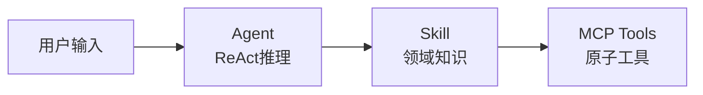

**核心能力：**

- 多格式文档解析入库（PDF/Word/TXT/MD/Excel/CSV）
- 语义检索 + 元数据过滤（按类型/厂商/设备）
- 文档版本自动覆盖更新
- 与带宽管理共享同一个 dedi agent，统一入口

### 1.3 约束

- 所有工具通过 MCP Server 注册，Agent 执行 ReAct 推理
- 与带宽管理系统共用 dedi agent，不新建 agent
- 每个子系统的 RAG collection 相互隔离，互不干扰
- 外部采集的配置/运行数据不入知识库 RAG（仅限运维经验/规范文档）
- 技术栈：Python 3.12 + FastMCP 2.x + ChromaDB + SQLite

---

## 2. 架构总览

### 2.1 三层架构（与带宽管理对称）

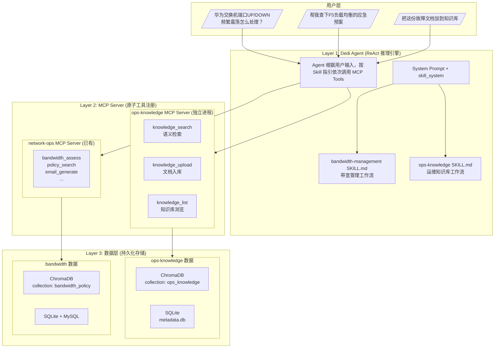

### 2.2 架构设计原则

| 原则 | 说明 |
|------|------|
| RAG 隔离 | 每个子系统独立 ChromaDB collection，互不干涉 |
| MCP Server 独立 | 每个子系统独立 MCP Server 进程，职责清晰 |
| Agent 统一 | 所有子系统共用 dedi agent，一个入口 |
| 数据与逻辑分离 | 原始文档在 `raw/` 目录，RAG/SQLite 是索引层 |
| 配置外置 | 所有配置支持环境变量覆盖，不硬编码 |
| 工具原子化 | 每个工具只做一件事，可独立测试 |

### 2.3 与带宽管理系统的架构对比

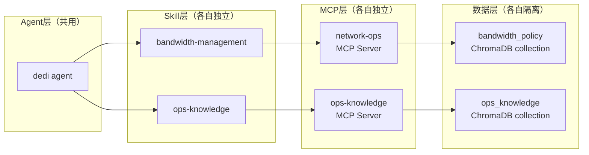

---

## 3. 数据层设计

### 3.1 ChromaDB — `ops_knowledge` collection

运维知识库使用独立的 ChromaDB collection，与带宽管理的 `bandwidth_policy` collection 完全隔离。

每个文档被分块后存入 ChromaDB，每个 chunk 携带以下 metadata：

| metadata 字段 | 说明 | 示例 |
|---------------|------|------|
| `doc_id` | 文档唯一标识 | `fault-2024-001` |
| `doc_type` | 文档类型 | `fault` / `sop` / `emergency_system` / `emergency_network` / `emergency_security` / `solution` / `event` |
| `device_vendor` | 设备厂商（可选） | `huawei` / `h3c` / `f5` / `sangfor` / `dcn` / `hillstone` |
| `device_type` | 设备类型（可选） | `switch` / `router` / `firewall` / `loadbalancer` |
| `source_file` | 原始文件名 | `华为交换机故障案例2024.pdf` |
| `chunk_index` | 当前chunk序号 | `3` |
| `total_chunks` | 总chunk数 | `8` |
| `upload_date` | 入库日期 | `2026-04-11` |

### 3.2 SQLite — 文档元数据

SQLite 存储文档级别的元数据和操作日志，提供精确查询能力（RAG 不擅长的部分）。

#### documents 表 — 文档注册信息

| 字段 | 类型 | 说明 |
|------|------|------|
| `doc_id` | TEXT PK | 文档唯一标识 |
| `doc_type` | TEXT NOT NULL | 文档类型（fault/sop/emergency_system/emergency_network/emergency_security/solution/event） |
| `title` | TEXT NOT NULL | 文档标题 |
| `source_file` | TEXT NOT NULL | 原始文件名 |
| `device_vendor` | TEXT | 设备厂商 |
| `device_type` | TEXT | 设备类型 |
| `chunk_count` | INTEGER | 分块数量 |
| `upload_date` | TEXT NOT NULL | 入库日期 |
| `file_hash` | TEXT NOT NULL | 文件SHA-256哈希，用于去重和变更检测 |

#### upload_logs 表 — 操作审计日志

| 字段 | 类型 | 说明 |
|------|------|------|
| `id` | INTEGER PK | 自增ID |
| `doc_id` | TEXT NOT NULL | 关联文档ID |
| `action` | TEXT NOT NULL | 操作类型（upload/update/delete/reindex） |
| `status` | TEXT NOT NULL | 操作状态（success/failed） |
| `message` | TEXT | 操作详情 |
| `created_at` | TEXT NOT NULL | 操作时间 |

### 3.3 RAG 分块策略

根据文档类型采用不同的分块策略，确保检索时返回的片段具有足够的上下文完整性：

| 文档类型 | 分块策略 | 设计理由 |
|----------|---------|----------|
| **故障案例** (fault) | 按案例边界分割，每个案例保持完整 | 用户按故障现象检索，需要完整的问题描述+处理过程+根因分析 |
| **SOP** (sop) | 按章节/步骤分割（`_chunk_by_headings`），metadata标记步骤序号 | 用户可能查整个SOP流程，也可能只查某个具体操作步骤 |
| **系统应急预案** (emergency_system) | 整个预案作为一个chunk（`_chunk_whole`） | 应急场景下不能接受信息碎片化，必须返回完整预案 |
| **网络应急预案** (emergency_network) | 整个预案作为一个chunk（`_chunk_whole`） | 网络应急预案需完整返回，按子类型隔离便于精确过滤 |
| **安全应急预案** (emergency_security) | 整个预案作为一个chunk（`_chunk_whole`） | 安全应急预案需完整返回，按子类型隔离便于精确过滤 |
| **解决方案** (solution) | 按问题边界分割 | 每个解决方案对应一个具体问题，保持完整 |
| **事件记录** (event) | 按事件边界分割 | 每个事件是一个独立的时间线 |

### 3.4 RAG 隔离边界

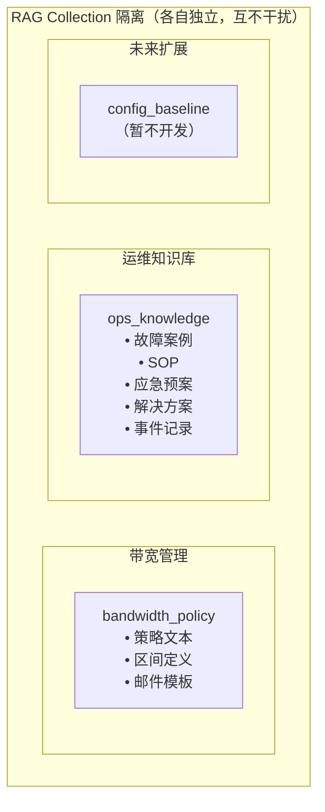

**重要约束：设备运行配置（running-config）不得入 RAG**，原因是运行配置是结构化的设备命令行文本，语义化处理后会影响 RAG 检索的准确性。运行配置仅存入 SQLite 用于文本对比。

---

## 4. MCP Server 设计

### 4.1 Server 概述

ops-knowledge MCP Server 是一个独立的 FastMCP 进程，注册3个原子工具。与 network-ops MCP Server 完全独立，各自管理自己的数据。

### 4.2 工具清单

| 工具名 | 功能 | 类型 | 对标带宽管理工具 |
|--------|------|------|-----------------|
| `knowledge_search` | 语义检索知识库 | 读 | policy_search |
| `knowledge_upload` | 文档入库（解析+分块+向量化） | 写 | 无（新增能力） |
| `knowledge_list` | 查看知识库文档列表 | 读 | bandwidth_stats |

### 4.3 工具详细设计

#### knowledge_search — 语义检索

**用途**：根据用户描述的故障现象、问题、需求，在知识库中检索相关文档片段。

**输入参数**：

| 参数 | 类型 | 必填 | 说明 |
|------|------|------|------|
| `query` | string | 是 | 检索内容，如"华为交换机端口UP/DOWN频繁震荡" |
| `doc_type` | string | 否 | 过滤文档类型（fault/sop/emergency_system/emergency_network/emergency_security/solution/event） |
| `device_vendor` | string | 否 | 过滤设备厂商 |
| `device_type` | string | 否 | 过滤设备类型 |
| `top_k` | int | 否 | 返回结果数，默认5 |

**输出**：匹配的文档片段列表，每条包含文档内容、来源、doc_type、device_vendor、device_type、score。

**调用关系**：

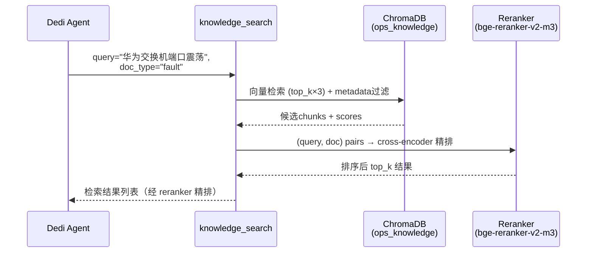

#### knowledge_upload — 文档入库

**用途**：将文档解析、分块、向量化后存入知识库。支持多种格式自动识别和转换。

**输入参数**：

| 参数 | 类型 | 必填 | 说明 |
|------|------|------|------|
| `file_path` | string | 是 | 文件路径（支持虚拟路径如 `/mnt/user-data/uploads/xxx.pdf`） |
| `doc_type` | string | 是 | 文档类型（fault/sop/emergency/solution/event） |
| `title` | string | 是 | 文档标题 |
| `device_vendor` | string | 否 | 设备厂商 |
| `device_type` | string | 否 | 设备类型 |

**输出**：入库结果（成功/失败、chunk数量、doc_id）。

**内部处理流程**：

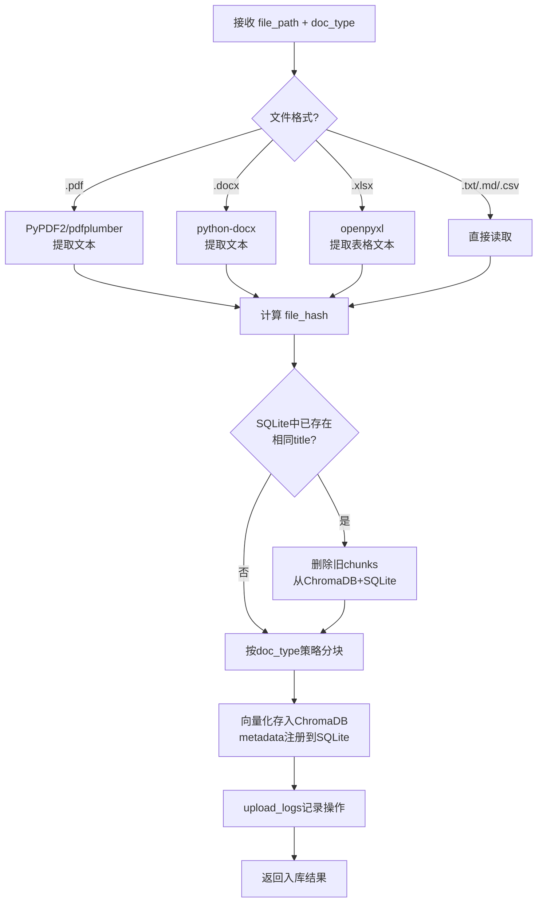

**支持格式**：

| 格式 | 解析方式 |
|------|---------|
| `.pdf` | PyPDF2 或 pdfplumber 提取文本 |
| `.docx` | python-docx 提取段落和表格 |
| `.txt` | 直接读取，UTF-8编码 |
| `.md` | 直接读取，保留Markdown结构 |
| `.xlsx` | openpyxl 提取表格内容 |
| `.csv` | 直接读取，逗号分隔 |

#### knowledge_list — 知识库浏览

**用途**：查看知识库中已入库的文档列表，支持按类型和厂商过滤。

**输入参数**：

| 参数 | 类型 | 必填 | 说明 |
|------|------|------|------|
| `doc_type` | string | 否 | 过滤文档类型 |
| `device_vendor` | string | 否 | 过滤设备厂商 |
| `limit` | int | 否 | 返回数量，默认20 |
| `offset` | int | 否 | 分页偏移，默认0 |

**输出**：文档列表（doc_id, title, doc_type, device_vendor, device_type, upload_date, chunk_count）。

### 4.4 工具调用关系总览

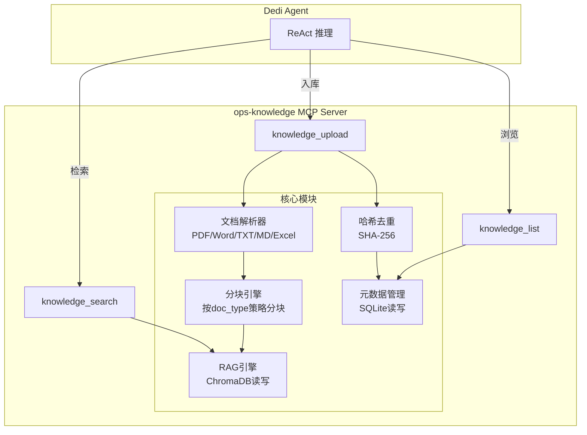

### 4.5 Reranker 二次排序机制

所有语义检索工具（`knowledge_search`）在内部执行两阶段检索：


| 阶段 | 模型 | 作用 | 输出 |
|------|------|------|------|
| 向量召回 | bge-m3:567m (Ollama) | 快速从 ChromaDB 召回候选文档 | top_k × 3 个文档 |
| Cross-encoder 精排 | bge-reranker-v2-m3 (FlagEmbedding) | 对每个 (query, doc) 对精确打分 | sigmoid 归一化分数 [0, 1] |

**关键配置**：

| 配置项 | 默认值 | 说明 |
|--------|--------|------|
| `retrieval_multiplier` | 3 | 向量检索的过采样倍数，越大召回越全但 reranker 开销越大 |
| `enabled` | true | 设为 false 时退化为纯向量检索模式 |

**约束**：
- Reranker 模型通过 HuggingFace 本地缓存加载，需设置 `HF_HUB_OFFLINE=1` 防止启动时联网
- 模型文件约 2.16GB，首次加载需 ~3s，后续通过 lazy-loading 机制延迟到首次查询时才加载


---

## 5. Skill 技能层设计

### 5.1 Skill 文档

文件路径：`skills/custom/ops-knowledge/SKILL.md`

Skill 文档是 Agent 的"操作手册"，定义触发条件、工作流和语义理解规则。Agent 读取 Skill 后知道何时使用 ops-knowledge 的工具，以及按什么流程处理。

### 5.2 触发条件

Skill 在以下场景被 Agent 激活：

- 用户描述网络设备故障、异常、报错
- 用户查询 SOP（标准操作流程）
- 用户查询应急预案
- 用户检索历史故障案例
- 用户要求将文档入库到知识库
- 用户要求查看知识库内容

### 5.3 工作流定义

Skill 定义了4个标准工作流，Agent 根据用户意图自动选择：

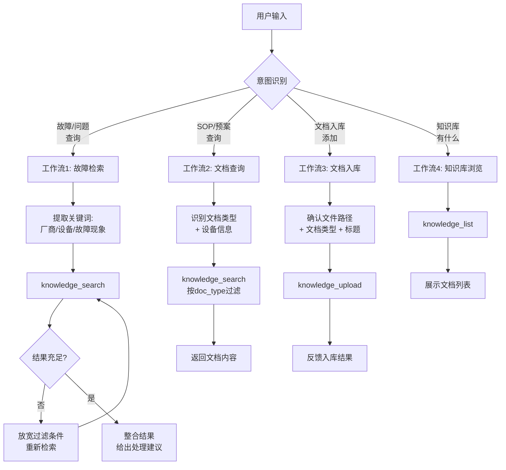

### 5.4 语义理解映射

Skill 文档中定义了自然语言到工具参数的映射规则，Agent 据此将用户的一句话转化为结构化的工具调用：

| 用户输入示例 | 识别意图 | 工具调用参数 |
|-------------|---------|-------------|
| "交换机端口down了" | 故障检索 | doc_type=fault, device_type=switch |
| "华为防火墙SOP" | SOP查询 | doc_type=sop, device_vendor=huawei, device_type=firewall |
| "F5负载均衡挂了怎么办" | 故障+预案 | 先搜 fault，再搜 emergency |
| "把这份文档加到知识库" | 文档入库 | 进入入库流程，要求用户确认参数 |
| "知识库里有什么" | 浏览 | knowledge_list 无过滤 |

---

## 6. DeerFlow 集成路径

### 6.1 Agent 复用策略

**不新建 Agent，复用现有 dedi agent。** 理由：

1. **用户体验统一** — 用户不需要知道该跟哪个 agent 说话，一个入口处理所有网络运维事务
2. **工具天然共享** — dedi agent 同时拥有带宽管理和知识库的工具，可以跨域组合调用
3. **扩展简单** — 未来新增子系统只需增加 Skill + MCP Server，不需要增加 Agent
4. **符合现实** — 网络工程师本就是一个人处理所有网络运维事务

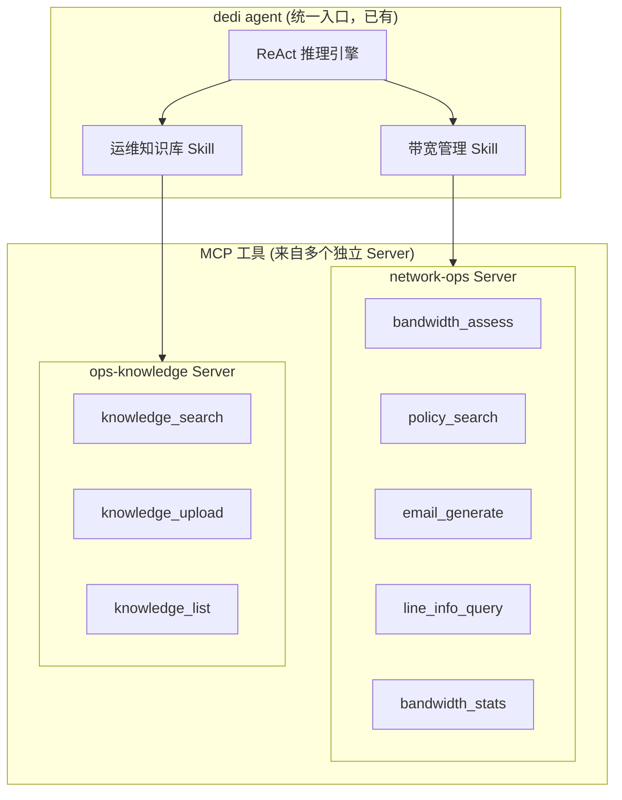

### 6.2 Skill 注册

Skill 文件放置在 `skills/custom/ops-knowledge/SKILL.md`，DeerFlow 启动时自动发现并加载。Agent 的 system prompt 中会注入所有已启用 Skill 的触发条件和工作流。

### 6.3 MCP Server 注册

在 `extensions_config.json` 中新增 ops-knowledge Server 配置：

| 配置项 | 值 |
|--------|-----|
| Server 名称 | `ops-knowledge` |
| 类型 | `stdio` |
| 命令 | `python -m mcp_servers.ops_knowledge.server` |
| collection | `ops_knowledge`（环境变量 `CHROMA_COLLECTION` 覆盖） |

---

## 7. 文件结构

### 7.1 ops-knowledge MCP Server 目录

```
mcp-servers/
├── network-ops/                  ← 已有（带宽管理）
│   ├── server.py
│   ├── config.py
│   ├── rag/bandwidth_rag.py
│   ├── db/sqlite_client.py
│   ├── tools/
│   └── requirements.txt
│
└── ops-knowledge/                ← 新建（运维知识库）
    ├── server.py                 # FastMCP 入口，注册3个工具
    ├── config.py                 # 配置层（dataclass + 环境变量覆盖）
    ├── rag/
    │   └── ops_knowledge_rag.py  # ChromaDB 读写、分块策略、语义搜索
    ├── db/
    │   └── metadata_client.py    # SQLite 元数据管理、去重、日志
    ├── tools/
    │   ├── knowledge_search.py   # 语义检索工具
    │   ├── knowledge_upload.py   # 文档入库工具（含格式解析+分块+去重）
    │   └── knowledge_list.py     # 知识库浏览工具
    └── requirements.txt          # Python 依赖
```

### 7.2 文档存放目录

```
docs/
├── bandwidth.md                          ← 已有（带宽管理唯一数据源）
├── bandwidth-management-architecture.md  ← 已有（带宽架构文档）
│
└── ops-knowledge/                        ← 新建（运维知识库）
    ├── raw/                              # 原始文档存放目录
    │   ├── 华为交换机故障案例2024.pdf
    │   ├── 华三路由器SOP.docx
    │   ├── F5应急预案.md
    │   └── ...
    └── metadata.db                       # SQLite 元数据文件（运行时生成）
```

### 7.3 Skill 文档

```
skills/custom/
├── bandwidth-management/          ← 已有
│   ├── SKILL.md
│   └── bandwidth-policy.md
│
└── ops-knowledge/                 ← 新建
    └── SKILL.md                   # 触发条件 + 4个工作流 + 语义映射
```

---

## 8. 数据流与调用链路

### 8.1 故障检索场景

用户输入："华为交换机端口UP/DOWN频繁震荡怎么处理"

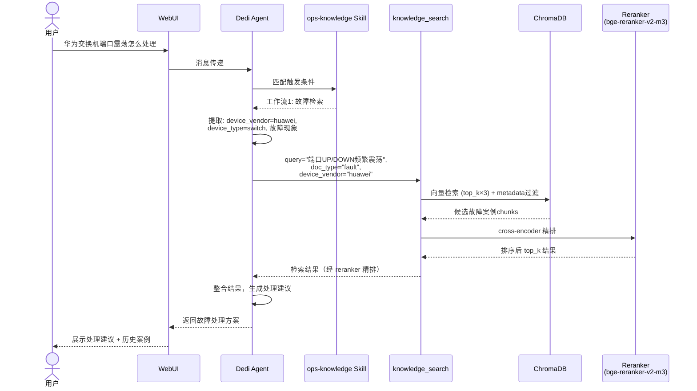

### 8.2 文档入库场景

用户输入："把这份故障报告加到知识库"（配合聊天窗口上传文件）

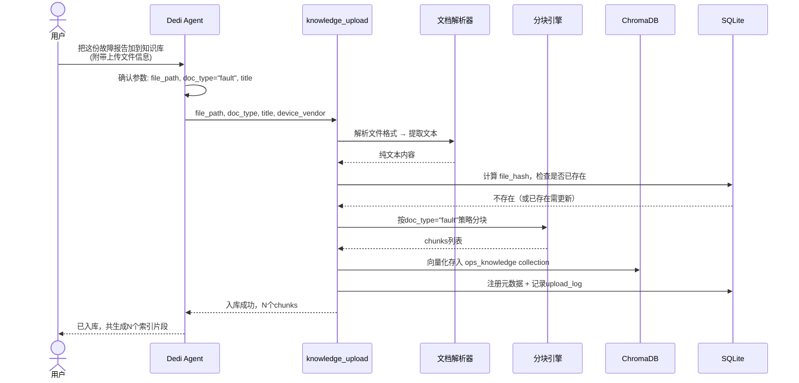

### 8.3 预案查询场景

用户输入："F5负载均衡的应急预案"

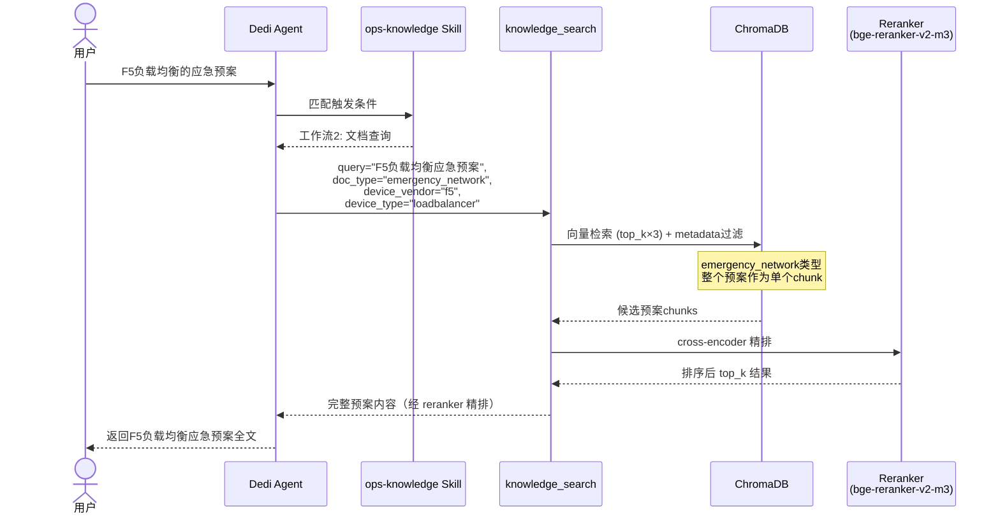

---

## 9. 文档入库与更新策略

### 9.1 文档来源

运维知识库的文档目前散落在各处（Word/PDF/Excel/文本文件），需要人工整理后放入指定目录：

| 来源 | 处理方式 |
|------|---------|
| `docs/ops-knowledge/raw/` 目录 | 主要入库路径，用户手动整理文档到此目录 |
| 聊天窗口上传的文件 | Agent 可读取后调用 knowledge_upload 入库 |
| 已有 `resources/SOP/` 目录 | 复制到 `raw/` 后批量入库 |

### 9.2 去重策略

使用文件的 SHA-256 哈希值作为唯一标识：

1. **新文件入库** — 计算 file_hash，与 SQLite 中已有记录对比
2. **相同文件** — file_hash 一致，跳过不入库
3. **同标题不同内容** — 视为版本更新，触发覆盖流程

### 9.3 版本更新流程

当用户上传同名或同标题的文档时（如预案更新）：

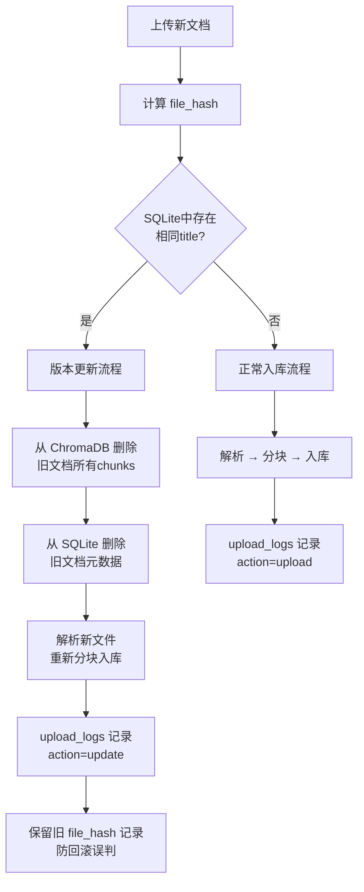

**用户视角**：
- 上传同名/同标题文件 → 自动覆盖旧版本
- 上传不同名文件 → 新增入库
- upload_logs 可追溯所有变更历史

---

## 10. 配置与部署

### 10.1 config.py 配置层

与带宽管理的 config.py 对齐，使用 dataclass + 环境变量覆盖模式：

| 配置项 | 默认值 | 环境变量 |
|--------|--------|---------|
| `ollama_base_url` | `http://localhost:11434` | `OLLAMA_BASE_URL` |
| `embed_model` | `bge-m3:567m` | `OLLAMA_EMBED_MODEL` |
| `chroma_collection` | `ops_knowledge` | `CHROMA_COLLECTION` |
| `raw_dir` | `docs/ops-knowledge/raw` | `OPS_KNOWLEDGE_RAW_DIR` |
| `db_path` | `docs/ops-knowledge/metadata.db` | `OPS_KNOWLEDGE_DB_PATH` |
| `reranker_enabled` | `true` | `RERANKER_ENABLED` |
| `reranker_model` | `BAAI/bge-reranker-v2-m3` | `RERANKER_MODEL` |
| `reranker_device` | `cpu` | `RERANKER_DEVICE` |
| `reranker_max_length` | `512` | `RERANKER_MAX_LENGTH` |
| `reranker_retrieval_multiplier` | `3` | `RERANKER_RETRIEVAL_MULTIPLIER` |
| `hf_hub_offline` | `1` | `HF_HUB_OFFLINE` |

### 10.2 Docker 部署

在 `docker/docker-compose-dev.yaml` 的 langgraph 服务中配置 volume 挂载：

```
挂载映射:
  # 代码挂载
  ./backend/:/app/backend/                          # 后端代码（开发热更新）
  ./mcp-servers/:/app/mcp-servers/:ro               # MCP Server 代码（只读）

  # 持久化数据挂载（容器重启不丢失）
  docker/volumes/langgraph-venv:/app/backend/.venv  # Python venv（含 FlagEmbedding 等手动安装的包）
  docker/volumes/hf-cache:/root/.cache/huggingface  # HuggingFace 模型缓存（bge-reranker-v2-m3 ~2.16GB）
  docker/volumes/deer-flow-data:/app/.deer-flow     # 向量库 + SQLite + 探针数据
```

**容器启动时依赖安装顺序**（通过 docker-compose command 实现）：

1. `uv sync` — 安装 pyproject.toml 定义的基础依赖
2. `uv pip install` — 安装额外依赖：paramiko, apscheduler, torch(CPU), transformers, huggingface-hub
3. `uv pip install` — 安装 FlagEmbedding 及其兼容依赖（datasets, accelerate, sentence-transformers, peft）
4. `uv run --no-sync` — 启动 langgraph 服务（`--no-sync` 防止重新同步覆盖手动安装的包版本）

**关键版本约束**（FlagEmbedding + transformers + huggingface-hub 三角兼容）：

| 包 | 版本约束 | 原因 |
|---|---|---|
| transformers | >=4.45, <5.0 | FlagEmbedding 1.2.x 依赖的 API 在 5.x 中被移除 |
| FlagEmbedding | >=1.2, <1.3 | 1.3.x 的 decoder_only reranker 需要新版 transformers |
| huggingface-hub | >=0.20, <1.0 | transformers <5.0 的硬性要求 |
| sentence-transformers | >=2.2.2, <4.0 | FlagEmbedding 间接依赖，需限制上限避免拉入新版 huggingface-hub |

### 10.3 MCP Server 注册

在 `extensions_config.json` 中新增：

```
ops-knowledge Server:
  类型: stdio
  命令: python -m mcp_servers.ops_knowledge.server
  环境变量:
    OLLAMA_BASE_URL: http://host.docker.internal:11434
    OLLAMA_EMBED_MODEL: bge-m3:567m
    CHROMA_COLLECTION: ops_knowledge
    OPS_KNOWLEDGE_RAW_DIR: /app/docs/ops-knowledge/raw
    OPS_KNOWLEDGE_DB_PATH: /app/docs/ops-knowledge/metadata.db
```

---

## 11. 与带宽管理系统的关系

### 11.1 架构对称性

运维知识库与带宽管理在架构上完全对称，遵循相同的设计模式：

| 维度 | 带宽管理 | 运维知识库 |
|------|---------|-----------|
| MCP Server | `network-ops`（独立进程） | `ops-knowledge`（独立进程） |
| Skill 文档 | `bandwidth-management/SKILL.md` | `ops-knowledge/SKILL.md` |
| ChromaDB collection | `bandwidth_policy` | `ops_knowledge` |
| SQLite | 带宽区间数据 | 文档元数据 |
| 唯一数据源 | `docs/bandwidth.md` | `docs/ops-knowledge/raw/` 目录 |
| 工具数量 | 5 | 3 |
| Agent | dedi agent（共用） | dedi agent（共用） |

### 11.2 数据隔离

两个系统的数据层完全隔离：

- **ChromaDB**：各自独立的 collection，搜索互不干扰
- **SQLite**：各自独立的数据库文件
- **原始数据**：各自独立的目录

### 11.3 未来扩展

本架构设计为可扩展模式，未来新增子系统（如配置基线管理、运行状态巡检）只需：

1. 新建独立 MCP Server（`mcp-servers/config-baseline/`）
2. 新建 Skill 文档（`skills/custom/config-baseline/SKILL.md`）
3. 新建 ChromaDB collection（`config_baseline`）
4. 在 `extensions_config.json` 注册新 Server
5. dedi agent 自动获得新能力

不需要新建 Agent，不需要修改已有系统。
