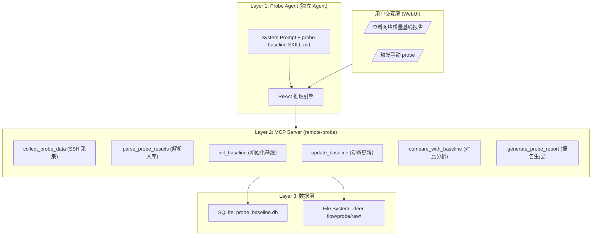

# 远程探针基线系统架构设计文档

> **版本**: v1.0  
> **日期**: 2026-04-12  
> **状态**: 草案  
> **原始文档存放**: `docs/remote-probe/raw/`

---

## 目录

1. [背景与目标](#1-背景与目标)
2. [架构总览](#2-架构总览)
3. [数据层设计](#3-数据层设计)
4. [MCP Server 设计](#4-mcp-server-设计)
5. [Skill 技能层设计](#5-skill-技能层设计)
6. [DeerFlow 集成路径](#6-deerflow-集成路径)
7. [文件结构](#7-文件结构)
8. [数据流与调用链路](#8-数据流与调用链路)
9. [配置与部署](#9-配置与部署)
10. [与其他系统的关系](#10-与其他系统的关系)

---

## 1. 背景与目标

### 1.1 背景
随着业务扩展，数据中心网络监控的需求日益增长。为了实时掌握全球多地节点的网络质量，需要部署一套独立且高效的远程探针系统。该系统需能够自动收集网络指标，建立基线，并进行异常分析，从而为后续的网络调优提供数据支撑。

### 1.2 目标
构建**远程探针基线系统**（Remote Probe Baseline System），作为 DeerFlow 的第三个子系统。实现从数据采集、解析、基线建立到报告生成的全流程自动化，确保监控数据的准确性和实时性。

### 1.3 核心原则
- **独立性**：探针系统与带宽管理、知识库系统完全解耦，拥有独立的数据库、文件存储和 MCP 工具。
- **自动化**：基于 APScheduler 实现定时采集与分析，无需人工干预。
- **标准化**：数据格式统一，基线计算方法科学，报告输出规范。
- **独立 Agent**：Probe 拥有独立的 Agent（Probe Agent）和专用的技能（probe-baseline），不复用其他系统的 Agent。

---

## 2. 架构总览

### 2.1 三层架构
系统采用标准的三层架构，确保职责清晰、扩展性强。



### 2.2 核心组件模块化设计
| 组件 | 说明 |
|------|------|
| Probe Agent | 独立 Agent 进程，负责任务调度与 ReAct 逻辑执行 |
| remote-probe MCP Server | 封装所有探针原子工具，提供标准接口 |
| 采集流水线 | 负责多地 ECS 节点网络数据采集、归档 |
| 分析基线引擎 | 基于 SQLite 实现基线计算与偏离度对比分析 |
| 报告与通知 | Markdown 报告生成与异常上报 |

---

## 3. 数据层设计

### 3.1 物理存储结构
系统数据分为文件存储和 SQLite 数据库两部分。

#### 3.1.1 文件系统 (`.deer-flow/probe/`)
- `raw/`: 原始数据存储目录
    - `hhht/`, `wh/`, `hz/`, `wlcb/`, `qd/`, `cd/` (按区域隔离)
        - `prob_{region}_*.tgz` (原始归档文件)
        - `domain_based/` (JSON 格式的最新检测数据)
- `reports/`:生成的 Markdown 报告

#### 3.1.2 SQLite 数据设计 (`probe_baseline.db`)
- `raw_files`: 采集记录表，记录每次 SSH 拉取的文件信息，用于去重。
- `probe_metrics`: 核心度量指标表，存放解析后的检测结果（如 RTT、丢包率等）。
- `probe_baseline`: 基线数据表，存储各维度指标的基准值。
- `baseline_history`: 基线变更历史表，记录基线更新的理由与前后关联。

---

## 4. MCP Server 设计

### 4.1 核心工具
Remote-probe MCP Server 注册以下 6 个原子工具：

1. `collect_probe_data`: 实现 SSH 增量拉取，仅同步远端缺失的 `.json` 或 `.tgz` 文件。
2. `parse_probe_results`: 解析 `.json` 文件并提取关键指标，存入 `probe_metrics`。
3. `init_baseline`: 基于近期 N 条数据计算初始均值，写入基线表。
4. `update_baseline`: 使用加权滑动窗口均值动态更新基线。
5. `compare_with_baseline`: 将新采集的数据与基线进行偏差分析。
6. `generate_probe_report`: 将分析结果渲染为 Markdown 报告并存盘。

---

## 5. Skill 技能层设计

### 5.1 Skill 概述
技能文件路径：`skills/custom/probe-baseline/SKILL.md`。
它定义了 Agent 在接到"查询探针数据"、"手动触发采集"或"生成基线报告"等请求时，如何按照工作流调用 MCP 工具。

### 5.2 触发场景
- **定时调度**：基于 APScheduler 配置，每日 11:00 和 17:00 触发 `collect` -> `parse` -> `compare` -> `report` 全量工作流。
- **手动查询**：用户输入“查看最近成都节点的网络稳定性”、“成都节点基线分析报告”等。
- **配置变更**：当基线逻辑调整或手动强制更新基线时。

---

## 6. DeerFlow 集成路径

系统作为独立的子系统集成：
- **Agent**：新建独立的 Probe Agent，配置 `backend/.deer-flow/agents/probe/config.yaml`。
- **MCP**：在 `extensions_config.json` 中配置 `remote-probe` MCP Server。
- **任务调度**：在 Probe Agent 中配置 APScheduler。
- **数据隔离**：所有 SQLite 数据和文件存储路径均与 bandwidth 和 ops-knowledge 分离。

---

## 7. 文件结构

```
.deer-flow/
├── backend/
│   └── .deer-flow/
│       └── agents/
│           └── probe/
│               └── config.yaml   # 独立 Agent 配置
├── mcp-servers/
│   └── remote-probe/             # MCP Server 代码
│       ├── server.py
│       ├── tools/
│       └── ...
└── .deer-flow/probe/             # 数据根目录
    ├── raw/
    │   ├── hhht/
    │   ├── wh/
    │   ...
    └── reports/
```

---

## 8. 数据流与调用链路

### 8.1 采集与分析链路
1. **定时任务**：APScheduler 触发。
2. **采集**：`collect_probe_data` SSH 连接 ECS 节点，对比本地校验和，差异拉取。
3. **解析**：`parse_probe_results` 读入 JSON，提取 DNS、TLS、HTTP、Multi-IP TCP/ICMP 数据入库。
4. **分析**：`compare_with_baseline` 进行 deviation 分析，定位告警指标。
5. **归档**：`generate_probe_report` 输出 MD 文件并触发告警逻辑（若有）。

---

## 9. 配置与部署

### 9.1 ECS 节点信息
| 区域 | IP | 城市 |
|------|----|-----|
| hhht | 39.104.209.139 | 呼和浩特 |
| wh | 47.122.115.139 | 武汉 |
| hz | 116.62.131.213 | 杭州 |
| wlcb | 8.130.82.52 | 乌兰察布 |
| qd | 120.27.112.200 | 青岛 |
| cd | 47.108.239.135 | 成都 |

### 9.2 关键约束
- 不复用任何现有 Agent。
- 基线计算完全基于 SQLite，拒绝使用 RAG 模型计算逻辑。
- 保证增量采集逻辑正确，避免重复拉取消耗带宽。

---

## 10. 与其他系统的关系

- **带宽管理系统**：独立存在，互不依赖，仅在 Agent 调度层面由统一的 WebUI 交互。
- **运维知识库**：独立存在，不进行跨系统的数据交互。
- **未来扩展**：该设计原则保证了后续新增的监控系统可以完全复用上述模式。
