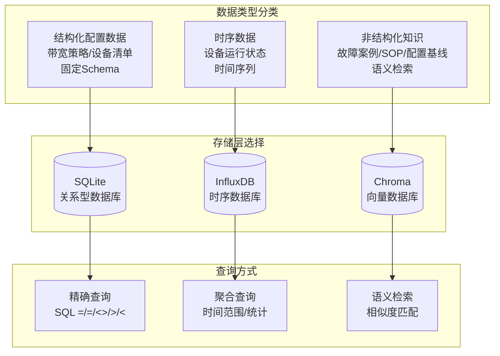
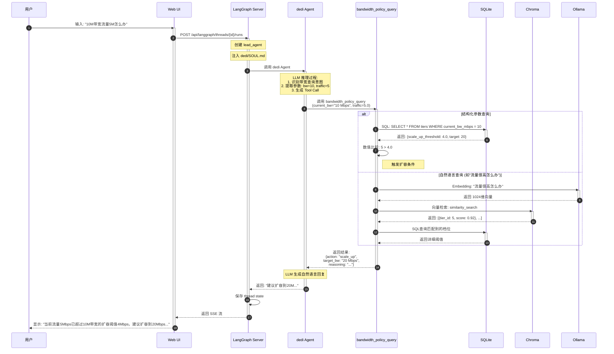

# 数据中心网络运维智能知识库系统设计文档

**版本**: 1.0  
**日期**: 2026-04-06  
**作者**: Alkaid + Claude  
**状态**: 设计阶段，待评审

---

## 1. 项目概述

### 1.1 背景与目标

构建基于 DeerFlow 的数据中心网络运维智能知识库系统，实现三个核心闭环：

1. **配置基线闭环**: 人定基线 → AI对比检查 → 人整改 → AI/人优化基线
2. **运行状态闭环**: 自动巡检 → RAG存基线 → 实时对比分析 → 优化基线
3. **故障知识闭环**: 历史案例/SOP入库 → 新问题智能检索推荐

### 1.2 业务范围

- **设备范围**: 800台网络设备（交换机、路由器、防火墙、负载均衡）
- **数据类型**: 结构化配置（JSON/CSV）、运行状态指标、故障案例文本
- **保留策略**: 核心设备运行数据30天，非核心设备7天，故障案例永久保存

### 1.3 核心用户

- Alkaid: 架构师，负责架构设计和开发决策
- dedi: 专用Agent，负责技术验证、RAG查询、报告生成
- 运维人员: 使用系统执行配置检查、状态分析、故障排查

---

## 2. 架构设计

### 2.1 整体架构图

```mermaid
flowchart TB
    subgraph UI["用户交互层"]
        A[DeerFlow Web UI<br/>Agent选择器: dedi]
    end

    subgraph AgentLayer["DeerFlow Agent层"]
        subgraph Dedi["dedi Agent (网络运维专家)"]
            B1[SOUL.md<br/>技术验证/RAG查询/报告生成]
            B2[Tools]
            B3[Subagent委派]
        end

        subgraph RAG["RAG模块 (LangChain + Chroma)"]
            C1[(配置基线库<br/>config_baseline)]
            C2[(故障案例库<br/>incident_kb)]
            C3[(异常模式库<br/>status_pattern)]
            C4[Embedding: bge-m3 (Ollama)<br/>1024维/8192 tokens/中英双语]
        end
    end

    subgraph MCP["MCP Server: deerflow-network-mcp"]
        D1[query_device_metrics<br/>查询InfluxDB时序数据]
        D2[calculate_rolling_baseline<br/>计算滚动基线 24×60]
        D3[detect_anomaly<br/>异常检测偏离度/置信度]
        D4[compare_with_baseline<br/>配置文本对比]
    end

    subgraph Storage["数据存储层"]
        subgraph InfluxDB["时序数据库 (InfluxDB)"]
            E1[(设备运行状态数据<br/>每分钟原始数据)]
            E2[(滚动基线数据<br/>24×60分钟均值)]
            E3[RP: core_30d / non_core_7d]
        end

        subgraph ChromaDB["向量数据库 (Chroma)"]
            F1[(运行状态异常向量<br/>异常模式语义化)]
        end
    end

    subgraph Collector["数据采集服务 (network-collector)"]
        G1[SNMP采集器<br/>(800设备)<br/>CPU/内存/流量]
        G2[SSH采集器<br/>配置文本/路由表/接口状态]
        G3[基线计算<br/>滚动平均/异常检测]
    end

    A --> Dedi
    B2 --> RAG
    Dedi -->|MCP协议| MCP
    MCP --> InfluxDB
    MCP -.-> ChromaDB
    Collector -->|HTTP API写入| InfluxDB
    G1 --> G3
    G2 --> G3
```

### 2.2 技术栈汇总

| 层级 | 组件 | 技术选型 | 版本/备注 |
|------|------|----------|-----------|
| **LLM** | 推理模型 | Ollama + qwen3.5:9b | 本地部署，支持thinking |
| | Embedding | Ollama + bge-m3 | 1024维，中英双语 |
| | Vision | Ollama + gemma4:e4b | 可选，用于拓扑图分析 |
| **Agent框架** | DeerFlow | langgraph + lead_agent | dedi作为专用Agent |
| **向量存储** | Chroma | 文件存储 | backend/.deer-flow/vectors/ |
| **时序存储** | InfluxDB | 2.x | 保留策略: 核心30天/非核心7天 |
| **数据采集** | SNMP | pysnmp 异步 | SNMPv2/v3 |
| | SSH | asyncssh | 配置采集 |
| **MCP** | Server | FastMCP | Python实现 |
| **部署** | 容器化 | Docker Compose | DeerFlow + InfluxDB |

### 2.3 项目结构

```mermaid
graph TD
    root["deer-flow/"] --> backend["backend/"]
    root --> backend2["backend/.deer-flow/"]
    root --> mcp["mcp-servers/"]
    root --> collectors["collectors/"]
    root --> docker["docker/"]
    root --> docs["docs/"]

    backend --> harness["packages/harness/deerflow/"]
    harness --> agents["agents/lead_agent/"]
    agents --> prompt["prompt.py<br/>已支持agent_name加载SOUL.md"]

    harness --> tools["tools/"]
    tools --> init1["__init__.py"]
    tools --> netconfig["network_config.py<br/>配置基线检查Tool"]
    tools --> netstatus["network_status.py<br/>运行状态分析Tool"]
    tools --> incident["incident_query.py<br/>故障知识检索Tool"]

    harness --> rag["rag/"]
    rag --> init2["__init__.py"]
    rag --> configbase["config_baseline.py<br/>配置基线RAG"]
    rag --> incidentkb["incident_kb.py<br/>故障知识库RAG"]
    rag --> statuspattern["status_pattern.py<br/>异常模式向量存储"]

    backend2 --> agents2["agents/dedi/"]
    agents2 --> configdedi["config.yaml<br/>已存在"]
    agents2 --> soul["SOUL.md<br/>网络运维专家定义"]

    mcp --> networkmcp["deerflow-network-mcp/"]
    networkmcp --> srcmcp["src/"]
    srcmcp --> init3["__init__.py"]
    srcmcp --> server["server.py<br/>MCP Server入口"]
    srcmcp --> influxclient["influx_client.py<br/>InfluxDB查询封装"]
    srcmcp --> baselinecalc["baseline_calculator.py<br/>滚动基线计算"]
    srcmcp --> anomalydetect["anomaly_detector.py<br/>异常检测算法"]
    networkmcp --> pyproject1["pyproject.toml"]
    networkmcp --> readme1["README.md"]

    collectors --> netcollector["network-collector/"]
    netcollector --> srccollector["src/"]
    srccollector --> init4["__init__.py"]
    srccollector --> main["main.py<br/>采集服务主入口"]
    srccollector --> snmp["snmp_poller.py<br/>SNMP轮询器"]
    srccollector --> ssh["ssh_collector.py<br/>SSH配置采集"]
    srccollector --> influxwrite["influx_writer.py<br/>数据写入InfluxDB"]
    srccollector --> baselineagg["baseline_aggregator.py<br/>基线聚合计算"]
    netcollector --> configdir["config/"]
    configdir --> devicesyaml["devices.yaml<br/>设备清单800台"]
    netcollector --> pyproject2["pyproject.toml"]
    netcollector --> dockerfile["Dockerfile"]

    docker --> composeyaml["docker-compose-network-ops.yaml<br/>运维系统专用compose"]

    docs --> superpowers["superpowers/specs/"]
    superpowers --> thisdoc["2026-04-06-network-ops-rag-design.md<br/>本文档"]
```



---

### 2.4 数据存储策略

根据数据特性和查询需求，采用**三类存储分层架构**：



#### 存储选型决策矩阵

| 数据类型 | 存储方案 | 选型理由 | 示例 |
|---------|---------|---------|------|
| **带宽策略表** | **SQLite** | 固定Schema，精确数值匹配，无需Embedding | 档位/阈值/目标带宽 |
| **设备清单** | **SQLite** | 关系型数据，多表关联，CRUD操作 | 800台设备信息 |
| **运行状态** | **InfluxDB** | 高写入吞吐，时间序列聚合，保留策略 | CPU/内存/流量指标 |
| **配置基线** | **Chroma** | 文本相似度对比，语义检索 | 配置模板合规检查 |
| **故障案例** | **Chroma** | 自然语言检索，语义匹配 | 相似故障解决方案 |
| **异常模式** | **Chroma** | 向量聚类，模式识别 | 历史异常特征 |

#### 为什么不全用向量数据库？

| 场景 | 向量检索 | SQL查询 | 说明 |
|------|---------|---------|------|
| "10M带宽阈值是多少" | ❌ 不准确 | ✅ 精确匹配 | 数值比较不应语义化 |
| "当前5M流量是否超标" | ❌ 需推理 | ✅ 直接比较 | 5 > 4.0 是数值运算 |
| "历史相似故障有哪些" | ✅ 语义匹配 | ❌ 无法检索 | 需要理解描述相似性 |

**结论**: 结构化数据用SQLite，非结构化知识用Chroma，时序数据用InfluxDB。


## 3. 模块详细设计

### 3.1 Tools 模块 (DeerFlow 内)

#### 3.1.1 network_config_check

```python
async def network_config_check(
    device_id: str,
    config_text: str | None = None,  # 如果None，自动通过SSH采集
    baseline_version: str = "latest"
) -> dict:
    """
    检查设备配置与基线的差异
    
    Returns:
        {
            "device_id": "SW01",
            "baseline_version": "v1.2.0",
            "overall_compliance": 0.92,  # 整体合规率
            "findings": [
                {
                    "severity": "high",
                    "category": "spanning-tree",
                    "expected": "stp mode rstp",
                    "actual": "stp mode stp",
                    "recommendation": "建议启用RSTP加速收敛"
                }
            ],
            "missing_items": [...],
            "extra_items": [...]
        }
    """
```

#### 3.1.2 network_status_analyze

```python
async def network_status_analyze(
    device_id: str,
    metric: str = "all",  # cpu, memory, traffic, all
    time_range: str = "1h",  # 15m, 1h, 24h
    compare_baseline: bool = True
) -> dict:
    """
    分析设备运行状态，与基线对比
    
    Returns:
        {
            "device_id": "SW01",
            "analysis_time": "2026-04-06T10:00:00Z",
            "metrics": {
                "cpu": {
                    "current": 45.2,
                    "baseline_avg": 42.0,
                    "deviation": 7.6,  # 百分比偏离
                    "status": "normal"  # normal, warning, critical
                },
                "memory": {...},
                "traffic": {...}
            },
            "anomalies": [
                {
                    "metric": "interface_eth1_in",
                    "severity": "warning",
                    "description": "入流量高于基线30%",
                    "suggestion": "检查是否有异常流量"
                }
            ]
        }
    """
```

#### 3.1.3 incident_retrieve

```python
async def incident_retrieve(
    query: str,  # 自然语言描述
    filters: dict | None = None,  # {device_type: "switch", severity: "high"}
    top_k: int = 5
) -> list:
    """
    检索相似故障案例和解决方案
    
    Returns:
        [
            {
                "case_id": "INC-2026-001",
                "title": "核心交换机广播风暴",
                "similarity": 0.92,
                "symptoms": [...],
                "root_cause": "...",
                "solution": "...",
                "sop_reference": "SOP-NET-001"
            }
        ]
    """
```

### 3.2 RAG 模块 (DeerFlow 内)

#### 3.2.1 配置基线 RAG

```python
# backend/packages/harness/deerflow/rag/config_baseline.py

from langchain_chroma import Chroma
from langchain_ollama import OllamaEmbeddings

class ConfigBaselineRAG:
    """配置基线向量存储"""
    
    def __init__(self, persist_dir: str = ".deer-flow/vectors/config_baseline"):
        self.embeddings = OllamaEmbeddings(
            model="bge-m3",
            base_url="http://host.docker.internal:11434"
        )
        self.vectorstore = Chroma(
            collection_name="config_baseline",
            embedding_function=self.embeddings,
            persist_directory=persist_dir
        )
    
    def add_baseline(self, config_doc: dict) -> str:
        """添加配置基线到向量库"""
        # 1. 将配置文本分块
        # 2. 添加元数据: device_type, vendor, version
        # 3. 存储到Chroma
        pass
    
    def search_similar(self, config_text: str, filters: dict, k: int = 5) -> list:
        """检索相似配置基线"""
        pass
    
    def compare_configs(self, device_config: str, baseline_id: str) -> dict:
        """对比设备配置与基线"""
        pass
```

#### 3.2.2 故障知识库 RAG

```python
# backend/packages/harness/deerflow/rag/incident_kb.py

class IncidentKBRAG:
    """故障案例知识库"""
    
    def __init__(self, persist_dir: str = ".deer-flow/vectors/incident_kb"):
        self.embeddings = OllamaEmbeddings(
            model="bge-m3",
            base_url="http://host.docker.internal:11434"
        )
        self.vectorstore = Chroma(
            collection_name="incident_kb",
            embedding_function=self.embeddings,
            persist_directory=persist_dir
        )
    
    def add_incident(self, incident: dict) -> str:
        """添加故障案例"""
        # 索引: title + symptoms + root_cause + solution
        # 元数据: case_id, device_models, keywords, severity
        pass
    
    def query(self, description: str, filters: dict | None = None, k: int = 5) -> list:
        """检索相似故障案例"""
        pass
```

### 3.3 MCP Server (deerflow-network-mcp)

#### 3.3.1 提供的 Tools

```python
# mcp-servers/deerflow-network-mcp/src/server.py

from mcp.server.fastmcp import FastMCP

mcp = FastMCP("deerflow-network")

@mcp.tool()
async def query_device_metrics(
    device_id: str,
    metric: str,  # cpu, memory, traffic_in, traffic_out, temperature
    time_range: str,  # 15m, 1h, 6h, 24h, 7d
    aggregation: str = "mean"  # mean, max, min, p95
) -> dict:
    """查询设备历史指标数据"""
    pass

@mcp.tool()
async def calculate_rolling_baseline(
    device_id: str,
    metric: str,
    days: int = 7,  # 使用过去7天数据计算基线
    update_store: bool = True
) -> dict:
    """
    计算滚动基线
    
    算法:
    1. 获取过去N天的每分钟数据
    2. 按时间点聚合 (00:00, 00:01, ..., 23:59)
    3. 计算每个时间点的均值和标准差
    4. 存储为新的基线
    """
    pass

@mcp.tool()
async def detect_anomaly(
    device_id: str,
    metric: str,
    current_value: float,
    sensitivity: str = "medium"  # low, medium, high
) -> dict:
    """
    检测当前值是否异常
    
    Returns:
        {
            "is_anomaly": True,
            "deviation_percent": 35.2,
            "confidence": 0.85,
            "severity": "warning",  # warning, critical
            "baseline_range": [40.0, 60.0],
            "suggestion": "建议检查设备负载"
        }
    """
    pass

@mcp.tool()
async def get_device_list(
    category: str | None = None,  # core, non_core, all
    vendor: str | None = None,
    status: str | None = None  # online, offline
) -> list:
    """获取设备清单"""
    pass
```

#### 3.3.2 InfluxDB Schema

```python
# Measurement: device_status
# Tag (索引): device_id, device_type, vendor, model, category (core/non_core)
# Field (数值): cpu_percent, mem_percent, temp_celsius, 
#              interface_up, interface_down,
#              in_bps, out_bps, in_pps, out_pps,
#              error_pkts, drop_pkts
# Timestamp: 每分钟一个点

# Measurement: config_baseline
# Tag: device_type, vendor, version
# Field: baseline_json
# Timestamp: 更新时间

# Measurement: rolling_baseline_stats
# Tag: device_id, metric
# Field: hour_00_mean, hour_00_std, ..., hour_23_mean, hour_23_std
#        minute_00_mean, ..., minute_59_mean  (24×60个字段)
```

### 3.4 数据采集服务 (network-collector)

#### 3.4.1 架构设计

```python
# collectors/network-collector/src/main.py

import asyncio
from datetime import datetime

class NetworkCollector:
    """网络设备数据采集器"""
    
    def __init__(self, config_path: str = "config/devices.yaml"):
        self.devices = self._load_devices(config_path)
        self.snmp_poller = SNMPPoller()
        self.ssh_collector = SSHCollector()
        self.influx_writer = InfluxWriter()
        self.baseline_agg = BaselineAggregator()
    
    async def run(self):
        """主循环：每分钟采集一次"""
        while True:
            start_time = datetime.now()
            
            # 1. 并行采集所有设备SNMP数据
            snmp_tasks = [
                self._collect_snmp(device)
                for device in self.devices
            ]
            snmp_results = await asyncio.gather(*snmp_tasks, return_exceptions=True)
            
            # 2. 批量写入InfluxDB
            await self.influx_writer.write_batch(snmp_results)
            
            # 3. 每小时整点触发基线计算
            if start_time.minute == 0:
                await self._update_rolling_baselines()
            
            # 4. 控制采集周期为60秒
            elapsed = (datetime.now() - start_time).total_seconds()
            await asyncio.sleep(max(0, 60 - elapsed))
    
    async def _collect_snmp(self, device: dict) -> dict:
        """采集单个设备SNMP数据"""
        try:
            return await self.snmp_poller.poll(device)
        except Exception as e:
            logger.error(f"SNMP采集失败 {device['id']}: {e}")
            return {"device_id": device["id"], "error": str(e)}
    
    async def _update_rolling_baselines(self):
        """更新滚动基线"""
        for device in self.devices:
            if device["category"] == "core":
                days = 7  # 核心设备用7天数据
            else:
                days = 3  # 非核心用3天数据
            
            await self.baseline_agg.calculate_and_store(device["id"], days)
```

#### 3.4.2 设备清单配置

```yaml
# collectors/network-collector/config/devices.yaml

devices:
  # 核心设备 (保留30天)
  - id: SW-CORE-01
    name: 核心交换机01
    category: core
    vendor: huawei
    model: CE6881-48S6CQ
    ip: 10.0.1.1
    snmp:
      version: v3
      username: snmp_user
      auth_protocol: sha
      priv_protocol: aes
    ssh:
      username: admin
      key_file: /secrets/ssh_key
    metrics:
      - cpu
      - memory
      - temperature
      - interface_status
      - traffic
    poll_interval: 60

  # 非核心设备 (保留7天)  
  - id: SW-ACC-01
    name: 接入交换机01
    category: non_core
    vendor: h3c
    model: S6730
    ip: 10.0.2.1
    snmp:
      version: v2c
      community: public
    metrics:
      - cpu
      - memory
    poll_interval: 60

# 共800台设备...
```

---


### 3.5 带宽策略管理模块 (SQLite + Chroma 混合方案)
#### 3.5.1 模块定位

带宽策略模块作为**最小可行产品(MVP)**，验证 DeerFlow 工具+多存储集成的能力。

**核心设计决策**: 采用 **SQLite + Chroma 混合架构**
- **SQLite**: 权威数据源 (Source of Truth)，精确数值查询
- **Chroma**: 语义增强层，支持自然语言理解

**解决的问题**:
- 纯 SQL: 无法理解 "流量很高怎么办"
- 纯向量: 数值比较不准确 (5Mbps 是否超阈值)
- 混合: 精确计算 + 语义理解兼顾

#### 3.5.2 混合架构设计

```mermaid
flowchart TB
    subgraph Input["用户输入"]
        Q1["精确查询: 当前10M带宽，流量5Mbps"]
        Q2["模糊查询: 流量很高应该怎么办"]
    end

    subgraph ToolLayer["bandwidth_policy_query Tool"]
        T1{查询类型判断}
        T2[参数提取
        current_bw / traffic]
        T3[自然语言理解
        query_text]
    end

    subgraph StorageLayer["数据存储层"]
        subgraph SQLite["SQLite (权威数据)"]
            S1[(bandwidth_tiers 表)]
            S2[current_bw]
            S3[scale_up_threshold]
            S4[scale_up_target]
        end

        subgraph Chroma["Chroma (语义增强)"]
            C1[(bandwidth_policy 集合)]
            C2[策略描述文本]
            C3[自然语言Embedding]
        end
    end

    subgraph LogicLayer["查询处理"]
        L1[SQL精确查询
        SELECT * FROM tiers
        WHERE current_bw = 10]
        L2[数值比较
        5 > 4.0 ?]
        L3[向量语义检索
        similarity_search
        "流量很高怎么办"]
    end

    subgraph OutputLayer["结果输出"]
        R1[action: scale_up
        target_bw: 20 Mbps
        reasoning: "..."]
        R2[相关策略列表
        relevance_score]
    end

    Q1 --> T1
    Q2 --> T1
    T1 -->|结构化参数| T2
    T1 -->|自然语言| T3

    T2 --> L1
    L1 --> S1
    S1 --> L2
    L2 --> R1

    T3 --> L3
    L3 --> C1
    C1 --> R2
    R2 -->|提取档位| L1

    style SQLite fill:#e1f5e1,stroke:#333,stroke-width:2px
    style Chroma fill:#fff2e1,stroke:#333,stroke-width:2px
```

#### 3.5.3 数据模型

**SQLite Schema (结构化数据)**:

```sql
-- 主表: 带宽档位策略
CREATE TABLE bandwidth_tiers (
    id INTEGER PRIMARY KEY,
    current_bw_mbps INTEGER NOT NULL,        -- 当前带宽 (Mbps)
    scale_up_threshold_mbps REAL NOT NULL,   -- 扩容阈值
    scale_up_target_mbps INTEGER NOT NULL,   -- 扩容目标
    scale_down_threshold_mbps REAL,          -- 缩容阈值 (可为NULL)
    scale_down_target_mbps INTEGER,          -- 缩容目标 (可为NULL)
    description TEXT,                        -- 策略描述
    created_at TIMESTAMP DEFAULT CURRENT_TIMESTAMP,
    updated_at TIMESTAMP DEFAULT CURRENT_TIMESTAMP
);

-- 初始化数据
INSERT INTO bandwidth_tiers VALUES
(1, 2, 0.8, 4, NULL, NULL, '最低配置，不支持缩容'),
(2, 4, 1.6, 6, 0.7, 2, '标准档位'),
(3, 6, 2.4, 8, 1.4, 4, '标准档位'),
(4, 8, 3.2, 10, 2.1, 6, '标准档位'),
(5, 10, 4.0, 20, 2.8, 8, '跳档扩容到20M'),
(6, 20, 8.0, 30, 3.5, 10, '大带宽档位'),
(7, 30, 12.0, 40, 7.0, 20, '大带宽档位'),
(8, 40, 16.0, 50, 10.5, 30, '大带宽档位');
```

**Chroma 集合 (语义增强)**:

```python
# 每个档位生成自然语言描述文档
documents = [
    {
        "content": "10 Mbps带宽档位。当P95流量超过4.0 Mbps（40%利用率）时，
                   需要扩容到20 Mbps。当流量低于2.8 Mbps时，可以缩容到8 Mbps。",
        "metadata": {
            "current_bw": "10 Mbps",
            "tier_id": 5,
            "keywords": ["扩容", "缩容", "10M", "20M"]
        }
    },
    # ... 其他档位
]
```

#### 3.5.4 DeerFlow 调用流程详解

当用户在 Web UI 中输入 **"我当前10M带宽，流量5Mbps，应该怎么办？"** 时，完整调用流程如下：



**调用步骤详解**:

| 步骤 | 组件 | 操作 | 耗时估算 |
|-----|------|------|---------|
| 1-2 | Web UI → LangGraph | HTTP POST 请求 | 10ms |
| 3 | LangGraph | 创建 Agent，加载 SOUL.md | 50ms |
| 4 | dedi Agent | LLM 推理，生成 Tool Call | 500ms |
| 5 | Tool | 接收参数 (bw, traffic) | <1ms |
| 6 | SQLite | SQL 查询阈值 | 5ms |
| 7 | Tool | 数值比较 (5 > 4.0) | <1ms |
| 8-10 | Chroma (可选) | Embedding + 向量检索 | 200ms |
| 11-13 | Tool → Agent | 返回结构化结果 | <1ms |
| 14 | Agent | 生成自然语言回复 | 500ms |
| 15-17 | LangGraph → Web UI | 保存状态，返回响应 | 20ms |

**总耗时**: ~600-800ms (不含网络延迟)

#### 3.5.5 代码实现

```python
# backend/packages/harness/deerflow/tools/bandwidth_tool.py

import sqlite3
from langchain_chroma import Chroma
from langchain_ollama import OllamaEmbeddings

class BandwidthPolicyTool:
    """带宽策略查询工具 (SQLite + Chroma 混合)"""

    def __init__(self):
        self.db_path = ".deer-flow/db/network_ops.db"
        self.chroma = Chroma(
            collection_name="bandwidth_policy",
            embedding_function=OllamaEmbeddings(model="bge-m3"),
            persist_directory=".deer-flow/vectors/bandwidth_policy"
        )

    async def query(
        self,
        current_bw: Optional[str] = None,
        current_traffic: Optional[float] = None,
        query_text: Optional[str] = None
    ) -> dict:
        """
        混合查询：结构化参数 + 自然语言
        """
        # 场景1: 有结构化参数 → SQL精确查询
        if current_bw and current_traffic is not None:
            return await self._sql_query(current_bw, current_traffic)

        # 场景2: 只有自然语言 → 语义检索 + SQL二次查询
        if query_text:
            return await self._hybrid_query(query_text)

        return {"error": "需要提供带宽参数或查询文本"}

    async def _sql_query(self, current_bw: str, traffic: float) -> dict:
        """SQLite 精确查询"""
        conn = sqlite3.connect(self.db_path)
        cursor = conn.cursor()

        # 提取数值 ("10 Mbps" → 10)
        bw_mbps = int(current_bw.split()[0])

        cursor.execute(
            """SELECT * FROM bandwidth_tiers
               WHERE current_bw_mbps = ?""",
            (bw_mbps,)
        )
        tier = cursor.fetchone()
        conn.close()

        if not tier:
            return {"action": "unknown", "reason": "带宽档位不存在"}

        # 数值比较
        _, _, scale_up_threshold, scale_up_target, \
        scale_down_threshold, scale_down_target, desc = tier

        if traffic > scale_up_threshold:
            return {
                "action": "scale_up",
                "current_bw": current_bw,
                "current_traffic_mbps": traffic,
                "threshold_mbps": scale_up_threshold,
                "target_bw": f"{scale_up_target} Mbps",
                "reasoning": f"当前流量 {traffic} Mbps 超过扩容阈值 {scale_up_threshold} Mbps，"
                            f"建议扩容到 {scale_up_target} Mbps"
            }
        elif scale_down_threshold and traffic < scale_down_threshold:
            return {
                "action": "scale_down",
                "target_bw": f"{scale_down_target} Mbps",
                "reasoning": f"当前流量 {traffic} Mbps 低于缩容阈值 {scale_down_threshold} Mbps"
            }
        else:
            return {
                "action": "maintain",
                "reasoning": f"当前流量 {traffic} Mbps 在合理范围内，维持 {current_bw} 配置"
            }

    async def _hybrid_query(self, query_text: str) -> dict:
        """混合查询：Chroma语义检索 → SQLite精确查询"""

        # Step 1: Chroma 语义检索
        results = self.chroma.similarity_search_with_score(query_text, k=2)

        if not results:
            return {"action": "unknown", "reason": "未找到相关策略"}

        # Step 2: 提取最相关的档位信息
        best_match = results[0][0]  # Document
        relevance_score = 1 - results[0][1]  # 转换距离为相似度

        current_bw = best_match.metadata["current_bw"]

        # Step 3: 提取查询中的流量信息 (简单正则)
        import re
        traffic_match = re.search(r'(\d+\.?\d*)\s*[Mm]', query_text)
        traffic = float(traffic_match.group(1)) if traffic_match else None

        if traffic:
            # 有流量信息 → SQL精确查询
            sql_result = await self._sql_query(current_bw, traffic)
            sql_result["relevance_score"] = round(relevance_score, 4)
            sql_result["semantic_match"] = best_match.page_content[:100]
            return sql_result
        else:
            # 无流量信息 → 返回语义检索结果
            return {
                "action": "info",
                "matched_policy": current_bw,
                "relevance_score": round(relevance_score, 4),
                "description": best_match.page_content,
                "suggestion": "请提供当前流量数据以获取具体建议"
            }


# Tool 实例
bandwidth_policy_query_tool = BandwidthPolicyTool()
```

#### 3.5.6 实现路径 (更新)

| 阶段 | 存储方案 | 状态 | 说明 |
|------|---------|------|------|
| **MVP (当前)** | Python Dict | ✅ 已完成 | 硬编码验证接口 |
| **V1.0 (推荐)** | SQLite + Chroma | 🔄 计划中 | 混合架构，精确+语义 |
| **V1.1** | SQLite + Chroma + 缓存 | 📋 待排期 | 高频查询缓存 |

**下一步**: 实现 V1.0 混合架构
1. 创建 SQLite 数据库和表
2. 同步数据到 Chroma (自动生成 Embedding)
3. 更新 Tool 实现混合查询逻辑
4. 添加测试用例验证两种查询路径

