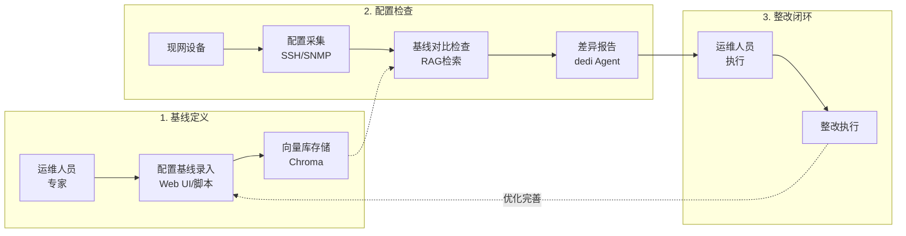
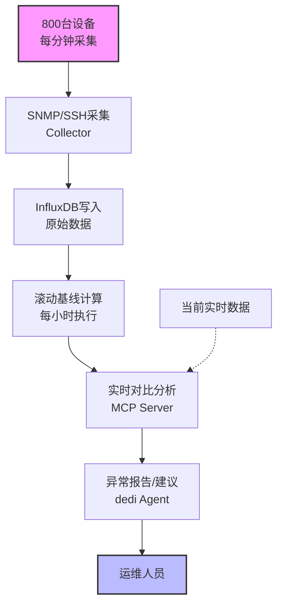
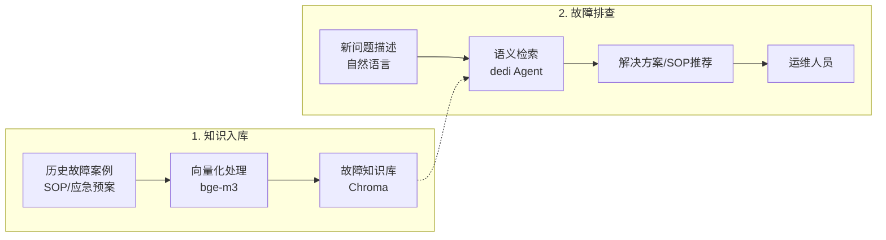

# 数据中心网络运维智能知识库系统设计文档

**版本**: 1.0  
**日期**: 2026-04-06  
**作者**: Alkaid + Claude  
**状态**: 设计阶段，待评审

---

## 1. 项目概述

### 1.1 背景与目标

构建基于 DeerFlow 的数据中心网络运维智能知识库系统，实现三个核心闭环：

1. **配置基线闭环**: 人定基线 → AI对比检查 → 人整改 → AI/人优化基线
2. **运行状态闭环**: 自动巡检 → RAG存基线 → 实时对比分析 → 优化基线
3. **故障知识闭环**: 历史案例/SOP入库 → 新问题智能检索推荐

### 1.2 业务范围

- **设备范围**: 800台网络设备（交换机、路由器、防火墙、负载均衡）
- **数据类型**: 结构化配置（JSON/CSV）、运行状态指标、故障案例文本
- **保留策略**: 核心设备运行数据30天，非核心设备7天，故障案例永久保存

### 1.3 核心用户

- Alkaid: 架构师，负责架构设计和开发决策
- dedi: 专用Agent，负责技术验证、RAG查询、报告生成
- 运维人员: 使用系统执行配置检查、状态分析、故障排查

---

## 2. 架构设计

### 2.1 整体架构图

```mermaid
flowchart TB
    subgraph UI["用户交互层"]
        A[DeerFlow Web UI<br/>Agent选择器: dedi]
    end

    subgraph AgentLayer["DeerFlow Agent层"]
        subgraph Dedi["dedi Agent (网络运维专家)"]
            B1[SOUL.md<br/>技术验证/RAG查询/报告生成]
            B2[Tools]
            B3[Subagent委派]
        end

        subgraph RAG["RAG模块 (LangChain + Chroma)"]
            C1[(配置基线库<br/>config_baseline)]
            C2[(故障案例库<br/>incident_kb)]
            C3[(异常模式库<br/>status_pattern)]
            C4[Embedding: bge-m3 (Ollama)<br/>1024维/8192 tokens/中英双语]
        end
    end

    subgraph MCP["MCP Server: deerflow-network-mcp"]
        D1[query_device_metrics<br/>查询InfluxDB时序数据]
        D2[calculate_rolling_baseline<br/>计算滚动基线 24×60]
        D3[detect_anomaly<br/>异常检测偏离度/置信度]
        D4[compare_with_baseline<br/>配置文本对比]
    end

    subgraph Storage["数据存储层"]
        subgraph InfluxDB["时序数据库 (InfluxDB)"]
            E1[(设备运行状态数据<br/>每分钟原始数据)]
            E2[(滚动基线数据<br/>24×60分钟均值)]
            E3[RP: core_30d / non_core_7d]
        end

        subgraph ChromaDB["向量数据库 (Chroma)"]
            F1[(运行状态异常向量<br/>异常模式语义化)]
        end
    end

    subgraph Collector["数据采集服务 (network-collector)"]
        G1[SNMP采集器<br/>(800设备)<br/>CPU/内存/流量]
        G2[SSH采集器<br/>配置文本/路由表/接口状态]
        G3[基线计算<br/>滚动平均/异常检测]
    end

    A --> Dedi
    B2 --> RAG
    Dedi -->|MCP协议| MCP
    MCP --> InfluxDB
    MCP -.-> ChromaDB
    Collector -->|HTTP API写入| InfluxDB
    G1 --> G3
    G2 --> G3
```

### 2.2 技术栈汇总

| 层级 | 组件 | 技术选型 | 版本/备注 |
|------|------|----------|-----------|
| **LLM** | 推理模型 | Ollama + qwen3.5:9b | 本地部署，支持thinking |
| | Embedding | Ollama + bge-m3 | 1024维，中英双语 |
| | Vision | Ollama + gemma4:e4b | 可选，用于拓扑图分析 |
| **Agent框架** | DeerFlow | langgraph + lead_agent | dedi作为专用Agent |
| **向量存储** | Chroma | 文件存储 | backend/.deer-flow/vectors/ |
| **时序存储** | InfluxDB | 2.x | 保留策略: 核心30天/非核心7天 |
| **数据采集** | SNMP | pysnmp 异步 | SNMPv2/v3 |
| | SSH | asyncssh | 配置采集 |
| **MCP** | Server | FastMCP | Python实现 |
| **部署** | 容器化 | Docker Compose | DeerFlow + InfluxDB |

### 2.3 项目结构

```mermaid
graph TD
    root["deer-flow/"] --> backend["backend/"]
    root --> backend2["backend/.deer-flow/"]
    root --> mcp["mcp-servers/"]
    root --> collectors["collectors/"]
    root --> docker["docker/"]
    root --> docs["docs/"]

    backend --> harness["packages/harness/deerflow/"]
    harness --> agents["agents/lead_agent/"]
    agents --> prompt["prompt.py<br/>已支持agent_name加载SOUL.md"]

    harness --> tools["tools/"]
    tools --> init1["__init__.py"]
    tools --> netconfig["network_config.py<br/>配置基线检查Tool"]
    tools --> netstatus["network_status.py<br/>运行状态分析Tool"]
    tools --> incident["incident_query.py<br/>故障知识检索Tool"]

    harness --> rag["rag/"]
    rag --> init2["__init__.py"]
    rag --> configbase["config_baseline.py<br/>配置基线RAG"]
    rag --> incidentkb["incident_kb.py<br/>故障知识库RAG"]
    rag --> statuspattern["status_pattern.py<br/>异常模式向量存储"]

    backend2 --> agents2["agents/dedi/"]
    agents2 --> configdedi["config.yaml<br/>已存在"]
    agents2 --> soul["SOUL.md<br/>网络运维专家定义"]

    mcp --> networkmcp["deerflow-network-mcp/"]
    networkmcp --> srcmcp["src/"]
    srcmcp --> init3["__init__.py"]
    srcmcp --> server["server.py<br/>MCP Server入口"]
    srcmcp --> influxclient["influx_client.py<br/>InfluxDB查询封装"]
    srcmcp --> baselinecalc["baseline_calculator.py<br/>滚动基线计算"]
    srcmcp --> anomalydetect["anomaly_detector.py<br/>异常检测算法"]
    networkmcp --> pyproject1["pyproject.toml"]
    networkmcp --> readme1["README.md"]

    collectors --> netcollector["network-collector/"]
    netcollector --> srccollector["src/"]
    srccollector --> init4["__init__.py"]
    srccollector --> main["main.py<br/>采集服务主入口"]
    srccollector --> snmp["snmp_poller.py<br/>SNMP轮询器"]
    srccollector --> ssh["ssh_collector.py<br/>SSH配置采集"]
    srccollector --> influxwrite["influx_writer.py<br/>数据写入InfluxDB"]
    srccollector --> baselineagg["baseline_aggregator.py<br/>基线聚合计算"]
    netcollector --> configdir["config/"]
    configdir --> devicesyaml["devices.yaml<br/>设备清单800台"]
    netcollector --> pyproject2["pyproject.toml"]
    netcollector --> dockerfile["Dockerfile"]

    docker --> composeyaml["docker-compose-network-ops.yaml<br/>运维系统专用compose"]

    docs --> superpowers["superpowers/specs/"]
    superpowers --> thisdoc["2026-04-06-network-ops-rag-design.md<br/>本文档"]
```



---

### 2.4 数据存储策略

根据数据特性和查询需求，采用**三类存储分层架构**：

```mermaid
flowchart TB
    subgraph DataTypes["数据类型分类"]
        D1[结构化配置数据
        带宽策略/设备清单
        固定Schema]
        
        D2[时序数据
        设备运行状态
        时间序列]
        
        D3[非结构化知识
        故障案例/SOP/配置基线
        语义检索]
    end

    subgraph StorageLayer["存储层选择"]
        S1[(SQLite
        关系型数据库)]
        
        S2[(InfluxDB
        时序数据库)]
        
        S3[(Chroma
        向量数据库)]
    end

    subgraph QueryPattern["查询方式"]
        Q1[精确查询
        SQL =/=/<>/>/<]
        
        Q2[聚合查询
        时间范围/统计]
        
        Q3[语义检索
        相似度匹配]
    end

    D1 --> S1 --> Q1
    D2 --> S2 --> Q2
    D3 --> S3 --> Q3
```



#### 存储选型决策矩阵

| 数据类型 | 存储方案 | 选型理由 | 示例 |
|---------|---------|---------|------|
| **带宽策略表** | **SQLite** | 固定Schema，精确数值匹配，无需Embedding | 档位/阈值/目标带宽 |
| **设备清单** | **SQLite** | 关系型数据，多表关联，CRUD操作 | 800台设备信息 |
| **运行状态** | **InfluxDB** | 高写入吞吐，时间序列聚合，保留策略 | CPU/内存/流量指标 |
| **配置基线** | **Chroma** | 文本相似度对比，语义检索 | 配置模板合规检查 |
| **故障案例** | **Chroma** | 自然语言检索，语义匹配 | 相似故障解决方案 |
| **异常模式** | **Chroma** | 向量聚类，模式识别 | 历史异常特征 |

#### 为什么不全用向量数据库？

| 场景 | 向量检索 | SQL查询 | 说明 |
|------|---------|---------|------|
| "10M带宽阈值是多少" | ❌ 不准确 | ✅ 精确匹配 | 数值比较不应语义化 |
| "当前5M流量是否超标" | ❌ 需推理 | ✅ 直接比较 | 5 > 4.0 是数值运算 |
| "历史相似故障有哪些" | ✅ 语义匹配 | ❌ 无法检索 | 需要理解描述相似性 |

**结论**: 结构化数据用SQLite，非结构化知识用Chroma，时序数据用InfluxDB。


## 3. 模块详细设计

### 3.1 Tools 模块 (DeerFlow 内)

#### 3.1.1 network_config_check

```python
async def network_config_check(
    device_id: str,
    config_text: str | None = None,  # 如果None，自动通过SSH采集
    baseline_version: str = "latest"
) -> dict:
    """
    检查设备配置与基线的差异
    
    Returns:
        {
            "device_id": "SW01",
            "baseline_version": "v1.2.0",
            "overall_compliance": 0.92,  # 整体合规率
            "findings": [
                {
                    "severity": "high",
                    "category": "spanning-tree",
                    "expected": "stp mode rstp",
                    "actual": "stp mode stp",
                    "recommendation": "建议启用RSTP加速收敛"
                }
            ],
            "missing_items": [...],
            "extra_items": [...]
        }
    """
```

#### 3.1.2 network_status_analyze

```python
async def network_status_analyze(
    device_id: str,
    metric: str = "all",  # cpu, memory, traffic, all
    time_range: str = "1h",  # 15m, 1h, 24h
    compare_baseline: bool = True
) -> dict:
    """
    分析设备运行状态，与基线对比
    
    Returns:
        {
            "device_id": "SW01",
            "analysis_time": "2026-04-06T10:00:00Z",
            "metrics": {
                "cpu": {
                    "current": 45.2,
                    "baseline_avg": 42.0,
                    "deviation": 7.6,  # 百分比偏离
                    "status": "normal"  # normal, warning, critical
                },
                "memory": {...},
                "traffic": {...}
            },
            "anomalies": [
                {
                    "metric": "interface_eth1_in",
                    "severity": "warning",
                    "description": "入流量高于基线30%",
                    "suggestion": "检查是否有异常流量"
                }
            ]
        }
    """
```

#### 3.1.3 incident_retrieve

```python
async def incident_retrieve(
    query: str,  # 自然语言描述
    filters: dict | None = None,  # {device_type: "switch", severity: "high"}
    top_k: int = 5
) -> list:
    """
    检索相似故障案例和解决方案
    
    Returns:
        [
            {
                "case_id": "INC-2026-001",
                "title": "核心交换机广播风暴",
                "similarity": 0.92,
                "symptoms": [...],
                "root_cause": "...",
                "solution": "...",
                "sop_reference": "SOP-NET-001"
            }
        ]
    """
```

### 3.2 RAG 模块 (DeerFlow 内)

#### 3.2.1 配置基线 RAG

```python
# backend/packages/harness/deerflow/rag/config_baseline.py

from langchain_chroma import Chroma
from langchain_ollama import OllamaEmbeddings

class ConfigBaselineRAG:
    """配置基线向量存储"""
    
    def __init__(self, persist_dir: str = ".deer-flow/vectors/config_baseline"):
        self.embeddings = OllamaEmbeddings(
            model="bge-m3",
            base_url="http://host.docker.internal:11434"
        )
        self.vectorstore = Chroma(
            collection_name="config_baseline",
            embedding_function=self.embeddings,
            persist_directory=persist_dir
        )
    
    def add_baseline(self, config_doc: dict) -> str:
        """添加配置基线到向量库"""
        # 1. 将配置文本分块
        # 2. 添加元数据: device_type, vendor, version
        # 3. 存储到Chroma
        pass
    
    def search_similar(self, config_text: str, filters: dict, k: int = 5) -> list:
        """检索相似配置基线"""
        pass
    
    def compare_configs(self, device_config: str, baseline_id: str) -> dict:
        """对比设备配置与基线"""
        pass
```

#### 3.2.2 故障知识库 RAG

```python
# backend/packages/harness/deerflow/rag/incident_kb.py

class IncidentKBRAG:
    """故障案例知识库"""
    
    def __init__(self, persist_dir: str = ".deer-flow/vectors/incident_kb"):
        self.embeddings = OllamaEmbeddings(
            model="bge-m3",
            base_url="http://host.docker.internal:11434"
        )
        self.vectorstore = Chroma(
            collection_name="incident_kb",
            embedding_function=self.embeddings,
            persist_directory=persist_dir
        )
    
    def add_incident(self, incident: dict) -> str:
        """添加故障案例"""
        # 索引: title + symptoms + root_cause + solution
        # 元数据: case_id, device_models, keywords, severity
        pass
    
    def query(self, description: str, filters: dict | None = None, k: int = 5) -> list:
        """检索相似故障案例"""
        pass
```

### 3.3 MCP Server (deerflow-network-mcp)

#### 3.3.1 提供的 Tools

```python
# mcp-servers/deerflow-network-mcp/src/server.py

from mcp.server.fastmcp import FastMCP

mcp = FastMCP("deerflow-network")

@mcp.tool()
async def query_device_metrics(
    device_id: str,
    metric: str,  # cpu, memory, traffic_in, traffic_out, temperature
    time_range: str,  # 15m, 1h, 6h, 24h, 7d
    aggregation: str = "mean"  # mean, max, min, p95
) -> dict:
    """查询设备历史指标数据"""
    pass

@mcp.tool()
async def calculate_rolling_baseline(
    device_id: str,
    metric: str,
    days: int = 7,  # 使用过去7天数据计算基线
    update_store: bool = True
) -> dict:
    """
    计算滚动基线
    
    算法:
    1. 获取过去N天的每分钟数据
    2. 按时间点聚合 (00:00, 00:01, ..., 23:59)
    3. 计算每个时间点的均值和标准差
    4. 存储为新的基线
    """
    pass

@mcp.tool()
async def detect_anomaly(
    device_id: str,
    metric: str,
    current_value: float,
    sensitivity: str = "medium"  # low, medium, high
) -> dict:
    """
    检测当前值是否异常
    
    Returns:
        {
            "is_anomaly": True,
            "deviation_percent": 35.2,
            "confidence": 0.85,
            "severity": "warning",  # warning, critical
            "baseline_range": [40.0, 60.0],
            "suggestion": "建议检查设备负载"
        }
    """
    pass

@mcp.tool()
async def get_device_list(
    category: str | None = None,  # core, non_core, all
    vendor: str | None = None,
    status: str | None = None  # online, offline
) -> list:
    """获取设备清单"""
    pass
```

#### 3.3.2 InfluxDB Schema

```python
# Measurement: device_status
# Tag (索引): device_id, device_type, vendor, model, category (core/non_core)
# Field (数值): cpu_percent, mem_percent, temp_celsius, 
#              interface_up, interface_down,
#              in_bps, out_bps, in_pps, out_pps,
#              error_pkts, drop_pkts
# Timestamp: 每分钟一个点

# Measurement: config_baseline
# Tag: device_type, vendor, version
# Field: baseline_json
# Timestamp: 更新时间

# Measurement: rolling_baseline_stats
# Tag: device_id, metric
# Field: hour_00_mean, hour_00_std, ..., hour_23_mean, hour_23_std
#        minute_00_mean, ..., minute_59_mean  (24×60个字段)
```

### 3.4 数据采集服务 (network-collector)

#### 3.4.1 架构设计

```python
# collectors/network-collector/src/main.py

import asyncio
from datetime import datetime

class NetworkCollector:
    """网络设备数据采集器"""
    
    def __init__(self, config_path: str = "config/devices.yaml"):
        self.devices = self._load_devices(config_path)
        self.snmp_poller = SNMPPoller()
        self.ssh_collector = SSHCollector()
        self.influx_writer = InfluxWriter()
        self.baseline_agg = BaselineAggregator()
    
    async def run(self):
        """主循环：每分钟采集一次"""
        while True:
            start_time = datetime.now()
            
            # 1. 并行采集所有设备SNMP数据
            snmp_tasks = [
                self._collect_snmp(device)
                for device in self.devices
            ]
            snmp_results = await asyncio.gather(*snmp_tasks, return_exceptions=True)
            
            # 2. 批量写入InfluxDB
            await self.influx_writer.write_batch(snmp_results)
            
            # 3. 每小时整点触发基线计算
            if start_time.minute == 0:
                await self._update_rolling_baselines()
            
            # 4. 控制采集周期为60秒
            elapsed = (datetime.now() - start_time).total_seconds()
            await asyncio.sleep(max(0, 60 - elapsed))
    
    async def _collect_snmp(self, device: dict) -> dict:
        """采集单个设备SNMP数据"""
        try:
            return await self.snmp_poller.poll(device)
        except Exception as e:
            logger.error(f"SNMP采集失败 {device['id']}: {e}")
            return {"device_id": device["id"], "error": str(e)}
    
    async def _update_rolling_baselines(self):
        """更新滚动基线"""
        for device in self.devices:
            if device["category"] == "core":
                days = 7  # 核心设备用7天数据
            else:
                days = 3  # 非核心用3天数据
            
            await self.baseline_agg.calculate_and_store(device["id"], days)
```

#### 3.4.2 设备清单配置

```yaml
# collectors/network-collector/config/devices.yaml

devices:
  # 核心设备 (保留30天)
  - id: SW-CORE-01
    name: 核心交换机01
    category: core
    vendor: huawei
    model: CE6881-48S6CQ
    ip: 10.0.1.1
    snmp:
      version: v3
      username: snmp_user
      auth_protocol: sha
      priv_protocol: aes
    ssh:
      username: admin
      key_file: /secrets/ssh_key
    metrics:
      - cpu
      - memory
      - temperature
      - interface_status
      - traffic
    poll_interval: 60

  # 非核心设备 (保留7天)  
  - id: SW-ACC-01
    name: 接入交换机01
    category: non_core
    vendor: h3c
    model: S6730
    ip: 10.0.2.1
    snmp:
      version: v2c
      community: public
    metrics:
      - cpu
      - memory
    poll_interval: 60

# 共800台设备...
```

---


### 3.5 带宽策略管理模块 (示例：结构化数据+RAG混合)

#### 3.5.1 模块定位

带宽策略模块作为**最小可行产品(MVP)**，验证 DeerFlow 工具+RAG 的集成能力。

**设计演进**:
- **V1 (当前)**: 硬编码 → 验证 Tool 接口
- **V2 (计划中)**: SQLite 存储 → 支持动态修改
- **V3 (可选)**: SQLite + Chroma 混合 → 支持自然语言查询

#### 3.5.2 数据模型

```sql
-- SQLite Schema
CREATE TABLE bandwidth_tiers (
    id INTEGER PRIMARY KEY,
    current_bw_mbps INTEGER NOT NULL,        -- 当前带宽 (Mbps)
    scale_up_threshold_mbps REAL NOT NULL,   -- 扩容阈值
    scale_up_target_mbps INTEGER NOT NULL,   -- 扩容目标
    scale_down_threshold_mbps REAL,          -- 缩容阈值 (可为NULL)
    scale_down_target_mbps INTEGER,          -- 缩容目标 (可为NULL)
    description TEXT,                        -- 策略描述
    created_at TIMESTAMP DEFAULT CURRENT_TIMESTAMP,
    updated_at TIMESTAMP DEFAULT CURRENT_TIMESTAMP
);

-- 初始化数据
INSERT INTO bandwidth_tiers VALUES
(1, 2, 0.8, 4, NULL, NULL, '最低配置，不支持缩容'),
(2, 4, 1.6, 6, 0.7, 2, '标准档位'),
(3, 6, 2.4, 8, 1.4, 4, '标准档位'),
(4, 8, 3.2, 10, 2.1, 6, '标准档位'),
(5, 10, 4.0, 20, 2.8, 8, '跳档扩容到20M'),
(6, 20, 8.0, 30, 3.5, 10, '大带宽档位'),
(7, 30, 12.0, 40, 7.0, 20, '大带宽档位'),
(8, 40, 16.0, 50, 10.5, 30, '大带宽档位');
```

#### 3.5.3 查询逻辑

```python
# 精确查询 (SQLite)
def get_recommendation_sqlite(current_bw_mbps: int, traffic_mbps: float) -> dict:
    """SQL直接查询，O(1)复杂度"""
    
    tier = db.execute(
        "SELECT * FROM bandwidth_tiers WHERE current_bw_mbps = ?",
        (current_bw_mbps,)
    ).fetchone()
    
    if not tier:
        return {"action": "unknown", "reason": "带宽档位不存在"}
    
    # 数值比较
    if traffic_mbps > tier.scale_up_threshold_mbps:
        return {
            "action": "scale_up",
            "target_bw": tier.scale_up_target_mbps,
            "reasoning": f"流量{traffic_mbps} > 阈值{tier.scale_up_threshold_mbps}"
        }
    elif tier.scale_down_threshold_mbps and traffic_mbps < tier.scale_down_threshold_mbps:
        return {
            "action": "scale_down", 
            "target_bw": tier.scale_down_target_mbps,
            "reasoning": f"流量{traffic_mbps} < 阈值{tier.scale_down_threshold_mbps}"
        }
    else:
        return {"action": "maintain", "reasoning": "流量在合理范围内"}

# 语义查询 (Chroma) - V3可选
def query_natural_language(query: str) -> list:
    """自然语言查询，用于模糊描述"""
    return chroma.similarity_search(query, k=2)
    # 例: "流量很高怎么办" → 匹配到 "scale_up" 相关文档
```

#### 3.5.4 与整体架构的关系

```mermaid
flowchart LR
    subgraph Agent["dedi Agent"]
        A[用户查询
        "10M带宽流量5M"]
    end

    subgraph Tools["Tools层"]
        T1[bandwidth_policy_query
        结构化查询]
        T2[network_config_check
        配置检查]
        T3[incident_retrieve
        故障检索]
    end

    subgraph Storage["存储层"]
        S1[(SQLite
        带宽策略表)]
        S2[(Chroma
        故障知识库)]
    end

    A --> T1
    T1 -->|SQL| S1
    T2 -->|向量检索| S2
    T3 -->|向量检索| S2
```

#### 3.5.5 实现路径

| 阶段 | 存储方案 | 查询方式 | 开发周期 | 适用场景 |
|------|---------|---------|---------|---------|
| **MVP** | Python Dict | 内存查找 | 1天 | 验证接口 |
| **V1.1** | SQLite | SQL查询 | 2天 | 生产使用 |
| **V1.2** | SQLite+Chroma | SQL+语义 | 3天 | 支持自然语言 |

**当前状态**: MVP 已完成 (Python Dict + Chroma 混合)
**下一步**: 迁移到 SQLite 存储

## 4. 数据流设计

### 4.1 配置基线闭环



### 4.2 运行状态闭环



### 4.3 故障知识闭环



---

## 5. 接口定义

### 5.1 Tool 接口

```python
# backend/packages/harness/deerflow/tools/network_config.py

from pydantic import BaseModel, Field
from typing import Literal

class ConfigCheckInput(BaseModel):
    device_id: str = Field(..., description="设备ID，如 SW-CORE-01")
    config_text: str | None = Field(None, description="配置文本，不传则自动采集")
    baseline_version: str = Field("latest", description="基线版本")

class ConfigCheckOutput(BaseModel):
    device_id: str
    baseline_version: str
    overall_compliance: float  # 0-1
    findings: list[ConfigFinding]
    missing_items: list[str]
    extra_items: list[str]

class ConfigFinding(BaseModel):
    severity: Literal["high", "medium", "low"]
    category: str
    expected: str
    actual: str
    recommendation: str

async def network_config_check(input: ConfigCheckInput) -> ConfigCheckOutput:
    """检查设备配置与基线的差异"""
    pass
```

### 5.2 MCP Server 接口

```python
# mcp-servers/deerflow-network-mcp/src/server.py

from pydantic import BaseModel

class QueryMetricsInput(BaseModel):
    device_id: str
    metric: str
    time_range: str
    aggregation: str = "mean"

class QueryMetricsOutput(BaseModel):
    device_id: str
    metric: str
    data_points: list[DataPoint]
    statistics: MetricStats

class DataPoint(BaseModel):
    timestamp: str
    value: float

class MetricStats(BaseModel):
    mean: float
    max: float
    min: float
    p95: float

@mcp.tool()
async def query_device_metrics(input: QueryMetricsInput) -> QueryMetricsOutput:
    pass
```

---

## 6. 本地开发环境

### 6.1 服务启动顺序

```bash
# 1. 启动 Ollama (宿主机)
ollama serve
ollama pull bge-m3
ollama pull qwen3.5:9b

# 2. 启动 InfluxDB (Docker)
docker run -d \
  --name influxdb-network-ops \
  -p 8086:8086 \
  -v influxdb-data:/var/lib/influxdb2 \
  influxdb:2

# 3. 启动 DeerFlow (项目根目录)
make dev

# 4. 启动 MCP Server (开发模式)
cd mcp-servers/deerflow-network-mcp
python -m src.server

# 5. 启动数据采集器 (模拟模式)
cd collectors/network-collector
python -m src.main --mode=simulate
```

### 6.2 模拟数据生成

由于本地无真实设备，开发阶段使用模拟数据：

```python
# collectors/network-collector/src/simulator.py

class DeviceSimulator:
    """设备数据模拟器"""
    
    def __init__(self):
        self.devices = self._load_device_templates()
    
    def generate_metrics(self, device_id: str) -> dict:
        """生成模拟指标数据"""
        base = self._get_baseline(device_id)
        
        # 添加随机波动
        noise = random.gauss(0, base["std"])
        
        # 偶尔注入异常 (5%概率)
        if random.random() < 0.05:
            anomaly = base["mean"] * 0.5  # 50%偏离
            return {"value": base["mean"] + noise + anomaly, "is_anomaly": True}
        
        return {"value": base["mean"] + noise, "is_anomaly": False}
    
    def generate_config(self, device_type: str, vendor: str) -> str:
        """从模板生成配置"""
        template = self._load_template(device_type, vendor)
        return template.render(vlan_id=random.randint(10, 100))
```

---

## 7. 部署配置

### 7.1 Docker Compose

```yaml
# docker/docker-compose-network-ops.yaml

version: '3.8'

services:
  # InfluxDB 时序数据库
  influxdb:
    image: influxdb:2
    container_name: network-ops-influxdb
    ports:
      - "8086:8086"
    volumes:
      - influxdb-data:/var/lib/influxdb2
    environment:
      - DOCKER_INFLUXDB_INIT_MODE=setup
      - DOCKER_INFLUXDB_INIT_USERNAME=admin
      - DOCKER_INFLUXDB_INIT_PASSWORD=adminpassword
      - DOCKER_INFLUXDB_INIT_ORG=network-ops
      - DOCKER_INFLUXDB_INIT_BUCKET=device_metrics

  # MCP Server
  network-mcp:
    build: ./mcp-servers/deerflow-network-mcp
    container_name: network-mcp-server
    environment:
      - INFLUXDB_URL=http://influxdb:8086
      - INFLUXDB_TOKEN=admin-token
      - INFLUXDB_ORG=network-ops
    depends_on:
      - influxdb

  # 数据采集器
  network-collector:
    build: ./collectors/network-collector
    container_name: network-collector
    environment:
      - INFLUXDB_URL=http://influxdb:8086
      - INFLUXDB_TOKEN=admin-token
      - MODE=simulate  # 开发模式使用模拟数据
    volumes:
      - ./collectors/network-collector/config:/app/config
    depends_on:
      - influxdb

volumes:
  influxdb-data:
```

### 7.2 DeerFlow 配置扩展

```yaml
# config.yaml 扩展部分

# 添加 embedding 模型配置
models:
  # ... 现有LLM配置 ...
  
  - name: ollama-bge-m3
    display_name: BGE-M3 Embedding
    use: langchain_ollama:OllamaEmbeddings
    model: bge-m3
    base_url: http://host.docker.internal:11434

# 添加网络运维专用Tools
tools:
  # ... 现有工具 ...
  
  - name: network_config_check
    group: network
    use: deerflow.tools.network_config:network_config_check_tool
  
  - name: network_status_analyze
    group: network
    use: deerflow.tools.network_status:network_status_analyze_tool
  
  - name: incident_retrieve
    group: network
    use: deerflow.tools.incident_query:incident_retrieve_tool

tool_groups:
  - name: web
  - name: file:read
  - name: file:write
  - name: bash
  - name: network  # 新增网络运维组
```

```json
// extensions_config.json 扩展部分
{
  "mcpServers": {
    "network-ops": {
      "enabled": true,
      "type": "stdio",
      "command": "python",
      "args": ["-m", "mcp_servers.deerflow_network_mcp"],
      "description": "网络运维数据查询服务"
    }
  },
  "skills": {
    "network-ops": {
      "enabled": true
    }
  }
}
```

---

## 8. 里程碑规划

### Phase 1: 基础架构 (Week 1-2)
- [ ] 项目结构搭建
- [ ] InfluxDB 部署和 Schema 设计
- [ ] MCP Server 框架和基础接口
- [ ] 数据采集器框架（模拟模式）

### Phase 2: RAG 核心 (Week 3-4)
- [ ] 配置基线 RAG 模块
- [ ] 故障知识库 RAG 模块
- [ ] bge-m3 Embedding 集成
- [ ] dedi Agent 配置优化

### Phase 3: Tools 实现 (Week 5-6)
- [ ] network_config_check Tool
- [ ] network_status_analyze Tool
- [ ] incident_retrieve Tool
- [ ] 报告生成 Tool

### Phase 4: 集成测试 (Week 7-8)
- [ ] 端到端流程测试
- [ ] 性能测试（800设备模拟）
- [ ] 用户验收测试
- [ ] 文档完善

---

## 9. 风险评估

| 风险 | 影响 | 缓解措施 |
|------|------|----------|
| Ollama Embedding 性能瓶颈 | 高 | 支持批量embedding，考虑本地缓存 |
| InfluxDB 数据量过大 | 中 | 严格保留策略，分层存储 |
| 800设备并发采集超时 | 中 | 异步采集，超时重试，降级机制 |
| bge-m3 中文效果不佳 | 低 | 预留切换到 m3e/bce 的接口 |

---

## 10. 附录

### 10.1 术语表

| 术语 | 说明 |
|------|------|
| RAG | Retrieval-Augmented Generation，检索增强生成 |
| MCP | Model Context Protocol，模型上下文协议 |
| Embedding | 文本向量化表示 |
| 滚动基线 | 基于历史数据的动态阈值 |
| Chroma | 开源向量数据库 |
| InfluxDB | 开源时序数据库 |

### 10.2 参考文档

- [DeerFlow Documentation](https://deer-flow.dev/docs)
- [LangChain RAG Tutorial](https://python.langchain.com/docs/tutorials/rag/)
- [InfluxDB Python Client](https://github.com/influxdata/influxdb-client-python)
- [MCP Protocol Spec](https://modelcontextprotocol.io/)

---

**文档状态**: 设计评审中  
**下次评审日期**: 2026-04-13  
**负责人**: Alkaid
