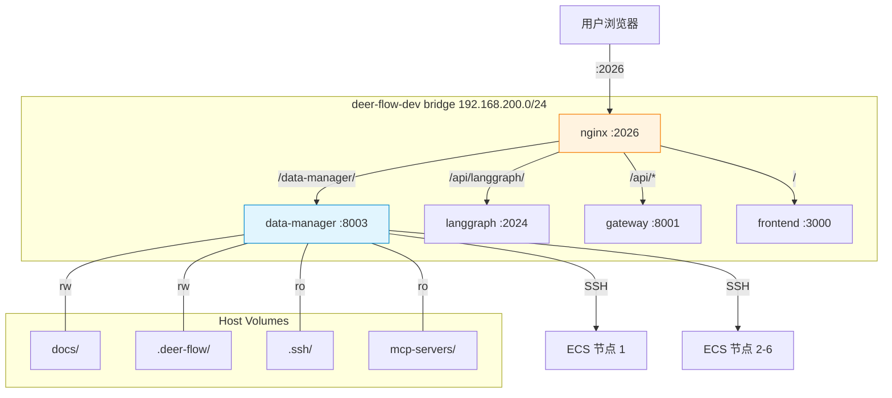
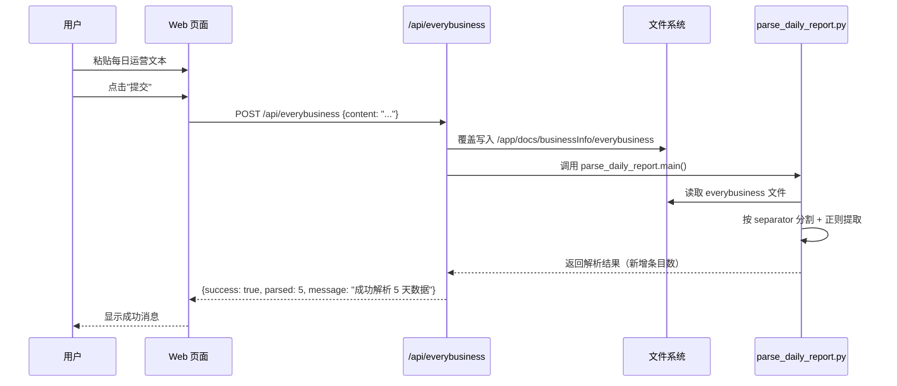
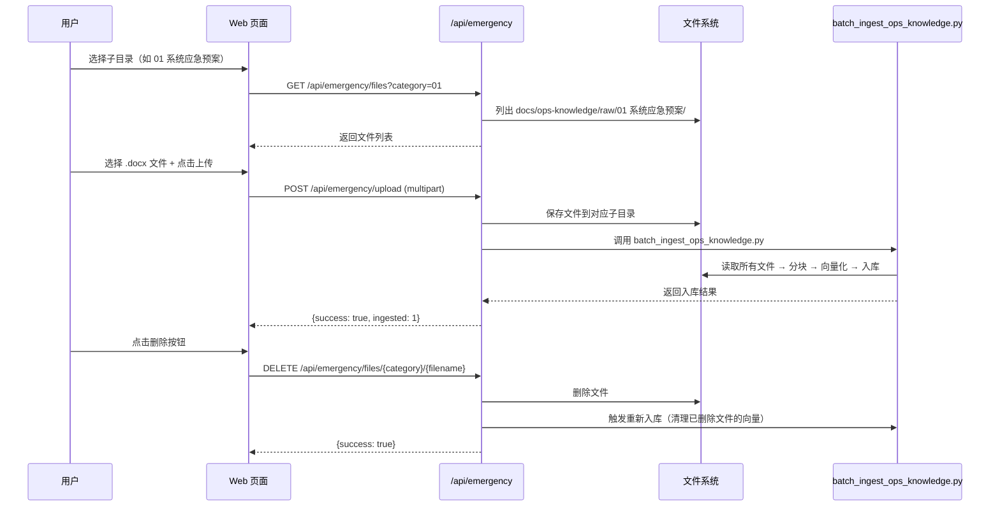
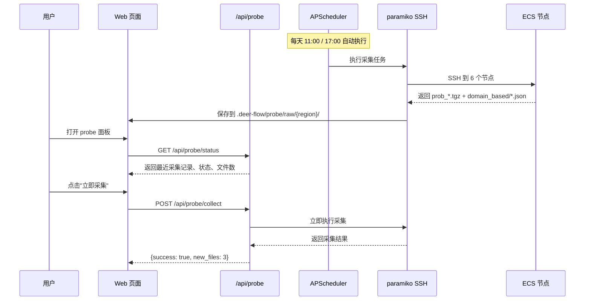

# Data Manager 服务设计

> 日期：2026-04-15
> 状态：**DRAFT** — 待审核
> 范围：新增独立容器 data-manager，提供 everybusiness 文本粘贴、应急预案文件管理、ECS 探测定时采集三大功能

---

## 1. 背景与动机

当前 deer-flow 的数据管理存在三个痛点：

1. **everybusiness 数据**：需要手动编辑 `docs/businessInfo/everybusiness` 文件并手动触发 agent 解析
2. **应急预案文档**：需要手动将 .docx 文件放到 `docs/ops-knowledge/raw/` 子目录并手动运行入库脚本
3. **ECS 探测数据**：remote-probe MCP server 中的 APScheduler 因 stdio MCP 短生命周期而从未正常工作

**目标**：新增一个独立 Web 容器（data-manager），通过 nginx 反向代理对外暴露，不深度侵入 deerflow 核心功能。

---

## 2. 架构概览



---

## 3. 服务定义

### 3.1 Docker Compose 新增服务

```yaml
# docker/docker-compose-dev.yaml — 新增 data-manager 服务
data-manager:
  build:
    context: ../
    dockerfile: docker/data-manager/Dockerfile
  container_name: deer-flow-data-manager
  command: uvicorn app:app --host 0.0.0.0 --port 8003
  volumes:
    # 共享目录：读写 docs（everybusiness + 应急预案）
    - ../docs:/app/docs:rw
    # 共享目录：读写 .deer-flow（probe 数据 + SQLite）
    - ../docker/volumes/deer-flow-data:/app/.deer-flow:rw
    # 只读：复用 remote-probe 代码
    - ../mcp-servers:/app/mcp-servers:ro
    # 只读：SSH 密钥（probe 采集用）
    - type: bind
      source: ${DEER_FLOW_ROOT:?}/.ssh
      target: /root/.ssh
      read_only: true
      bind:
        create_host_path: true
  working_dir: /app
  env_file:
    - ../.env
  networks:
    - deer-flow-dev
  restart: unless-stopped
```

### 3.2 Nginx 路由新增

在 `docker/nginx/nginx.conf` 中新增 upstream 和 location：

```nginx
# 新增 upstream
upstream data-manager {
    server data-manager:8003;
}

# 新增 location（在 location / 之前）
# ── Data Manager (文件上传/数据管理) ───────────────────
location /data-manager/ {
    rewrite ^/data-manager/(.*) /$1 break;
    proxy_pass http://data-manager;
    proxy_http_version 1.1;
    proxy_set_header Host $host;
    proxy_set_header X-Real-IP $remote_addr;
    proxy_set_header X-Forwarded-For $proxy_add_x_forwarded_for;
    proxy_set_header X-Forwarded-Proto $scheme;

    # 文件上传支持
    client_max_body_size 50M;
    proxy_request_buffering off;
}
```

访问地址：`http://localhost:2026/data-manager/`

### 3.3 目录结构

```
docker/data-manager/
├── Dockerfile
├── pyproject.toml            # 依赖：fastapi, uvicorn, python-multipart, paramiko, apscheduler, python-docx
├── app/
│   ├── __init__.py
│   ├── app.py                # FastAPI 应用入口 + APScheduler 初始化
│   ├── routers/
│   │   ├── __init__.py
│   │   ├── everybusiness.py  # everybusiness 文本粘贴 API
│   │   ├── emergency.py      # 应急预案文件管理 API
│   │   └── probe.py          # probe 状态面板 + 手动触发 API
│   ├── services/
│   │   ├── __init__.py
│   │   ├── everybusiness_service.py  # 文件写入 + 触发解析
│   │   ├── emergency_service.py      # 文件 CRUD + 触发入库
│   │   └── probe_service.py          # SSH 采集（复用 remote-probe 代码）+ 状态查询
│   ├── templates/
│   │   └── index.html        # 单页应用（3 个功能区）
│   └── static/               # CSS/JS（如需要）
└── requirements.txt           # 或使用 pyproject.toml
```

---

## 4. 功能模块详细设计

### 4.1 EveryBusiness 文本粘贴模块

#### 用户流程



#### API 设计

| 方法 | 路径 | 说明 |
|------|------|------|
| GET | `/api/everybusiness` | 获取当前文件内容（用于显示/编辑） |
| POST | `/api/everybusiness` | 提交文本（覆盖写入 + 自动解析） |

**POST 请求体：**
```json
{
  "content": "【全业务统一运营支撑平台运行情况概述】\n3月15日7时至3月16日7时..."
}
```

**POST 响应：**
```json
{
  "success": true,
  "file_size": 2048,
  "parsed_count": 5,
  "message": "文件已保存，成功解析 5 天数据"
}
```

#### 实现要点

- **覆盖写入**：每次提交完全覆盖 `everybusiness` 文件，不追加
- **解析调用**：通过 `subprocess` 调用 `python -m mcp_servers.business_baseline.tools.parse_daily_report`（或将核心逻辑 import 为函数直接调用）
- **错误处理**：文件写入成功但解析失败时，返回 warning 信息（文件已保存但解析失败）

---

### 4.2 应急预案文件管理模块

#### 用户流程



#### API 设计

| 方法 | 路径 | 说明 |
|------|------|------|
| GET | `/api/emergency/categories` | 获取 4 个子目录列表 |
| GET | `/api/emergency/files?category={dir}` | 获取指定目录下的文件列表 |
| POST | `/api/emergency/upload` | 上传文件（multipart form） |
| DELETE | `/api/emergency/files/{category}/{filename}` | 删除文件 + 清理向量 |

**分类映射：**

| 目录名 | doc_type |
|--------|----------|
| 01 系统应急预案 | emergency_system |
| 02 网络应急预案 | emergency_network |
| 03 安全应急预案 | emergency_security |
| SOP | sop |

**上传请求：** multipart form-data
- `file`: .docx 文件
- `category`: 目标子目录名（如 "01 系统应急预案"）

**删除逻辑：**
1. 删除物理文件
2. 从 Chroma 向量库中删除 `doc_type` 匹配 + `source` 匹配的向量
3. 从 SQLite 中删除对应的元数据记录

#### 实现要点

- **文件校验**：仅允许 .docx / .pdf / .xlsx / .txt / .md / .csv 格式
- **文件名去重**：同名文件覆盖（先删除旧的，再写入新的）
- **入库方式**：上传单个文件后，触发全量重新入库（`batch_ingest_ops_knowledge.py` 会自动去重），或只入库新增文件（需实现增量入库）
- **推荐方案**：先全量重入，简单可靠；后续优化为增量

---

### 4.3 Probe 探测采集模块

#### 用户流程



#### API 设计

| 方法 | 路径 | 说明 |
|------|------|------|
| GET | `/api/probe/status` | 获取采集状态（最近记录、定时任务状态） |
| POST | `/api/probe/collect` | 手动触发一次采集 |
| GET | `/api/probe/history` | 获取采集历史记录 |

**状态响应：**
```json
{
  "scheduler_running": true,
  "next_run": "2026-04-15T17:00:00+08:00",
  "last_collection": {
    "time": "2026-04-15T11:00:23+08:00",
    "status": "success",
    "new_files": 3,
    "total_files": 47
  },
  "regions": [
    {"name": "bj", "file_count": 15, "last_update": "2026-04-15"},
    {"name": "sh", "file_count": 12, "last_update": "2026-04-14"}
  ]
}
```

#### 代码复用策略

```python
# app/services/probe_service.py
import sys
sys.path.insert(0, '/app/mcp-servers')

# 复用现有模块
from remote_probe.config import SSH_CONFIG, ECS_NODES, SCHEDULE_TIMES
from remote_probe.tools.collect_probe_data import collect_from_all_nodes
```

复用的模块：
- `mcp-servers/remote-probe/config.py` — SSH 配置、节点列表、调度时间
- `mcp-servers/remote-probe/tools/collect_probe_data.py` — SSH 增量采集逻辑
- `mcp-servers/remote-probe/tools/scheduler.py` — 5 步流水线（collect → parse → compare → report → update_baseline）

#### 实现要点

- **APScheduler**：在 FastAPI 的 `lifespan` 事件中启动，使用 `BackgroundScheduler`
- **定时任务**：每天 11:00 和 17:00 执行完整 5 步流水线
- **手动触发**：只执行 collect 步骤（不自动触发后续 parse/compare/report）
- **采集记录**：在 `.deer-flow/probe/` 下维护一个 `collection_log.json` 记录每次采集的时间、状态、文件数
- **SSH 连接**：复用 `.ssh/` 目录下的密钥，paramiko `look_for_keys=True`

---

## 5. Web 前端设计

### 5.1 页面布局

单页应用，3 个 Tab 功能区：

```
┌─────────────────────────────────────────────────┐
│  🦌 DeerFlow 数据管理                            │
│  ┌──────────┬──────────┬──────────┐              │
│  │ 每日运营  │ 应急预案  │ 探测数据  │              │
│  └──────────┴──────────┴──────────┘              │
│                                                   │
│  [当前 Tab 内容区域]                               │
│                                                   │
└─────────────────────────────────────────────────┘
```

### 5.2 Tab 1：每日运营（everybusiness）

```
┌─────────────────────────────────────────────┐
│ 当前文件大小：2.04 KB  最后更新：2026-04-15   │
│                                              │
│ ┌──────────────────────────────────────────┐ │
│ │                                          │ │
│ │  （文本粘贴区域 / textarea）              │ │
│ │                                          │ │
│ │  【全业务统一运营支撑平台运行情况概述】    │ │
│ │  3月15日7时至3月16日7时...               │ │
│ │                                          │ │
│ └──────────────────────────────────────────┘ │
│                                              │
│ [提交并解析]                    [清空]         │
│                                              │
│ ℹ️ 提交后将覆盖现有文件并自动触发解析入库      │
└─────────────────────────────────────────────┘
```

### 5.3 Tab 2：应急预案（emergency）

```
┌─────────────────────────────────────────────┐
│ 目录选择：                                    │
│ [01 系统应急预案 ▼]                           │
│                                              │
│ 当前文件列表：                                │
│ ┌────────────────────────────────────┬─────┐ │
│ │ Netapp FAS8200存储更换控制器...docx │ [删] │ │
│ │ 应急预案-TCS容器集群Master...docx   │ [删] │ │
│ │ 腾讯云云产品tke集群驱逐...docx      │ [删] │ │
│ └────────────────────────────────────┴─────┘ │
│                                              │
│ 上传新文件：                                  │
│ [选择文件 (.docx)]  [上传并入库]              │
│                                              │
│ ℹ️ 上传后将自动触发向量数据库入库              │
└─────────────────────────────────────────────┘
```

### 5.4 Tab 3：探测数据（probe）

```
┌─────────────────────────────────────────────┐
│ 定时任务状态：🟢 运行中                       │
│ 下次执行：2026-04-15 17:00                    │
│                                              │
│ 最近采集：                                    │
│ ┌──────────┬────────┬─────┬──────────┐       │
│ │ 时间      │ 状态    │ 新文件│ 总文件   │       │
│ │ 04-15 11:00│ ✅ 成功 │ 3   │ 47      │       │
│ │ 04-14 17:00│ ✅ 成功 │ 1   │ 44      │       │
│ │ 04-14 11:00│ ❌ 失败 │ 0   │ 43      │       │
│ └──────────┴────────┴─────┴──────────┘       │
│                                              │
│ 各区域文件数：                                │
│ bj: 15  sh: 12  gz: 8  cd: 6  wh: 4  nj: 2  │
│                                              │
│ [立即采集]                                    │
│                                              │
│ ℹ️ 采集将从 6 个 ECS 节点拉取最新探测数据      │
└─────────────────────────────────────────────┘
```

---

## 6. 依赖清单

```toml
# pyproject.toml
[project]
name = "deer-flow-data-manager"
version = "0.1.0"
requires-python = ">=3.12"
dependencies = [
    "fastapi>=0.115.0",
    "uvicorn>=0.34.0",
    "python-multipart>=0.0.18",    # 文件上传
    "paramiko>=3.5.0",             # SSH 采集
    "apscheduler>=3.11.0",         # 定时任务
    "python-docx>=1.1.0",          # docx 读取（应急预案文件校验）
    "jinja2>=3.1.0",               # HTML 模板
]
```

---

## 7. 实施步骤

### Phase 1：基础设施（约 1 小时）

1. 创建 `docker/data-manager/` 目录结构
2. 编写 `Dockerfile` + `pyproject.toml`
3. 修改 `docker-compose-dev.yaml` 添加 data-manager 服务
4. 修改 `docker/nginx/nginx.conf` 添加 upstream + location
5. 编写最小 FastAPI 应用 + HTML 模板（空白 3 Tab 页面）
6. 测试：`docker compose up` → 访问 `http://localhost:2026/data-manager/`

### Phase 2：everybusiness 模块（约 1 小时）

1. 实现 `routers/everybusiness.py` — GET/POST API
2. 实现 `services/everybusiness_service.py` — 文件写入 + 解析触发
3. 集成 parse_daily_report.py 调用
4. 前端：文本区域 + 提交按钮 + 状态显示
5. 测试：粘贴文本 → 文件生成 → 自动解析 → 数据入库

### Phase 3：应急预案模块（约 1.5 小时）

1. 实现 `routers/emergency.py` — CRUD API
2. 实现 `services/emergency_service.py` — 文件管理 + 入库触发
3. 集成 batch_ingest_ops_knowledge.py 调用
4. 前端：目录选择 + 文件列表 + 上传 + 删除
5. 测试：上传 .docx → 文件保存 → 自动入库 → 向量可检索

### Phase 4：probe 模块（约 2 小时）

1. 实现 `services/probe_service.py` — 复用 remote-probe 代码
2. 实现 `routers/probe.py` — 状态 + 手动触发 API
3. 在 `app.py` lifespan 中配置 APScheduler
4. 前端：状态面板 + 历史记录 + 手动触发按钮
5. 测试：手动触发 → SSH 采集 → 文件保存 → 定时任务正常

---

## 8. 风险与缓解

| 风险 | 影响 | 缓解措施 |
|------|------|----------|
| remote-probe 代码依赖 mcp server 框架 | import 可能失败 | 逐步引入，先只 import config + collect，不 import scheduler |
| parse_daily_report.py 需要 SQLite 连接 | 路径可能不匹配 | 使用与 langgraph 相同的 `.deer-flow` 路径 |
| 应急预案全量重入耗时 | 每次上传后重入 10+ 文件较慢 | 先全量，后续优化增量入库 |
| docs 目录 rw 挂载安全性 | data-manager 可修改所有 docs | 长期可考虑只挂载需要的子目录 |

---

## 9. 不做的事

- ❌ 不修改 deerflow 核心代码（backend/frontend）
- ❌ 不修改 extensions_config.json（不影响 MCP server 注册）
- ❌ 不修改 langgraph/gateway 的 Dockerfile 或配置
- ❌ 不引入额外数据库（使用文件系统 + SQLite）
- ❌ 前端不使用 React/Vue（纯 HTML + Vanilla JS，保持简单）
